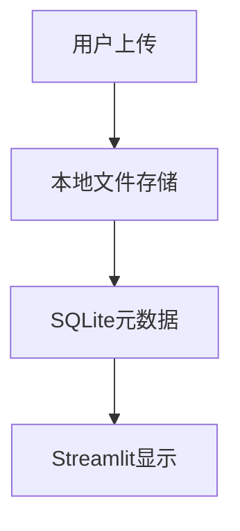

# 无人驾驶数据管理平台设计文档

## 1. 概述

### 1.1 项目简介
无人驾驶数据管理平台是一个类似GitHub的开源数据共享平台，专门用于管理和共享无人驾驶相关的多模态传感器数据。平台支持ROS Bag、PCD点云、PNG图像和YAML外参标定文件的上传、下载、存储、处理和可视化。

### 1.2 核心价值
- 为无人驾驶研究提供统一的数据共享平台
- 支持ROS生态系统的数据格式
- 提供直观的数据可视化和分析工具
- 降低数据获取和处理的技术门槛

### 1.3 目标用户
- 自动驾驶研究人员
- 高校学生和教师
- 算法工程师
- 数据科学家

## 2. 技术栈与依赖

### 2.1 前端技术栈
- **框架**: Streamlit
- **数据可视化**: 
  - Plotly（图表和3D点云可视化）
  - Matplotlib（简单图表）
- **文件处理**: pandas
- **ROS数据处理**: rosbag, rospy（用于rosbag解析）
- **点云处理**: open3d（点云可视化和处理）
- **图像处理**: PIL, opencv-python
- **配置文件处理**: PyYAML

### 2.2 后端存储
- **数据库**: SQLite（本地文件数据库，无需安装配置）
- **文件存储**: 本地文件系统
- **用户认证**: Streamlit Session State（简单会话管理）

### 2.3 数据处理
- **ROS数据**: rosbag解析和topic提取
- **点云处理**: PCD文件读取和3D可视化
- **图像处理**: PNG文件显示和基本处理
- **配置文件**: YAML外参标定数据解析
- **支持的数据格式**: 
  - ROS数据: .bag
  - 点云: .pcd
  - 图像: .png, .jpg
  - 配置: .yaml, .yml

## 3. 简化应用架构

### 3.1 单页面Streamlit应用

```python
# main.py - 主应用文件
import streamlit as st
import sqlite3
import os
from datetime import datetime
import pandas as pd
import plotly.express as px
import plotly.graph_objects as go
from PIL import Image
import open3d as o3d
import numpy as np
import yaml
import rosbag

def main():
    st.set_page_config(
        page_title="无人驾驶数据平台",
        page_icon="🚗",
        layout="wide"
    )
    
    # 初始化数据库
    init_database()
    
    # 侧边栏导航
    page = st.sidebar.selectbox(
        "选择功能",
        ["首页", "数据上传", "数据浏览", "数据可视化"]
    )
    
    if page == "首页":
        show_homepage()
    elif page == "数据上传":
        show_upload_page()
    elif page == "数据浏览":
        show_browse_page()
    elif page == "数据可视化":
        show_visualization_page()

def init_database():
    """初始化SQLite数据库"""
    conn = sqlite3.connect('data.db')
    c = conn.cursor()
    
    # 创建数据集表
    c.execute('''
        CREATE TABLE IF NOT EXISTS datasets (
            id INTEGER PRIMARY KEY AUTOINCREMENT,
            name TEXT NOT NULL,
            description TEXT,
            upload_time TEXT,
            file_count INTEGER DEFAULT 0,
            file_paths TEXT,
            data_types TEXT
        )
    ''')
    
    conn.commit()
    conn.close()
```

### 3.2 核心功能实现

#### 3.2.1 数据上传页面
```python
def show_upload_page():
    st.title("📤 数据上传")
    
    # 数据集信息
    dataset_name = st.text_input("数据集名称")
    dataset_desc = st.text_area("数据集描述")
    
    # 文件上传
    uploaded_files = st.file_uploader(
        "选择文件",
        accept_multiple_files=True,
        type=['bag', 'pcd', 'png', 'jpg', 'yaml', 'yml']
    )
    
    if st.button("上传数据集") and dataset_name and uploaded_files:
        # 创建存储目录
        dataset_dir = f"datasets/{dataset_name}_{datetime.now().strftime('%Y%m%d_%H%M%S')}"
        os.makedirs(dataset_dir, exist_ok=True)
        
        # 保存文件并分类处理
        file_paths = []
        data_types = []
        
        for file in uploaded_files:
            file_path = os.path.join(dataset_dir, file.name)
            with open(file_path, "wb") as f:
                f.write(file.getvalue())
            file_paths.append(file_path)
            
            # 根据文件类型进行初步处理和分类
            file_ext = file.name.lower().split('.')[-1]
            if file_ext == 'bag':
                process_rosbag(file_path)
                data_types.append('rosbag')
            elif file_ext == 'pcd':
                process_pointcloud(file_path)
                data_types.append('pointcloud')
            elif file_ext in ['png', 'jpg']:
                process_image(file_path)
                data_types.append('image')
            elif file_ext in ['yaml', 'yml']:
                process_calibration(file_path)
                data_types.append('calibration')
        
        # 保存到数据库
        conn = sqlite3.connect('data.db')
        c = conn.cursor()
        c.execute('''
            INSERT INTO datasets (name, description, upload_time, file_count, file_paths, data_types)
            VALUES (?, ?, ?, ?, ?, ?)
        ''', (
            dataset_name,
            dataset_desc,
            datetime.now().isoformat(),
            len(file_paths),
            ",".join(file_paths),
            ",".join(data_types)
        ))
        conn.commit()
        conn.close()
        
        st.success(f"上传成功！共{len(file_paths)}个文件")
        
        # 显示文件类型统计
        type_counts = {}
        for dt in data_types:
            type_counts[dt] = type_counts.get(dt, 0) + 1
        st.json(type_counts)
```

#### 3.2.2 数据可视化页面
```python
def show_visualization_page():
    st.title("📈 数据可视化")
    
    # 获取数据集列表
    conn = sqlite3.connect('data.db')
    datasets = pd.read_sql_query("SELECT id, name FROM datasets", conn)
    conn.close()
    
    if datasets.empty:
        st.info("暂无数据集可视化")
        return
    
    # 选择数据集
    selected_dataset = st.selectbox(
        "选择数据集",
        datasets['id'].tolist(),
        format_func=lambda x: datasets[datasets['id']==x]['name'].iloc[0]
    )
    
    if selected_dataset:
        # 获取选中数据集的文件
        conn = sqlite3.connect('data.db')
        c = conn.cursor()
        c.execute("SELECT file_paths FROM datasets WHERE id = ?", (selected_dataset,))
        result = c.fetchone()
        conn.close()
        
        if result:
            file_paths = result[0].split(",")
            
            # 显示不同类型的文件
            rosbag_files = [f for f in file_paths if f.endswith('.bag')]
            pcd_files = [f for f in file_paths if f.endswith('.pcd')]
            image_files = [f for f in file_paths if f.endswith(('.png', '.jpg'))]
            yaml_files = [f for f in file_paths if f.endswith(('.yaml', '.yml'))]
            
            # ROS Bag文件信息
            if rosbag_files:
                st.subheader("🎒 ROS Bag文件")
                for bag_file in rosbag_files:
                    if os.path.exists(bag_file):
                        bag_info = get_rosbag_info(bag_file)
                        st.write(f"**文件**: {os.path.basename(bag_file)}")
                        st.json(bag_info)
                        
                        # 显示可提取的topic
                        if st.button(f"提取数据", key=f"extract_{os.path.basename(bag_file)}"):
                            extract_rosbag_data(bag_file)
            
            # 点云数据
            if pcd_files:
                st.subheader("📈 点云数据")
                for pcd_file in pcd_files:
                    if os.path.exists(pcd_file):
                        st.write(f"**文件**: {os.path.basename(pcd_file)}")
                        if st.button(f"显示3D点云", key=f"pcd_{os.path.basename(pcd_file)}"):
                            show_pointcloud_3d(pcd_file)
            
            # 图像数据
            if image_files:
                st.subheader("🖼️ 图像数据")
                cols = st.columns(3)
                for i, img_path in enumerate(image_files[:9]):  # 最多显示9张
                    with cols[i % 3]:
                        if os.path.exists(img_path):
                            image = Image.open(img_path)
                            st.image(image, caption=os.path.basename(img_path), use_column_width=True)
            
            # 标定文件
            if yaml_files:
                st.subheader("⚙️ 标定文件")
                for yaml_file in yaml_files:
                    if os.path.exists(yaml_file):
                        calib_data = load_calibration_data(yaml_file)
                        st.write(f"**文件**: {os.path.basename(yaml_file)}")
                        st.json(calib_data)
```

### 3.3 数据处理函数

#### 3.3.1 ROS Bag处理
```python
def process_rosbag(bag_path):
    """处理ROS Bag文件"""
    try:
        bag = rosbag.Bag(bag_path)
        info = {
            'duration': bag.get_end_time() - bag.get_start_time(),
            'messages': bag.get_message_count(),
            'topics': list(bag.get_type_and_topic_info()[1].keys())
        }
        bag.close()
        return info
    except Exception as e:
        st.error(f"处理ROS Bag文件出错: {e}")
        return None

def get_rosbag_info(bag_path):
    """获取ROS Bag文件信息"""
    try:
        bag = rosbag.Bag(bag_path)
        info = bag.get_type_and_topic_info()
        bag_info = {
            '持续时间': f"{bag.get_end_time() - bag.get_start_time():.2f}秒",
            '消息数量': bag.get_message_count(),
            'Topic列表': []
        }
        
        for topic, topic_info in info[1].items():
            bag_info['Topic列表'].append({
                'topic': topic,
                'type': topic_info.msg_type,
                'count': topic_info.message_count
            })
        
        bag.close()
        return bag_info
    except Exception as e:
        return {'错误': str(e)}
```

#### 3.3.2 PCD点云处理
```python
def show_pointcloud_3d(pcd_path):
    """显示3D点云"""
    try:
        pcd = o3d.io.read_point_cloud(pcd_path)
        points = np.asarray(pcd.points)
        
        # 降采样以提高性能
        if len(points) > 10000:
            indices = np.random.choice(len(points), 10000, replace=False)
            points = points[indices]
        
        # 使用Plotly创建3D散点图
        fig = go.Figure(data=[go.Scatter3d(
            x=points[:, 0],
            y=points[:, 1],
            z=points[:, 2],
            mode='markers',
            marker=dict(
                size=2,
                color=points[:, 2],  # 按Z坐标着色
                colorscale='Viridis',
                showscale=True
            )
        )])
        
        fig.update_layout(
            title=f"点云数据: {os.path.basename(pcd_path)}",
            scene=dict(
                xaxis_title="X (m)",
                yaxis_title="Y (m)",
                zaxis_title="Z (m)"
            ),
            width=800,
            height=600
        )
        
        st.plotly_chart(fig, use_container_width=True)
        
    except Exception as e:
        st.error(f"显示点云失败: {e}")
```

#### 3.3.3 YAML标定文件处理
```python
def load_calibration_data(yaml_path):
    """加载并解析标定数据"""
    try:
        with open(yaml_path, 'r', encoding='utf-8') as file:
            calib_data = yaml.safe_load(file)
        
        # 提取常见的标定参数
        parsed_data = {}
        
        if 'camera_matrix' in calib_data:
            parsed_data['相机内参'] = calib_data['camera_matrix']
        
        if 'distortion_coefficients' in calib_data:
            parsed_data['畸变参数'] = calib_data['distortion_coefficients']
            
        if 'rotation' in calib_data:
            parsed_data['旋转矩阵'] = calib_data['rotation']
            
        if 'translation' in calib_data:
            parsed_data['平移向量'] = calib_data['translation']
        
        # 如果没有识别到标准格式，返回原始数据
        if not parsed_data:
            parsed_data = calib_data
            
        return parsed_data
        
    except Exception as e:
        return {'错误': f"无法解析YAML文件: {e}"}
```

### 3.4 数据存储结构

```
project/
├── main.py              # 主应用文件
├── data.db             # SQLite数据库
├── datasets/           # 数据集存储目录
│   ├── dataset1_20240101_120000/
│   │   ├── data.bag    # ROS Bag文件
│   │   ├── scan.pcd    # 点云文件
│   │   ├── image.png   # 图像文件
│   │   └── calib.yaml  # 标定文件
│   └── dataset2_20240101_130000/
│       └── ...
└── requirements.txt    # 依赖列表
```

### 3.5 运行环境配置

#### requirements.txt
```
streamlit==1.29.0
pandas==2.1.4
plotly==5.17.0
Pillow==10.1.0
open3d==0.18.0
opencv-python==4.8.1.78
PyYAML==6.0.1
rosbag==1.16.0
rospkg==1.5.0
```

#### 启动命令
```bash
# 安装依赖
pip install -r requirements.txt

# 运行应用
streamlit run main.py
```

## 4. 数据处理与可视化

### 4.1 简化数据处理流程

``mermaid
graph LR
    A[文件上传] --> B[保存到本地]
    B --> C[元数据提取]
    C --> D[保存到SQLite]
    D --> E[页面显示]
```

### 4.2 支持的数据类型

| 数据类型 | 文件格式 | 处理方式 | 可视化方式 |
|------------|----------|----------|------------|
| 图像数据 | JPG, PNG | 缩略图生成 | 图片展示 |
| GPS数据 | CSV | 读取坐标点 | 散点图 |
| 传感器数据 | CSV, JSON | 数值分析 | 线型图、直方图 |
| 点云数据 | TXT | 简单读取 | 3D散点图（可选） |

### 4.3 简化可视化功能

#### 4.3.1 图像展示
```python
def show_images(image_paths):
    st.subheader("图像数据")
    cols = st.columns(3)
    for i, img_path in enumerate(image_paths):
        with cols[i % 3]:
            if os.path.exists(img_path):
                image = Image.open(img_path)
                st.image(image, caption=os.path.basename(img_path))
```

#### 4.3.2 数据图表
```python
def show_data_charts(csv_path):
    df = pd.read_csv(csv_path)
    
    # 基本信息
    st.write(f"数据形状: {df.shape}")
    st.dataframe(df.head())
    
    # 简单图表
    numeric_cols = df.select_dtypes(include=['number']).columns.tolist()
    if len(numeric_cols) >= 2:
        fig = px.scatter(df, x=numeric_cols[0], y=numeric_cols[1])
        st.plotly_chart(fig)
```

## 5. 数据存储策略

### 5.1 简化存储架构


### 5.2 存储路径规范
```
/datasets/
  ├── dataset1_20240101_120000/
  │   ├── image1.jpg
  │   ├── image2.jpg
  │   └── gps_data.csv
  └── dataset2_20240101_130000/
      └── ...
```

### 5.3 SQLite数据库结构
```sql
CREATE TABLE datasets (
    id INTEGER PRIMARY KEY AUTOINCREMENT,
    name TEXT NOT NULL,
    description TEXT,
    upload_time TEXT,
    file_count INTEGER DEFAULT 0,
    file_paths TEXT  -- 逗号分隔的文件路径
);
```

## 6. 简单测试

### 6.1 功能测试
```python
# test_basic.py
import os
import tempfile
import sqlite3

def test_database_creation():
    """测试数据库创建"""
    with tempfile.NamedTemporaryFile(delete=False) as tmp:
        conn = sqlite3.connect(tmp.name)
        c = conn.cursor()
        c.execute('''
            CREATE TABLE IF NOT EXISTS datasets (
                id INTEGER PRIMARY KEY AUTOINCREMENT,
                name TEXT NOT NULL
            )
        ''')
        conn.commit()
        conn.close()
        
        # 验证表是否创建成功
        conn = sqlite3.connect(tmp.name)
        c = conn.cursor()
        c.execute("SELECT name FROM sqlite_master WHERE type='table' AND name='datasets'")
        result = c.fetchone()
        assert result is not None
        conn.close()
        
        os.unlink(tmp.name)

def test_file_upload():
    """测试文件上传功能"""
    test_dir = "test_datasets"
    os.makedirs(test_dir, exist_ok=True)
    
    # 模拟文件上传
    test_file = os.path.join(test_dir, "test.jpg")
    with open(test_file, "wb") as f:
        f.write(b"fake image data")
    
    # 验证文件存在
    assert os.path.exists(test_file)
    
    # 清理
    os.remove(test_file)
    os.rmdir(test_dir)
```

### 6.2 手动测试步骤
1. **安装依赖**: `pip install -r requirements.txt`
2. **启动应用**: `streamlit run main.py`
3. **上传数据**: 选择数据上传页面，上传测试文件
4. **浏览数据**: 检查数据是否正常显示
5. **可视化测试**: 验证图表和图像显示

