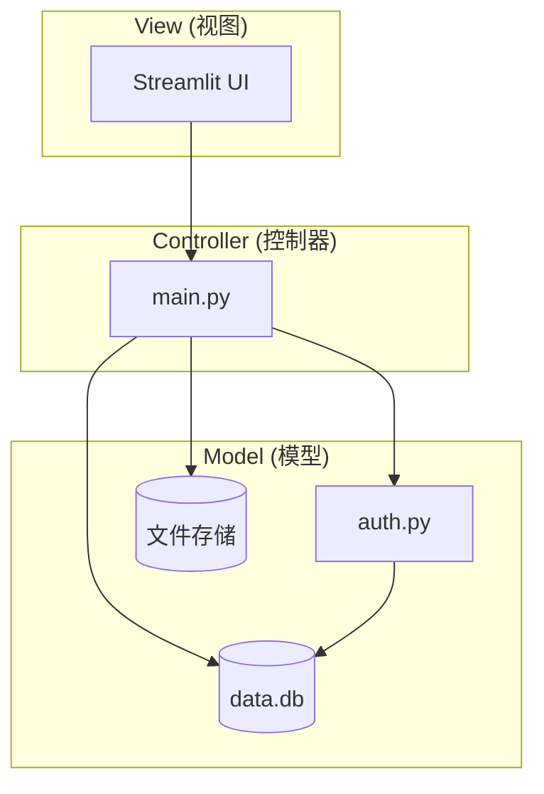
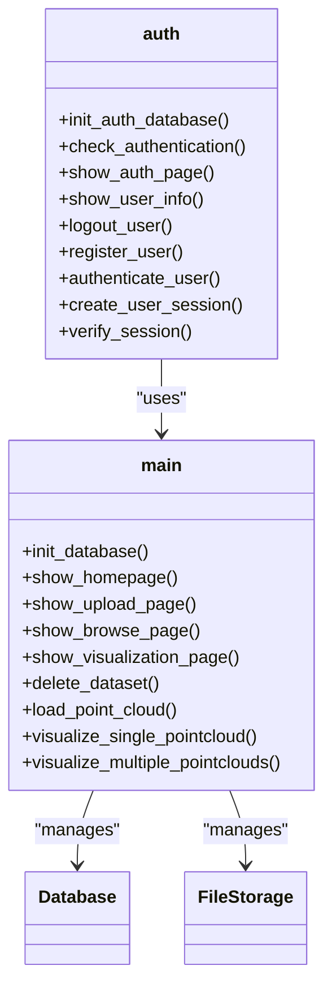
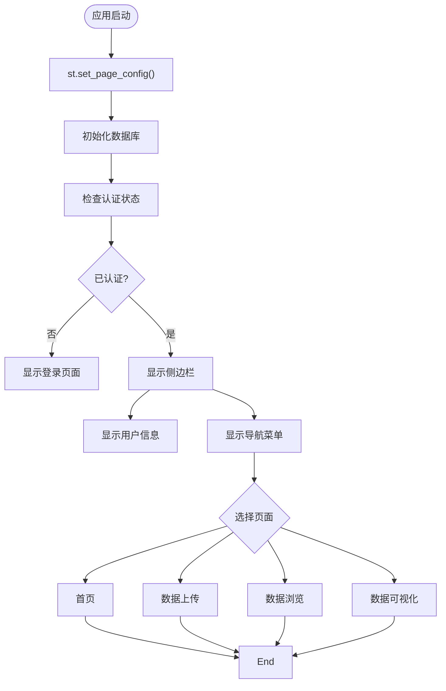

# 开发者指南

<cite>
**本文档引用的文件**   
- [main.py](file://src/main.py)
- [auth.py](file://src/auth.py)
- [pyproject.toml](file://config/pyproject.toml)
- [requirements.txt](file://config/requirements.txt)
- [project_status.py](file://src/project_status.py)
- [demo_login.py](file://src/demo_login.py)
</cite>

## 目录
1. [项目结构](#项目结构)
2. [MVC架构设计](#mvc架构设计)
3. [代码贡献流程](#代码贡献流程)
4. [系统功能扩展](#系统功能扩展)
5. [代码风格与最佳实践](#代码风格与最佳实践)
6. [调试技巧与开发工具](#调试技巧与开发工具)
7. [安全性最佳实践](#安全性最佳实践)

## 项目结构

本项目采用清晰的分层结构，便于维护和扩展：

```
platform/
├── config/              # 配置文件目录
│   ├── pyproject.toml   # Python项目配置
│   └── requirements.txt # 依赖包列表
├── data/                # 数据存储目录
│   └── temp_pointclouds # 临时点云数据
├── scripts/             # 启动脚本
│   ├── start_app.bat    # Windows启动脚本
│   └── start_app.sh     # Linux/Mac启动脚本
├── src/                 # 源代码目录
│   ├── auth.py          # 认证模块
│   ├── check_db.py      # 数据库检查
│   ├── demo_login.py    # 登录演示
│   ├── main.py          # 主应用入口
│   └── project_status.py # 项目状态检查
└── test/                # 测试目录
    ├── test_auth.py     # 认证测试
    ├── test_basic.py    # 基础测试
    ├── test_pointcloud.py # 点云测试
    └── test_pointcloud_unit.py # 点云单元测试
```

**文档来源**
- [main.py](file://src/main.py)
- [auth.py](file://src/auth.py)
- [requirements.txt](file://config/requirements.txt)

## MVC架构设计

本平台采用MVC（Model-View-Controller）架构模式，实现了关注点分离，提高了代码的可维护性和可扩展性。



**图示来源**
- [main.py](file://src/main.py)
- [auth.py](file://src/auth.py)

### 控制器 (main.py)

`main.py`作为核心控制器，负责协调视图和模型之间的交互：

```mermaid
graph TD
Main[main.py] --> InitDB[init_database]
Main --> InitAuth[init_auth_database]
Main --> CheckAuth[check_authentication]
Main --> ShowAuth[show_auth_page]
Main --> ShowUserInfo[show_user_info]
Main --> ShowHomepage[show_homepage]
Main --> ShowUpload[show_upload_page]
Main --> ShowBrowse[show_browse_page]
Main --> ShowVisual[show_visualization_page]
Main --> DeleteDataset[delete_dataset]
Main --> LoadPC[load_point_cloud]
Main --> VisualSingle[visualize_single_pointcloud]
Main --> VisualMulti[visualize_multiple_pointclouds]
```



**图示来源**
- [main.py](file://src/main.py#L0-L806)

### 模型层

模型层包含数据访问和业务逻辑：

1. **认证模型 (auth.py)**：处理用户认证、会话管理和安全验证
2. **数据模型**：通过SQLite数据库管理数据集元数据
3. **文件模型**：管理点云文件和其他传感器数据的存储



**图示来源**
- [auth.py](file://src/auth.py#L0-L562)
- [main.py](file://src/main.py#L0-L806)

### 视图层

视图层基于Streamlit构建，提供直观的Web界面：



**图示来源**
- [main.py](file://src/main.py#L0-L806)

## 代码贡献流程

### 环境搭建

1. **克隆仓库**
```bash
git clone https://github.com/your-repo/platform.git
cd platform
```

2. **创建虚拟环境**
```bash
python -m venv venv
source venv/bin/activate  # Linux/Mac
# 或
venv\Scripts\activate     # Windows
```

3. **安装依赖**
```bash
pip install -r config/requirements.txt
```

4. **验证安装**
```bash
python src/project_status.py
```

### 开发流程

1. **创建特性分支**
```bash
git checkout -b feature/new-visualization
```

2. **进行代码修改**
遵循代码风格规范，添加必要的单元测试

3. **运行测试**
```bash
python test/test_auth.py
python test/test_pointcloud.py
```

4. **提交更改**
```bash
git add .
git commit -m "添加新的可视化功能"
```

5. **推送分支**
```bash
git push origin feature/new-visualization
```

### Pull Request流程

1. 在GitHub上创建Pull Request
2. 填写PR描述，说明更改内容和影响
3. 等待代码审查
4. 根据反馈进行修改
5. 合并到主分支

**文档来源**
- [requirements.txt](file://config/requirements.txt)
- [project_status.py](file://src/project_status.py)
- [test/](file://test/)

## 系统功能扩展

### 添加新的文件格式支持

以添加ROS bag文件解析为例：

1. **安装依赖**
```bash
pip install rosbag rospy
```

2. **修改`main.py`中的`load_point_cloud`函数**
```python
elif file_path.endswith('.bag'):
    try:
        import rosbag
        bag = rosbag.Bag(file_path)
        # 解析bag文件中的点云数据
        # 返回points, colors
    except ImportError:
        st.error("需要安装rosbag库来读取.bag文件")
        return None, None
```

3. **更新文件上传类型**
```python
uploaded_files = st.file_uploader(
    "选择文件",
    accept_multiple_files=True,
    type=['bag', 'pcd', 'png', 'jpg', 'yaml', 'yml', 'csv', 'json'],
    help="支持的文件格式：.bag, .pcd, .png, .jpg, .yaml, .yml, .csv, .json"
)
```

**文档来源**
- [main.py](file://src/main.py#L29-L71)
- [requirements.txt](file://config/requirements.txt)

### 集成第三方认证服务

以集成OAuth2为例：

1. **安装依赖**
```bash
pip install requests-oauthlib
```

2. **创建认证服务类**
```python
# src/oauth_service.py
class OAuthService:
    def __init__(self, client_id, client_secret, redirect_uri):
        self.client_id = client_id
        self.client_secret = client_secret
        self.redirect_uri = redirect_uri
    
    def get_authorization_url(self):
        # 生成授权URL
        pass
    
    def exchange_code_for_token(self, code):
        # 交换授权码获取token
        pass
    
    def get_user_info(self, access_token):
        # 获取用户信息
        pass
```

3. **在`auth.py`中集成**
```python
# 在auth.py中添加
from oauth_service import OAuthService

def init_oauth_service():
    return OAuthService(
        client_id=os.getenv('OAUTH_CLIENT_ID'),
        client_secret=os.getenv('OAUTH_CLIENT_SECRET'),
        redirect_uri=os.getenv('OAUTH_REDIRECT_URI')
    )
```

**文档来源**
- [auth.py](file://src/auth.py)
- [requirements.txt](file://config/requirements.txt)

### 开发新的可视化模块

1. **创建可视化函数**
```python
def visualize_lidar_data(file_path):
    """激光雷达数据可视化"""
    # 特定于激光雷达的可视化逻辑
    pass

def visualize_camera_data(file_path):
    """摄像头数据可视化"""
    # 特定于摄像头的可视化逻辑
    pass
```

2. **在主页面中集成**
```python
def show_visualization_page():
    # ...现有代码...
    
    if lidar_files:
        st.subheader("📡 激光雷达数据")
        for lidar_file in lidar_files:
            visualize_lidar_data(lidar_file)
    
    if camera_files:
        st.subheader("📷 摄像头数据")
        for camera_file in camera_files:
            visualize_camera_data(camera_file)
```

**文档来源**
- [main.py](file://src/main.py)
- [auth.py](file://src/auth.py)

## 代码风格与最佳实践

### 代码风格规范

1. **命名规范**
- 变量名：使用小写字母和下划线（snake_case）
- 函数名：使用小写字母和下划线（snake_case）
- 类名：使用驼峰命名法（CamelCase）
- 常量：使用大写字母和下划线（UPPER_CASE）

2. **文档字符串**
```python
def function_name(param1, param2):
    """
    函数功能描述
    
    Args:
        param1: 参数1描述
        param2: 参数2描述
    
    Returns:
        返回值描述
    
    Raises:
        ExceptionType: 异常描述
    """
```

3. **代码格式化**
使用`pyproject.toml`中的配置进行代码格式化：
```toml
[tool.pyright]
include = ["**/*.py"]
exclude = ["**/node_modules", "**/__pycache__"]
reportMissingImports = false
reportOptionalMemberAccess = false
pythonVersion = "3.9"
```

### 日志记录实践

1. **使用Streamlit的内置消息系统**
```python
st.success("操作成功")
st.error("操作失败")
st.warning("警告信息")
st.info("提示信息")
```

2. **添加详细的错误处理**
```python
try:
    # 操作代码
    pass
except SpecificException as e:
    st.error(f"具体错误: {str(e)}")
except Exception as e:
    st.error(f"未知错误: {str(e)}")
```

### 错误处理机制

1. **输入验证**
```python
if not dataset_name or not uploaded_files:
    st.error("请填写完整信息")
    return
```

2. **异常捕获**
```python
try:
    # 文件操作
    with open(file_path, "wb") as f:
        f.write(file.getvalue())
except PermissionError:
    st.error("文件权限不足")
except IOError:
    st.error("文件读写错误")
```

**文档来源**
- [main.py](file://src/main.py)
- [auth.py](file://src/auth.py)
- [pyproject.toml](file://config/pyproject.toml)

## 调试技巧与开发工具

### 调试技巧

1. **使用`st.write()`进行调试**
```python
st.write("调试信息:", variable)
```

2. **启用详细日志**
```python
import logging
logging.basicConfig(level=logging.DEBUG)
```

3. **使用`st.expander()`组织调试信息**
```python
with st.expander("调试信息"):
    st.write("变量状态:", variable)
    st.write("函数参数:", params)
```

### 开发工具推荐

1. **IDE/编辑器**
- VS Code：推荐使用Python扩展
- PyCharm：专业的Python IDE
- Jupyter Notebook：用于数据探索

2. **调试工具**
- `pdb`：Python内置调试器
- `ipdb`：增强版调试器
- `streamlit run --server.enableCORS=false`：开发模式启动

3. **性能分析**
```python
import time
start_time = time.time()
# 代码块
end_time = time.time()
st.write(f"执行时间: {end_time - start_time:.2f}秒")
```

**文档来源**
- [main.py](file://src/main.py)
- [demo_login.py](file://src/demo_login.py)

## 安全性最佳实践

### 用户输入处理

1. **输入验证**
```python
def validate_username(username: str) -> bool:
    """验证用户名格式"""
    if len(username) < 3 or len(username) > 20:
        return False
    pattern = r'^[a-zA-Z0-9_]+$'
    return re.match(pattern, username) is not None
```

2. **密码安全**
```python
def validate_password(password: str) -> tuple[bool, str]:
    """验证密码强度"""
    if len(password) < MIN_PASSWORD_LENGTH:
        return False, f"密码长度至少为 {MIN_PASSWORD_LENGTH} 位"
    
    if not re.search(r'[A-Za-z]', password):
        return False, "密码必须包含字母"
    
    if not re.search(r'[0-9]', password):
        return False, "密码必须包含数字"
    
    return True, "密码强度合格"
```

### 文件上传防护

1. **文件类型限制**
```python
uploaded_files = st.file_uploader(
    "选择文件",
    accept_multiple_files=True,
    type=['bag', 'pcd', 'png', 'jpg', 'yaml', 'yml', 'csv', 'json'],
    help="支持的文件格式：.bag, .pcd, .png, .jpg, .yaml, .yml, .csv, .json"
)
```

2. **文件大小限制**
```python
MAX_FILE_SIZE = 100 * 1024 * 1024  # 100MB
if file.size > MAX_FILE_SIZE:
    st.error("文件大小超过限制")
    return
```

3. **安全的文件存储**
```python
# 使用安全的文件路径
timestamp = datetime.now().strftime('%Y%m%d_%H%M%S')
dataset_dir = f"datasets/{dataset_name}_{timestamp}"
os.makedirs(dataset_dir, exist_ok=True)
```

### 认证安全

1. **会话管理**
```python
def create_user_session(user_id: int) -> str:
    """创建用户会话"""
    session_token = secrets.token_urlsafe(32)
    expires_at = datetime.now() + timedelta(hours=SESSION_TIMEOUT_HOURS)
    # 存储会话到数据库
    return session_token
```

2. **账户锁定机制**
```python
def increment_failed_login(username: str):
    """增加登录失败次数"""
    c.execute('''
        UPDATE users 
        SET failed_login_attempts = failed_login_attempts + 1 
        WHERE username = ?
    ''', (username,))
    
    # 检查是否需要锁定账户
    if result and result[0] >= MAX_LOGIN_ATTEMPTS:
        # 锁定账户1小时
        lock_until = datetime.now() + timedelta(hours=1)
        c.execute('''
            UPDATE users 
            SET locked_until = ? 
            WHERE username = ?
        ''', (lock_until.isoformat(), username))
```

**文档来源**
- [auth.py](file://src/auth.py#L38-L80)
- [main.py](file://src/main.py)