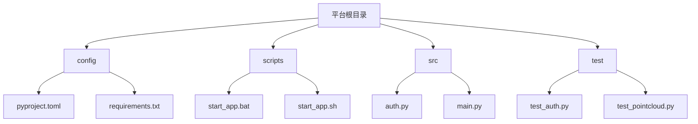
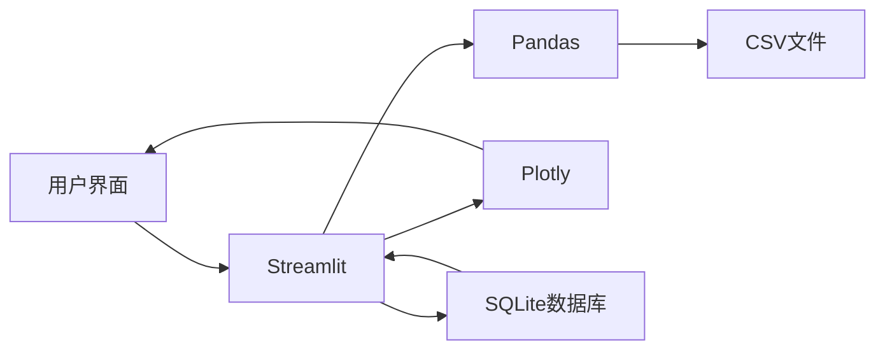
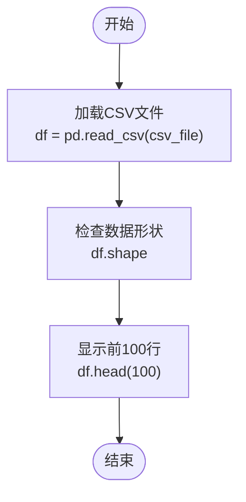
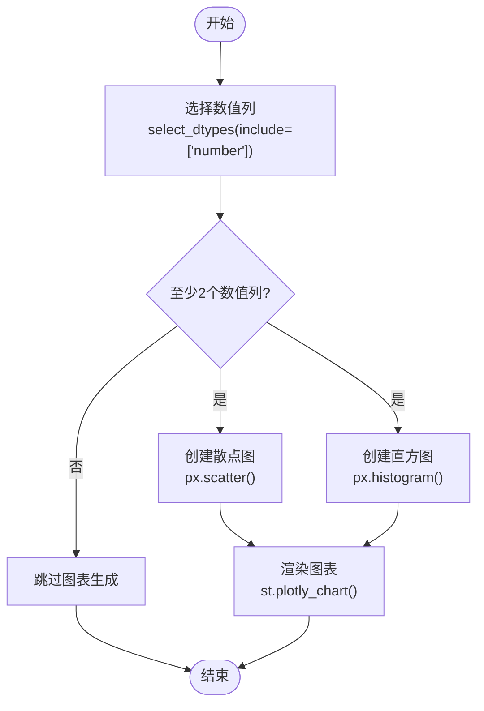
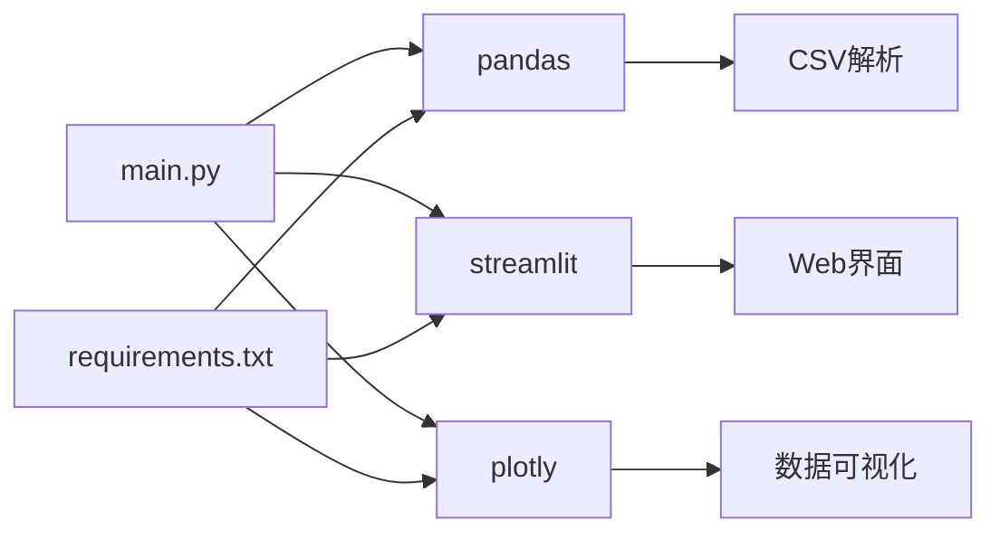

# CSV数据分析与可视化

<cite>
**本文档引用的文件**   
- [main.py](file://src/main.py)
- [requirements.txt](file://config/requirements.txt)
</cite>

## 目录
1. [简介](#简介)
2. [项目结构](#项目结构)
3. [核心组件](#核心组件)
4. [架构概述](#架构概述)
5. [详细组件分析](#详细组件分析)
6. [依赖分析](#依赖分析)
7. [性能考虑](#性能考虑)
8. [故障排除指南](#故障排除指南)
9. [结论](#结论)

## 简介
本文档全面阐述了无人驾驶数据管理平台中CSV文件的解析与可视化方法。系统基于Pandas和Streamlit构建，支持从数据库中加载CSV数据，自动检测列结构并生成基本统计信息。文档详细描述了表格预览、柱状图、折线图等多种可视化形式的实现逻辑，并提供交互式功能如列筛选、排序和数值分布直方图。同时涵盖编码处理、缺失值管理及大文件优化策略。

## 项目结构
该平台采用模块化设计，主要分为配置、脚本、源码和测试四大目录。核心功能集中在src目录下的main.py文件中，通过Streamlit构建Web界面，结合Pandas进行数据处理，Plotly实现数据可视化。

**图源**
- [main.py](file://src/main.py#L0-L806)

**章节源**
- [main.py](file://src/main.py#L0-L806)

## 核心组件
系统核心由数据加载、可视化引擎和用户交互三部分组成。CSV数据处理模块集成在数据可视化页面中，利用Pandas进行数据读取与分析，Streamlit进行前端渲染，实现从数据绑定到可视化展示的完整流程。

**章节源**
- [main.py](file://src/main.py#L575-L799)

## 架构概述
系统采用前后端分离架构，后端使用Python处理数据逻辑，前端通过Streamlit动态渲染。数据流从SQLite数据库获取文件路径，经Pandas解析CSV内容，最终通过Plotly在浏览器中呈现可视化结果。

**图源**
- [main.py](file://src/main.py#L575-L799)

## 详细组件分析
### CSV数据处理分析
系统在数据可视化页面中实现了完整的CSV文件处理流程，包括数据加载、结构分析和可视化呈现。

#### 数据加载与预览

**图源**
- [main.py](file://src/main.py#L634)

#### 统计图表生成

**图源**
- [main.py](file://src/main.py#L637-L661)

**章节源**
- [main.py](file://src/main.py#L611-L661)

## 依赖分析
系统依赖多个关键库实现CSV数据处理功能，各组件间存在明确的依赖关系。

**图源**
- [requirements.txt](file://config/requirements.txt#L1-L12)
- [main.py](file://src/main.py#L0-L27)

**章节源**
- [requirements.txt](file://config/requirements.txt#L1-L12)

## 性能考虑
对于大型CSV文件，系统采用限制显示行数的策略（仅显示前100行）来保证响应速度。建议在实际应用中进一步优化，如使用分块读取（chunking）和列选择性加载来减少内存占用。

## 故障排除指南
常见问题包括编码错误、缺失值处理和大文件内存溢出。系统通过try-except机制捕获异常并显示友好错误信息。对于编码问题，建议统一使用UTF-8编码；对于大文件，应实施分块处理策略。

**章节源**
- [main.py](file://src/main.py#L634-L661)

## 结论
本平台实现了基础的CSV数据解析与可视化功能，通过Pandas和Streamlit的有机结合，提供了直观的数据分析界面。未来可扩展更多高级功能，如数据清洗、复杂图表类型和交互式过滤，以满足更广泛的数据分析需求。