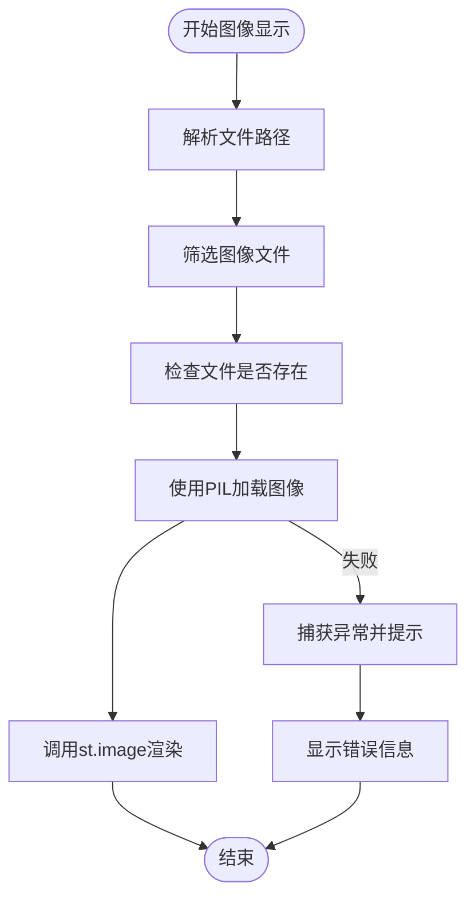

# 图像可视化

<cite>
**本文档引用的文件**  
- [main.py](file://src/main.py)
</cite>

## 目录
1. [简介](#简介)
2. [图像加载与格式支持](#图像加载与格式支持)
3. [图像元数据提取与显示布局](#图像元数据提取与显示布局)
4. [图像显示逻辑实现](#图像显示逻辑实现)
5. [图像浏览与响应式显示](#图像浏览与响应式显示)
6. [异常处理与用户提示](#异常处理与用户提示)
7. [性能优化建议](#性能优化建议)

## 简介
本平台支持多种传感器数据的可视化，其中图像数据作为无人驾驶系统中的重要组成部分，被广泛用于环境感知、目标检测等任务。系统通过Streamlit界面实现图像的加载、展示与交互，支持常见图像格式，并具备良好的用户体验设计。

## 图像加载与格式支持
系统支持常见的图像格式，包括PNG、JPG/JPEG等。在数据可视化页面中，系统会自动识别上传数据集中包含的图像文件，并进行分类处理。

图像文件的识别基于文件扩展名进行过滤，相关逻辑如下：
- 使用 `endswith()` 方法判断文件路径是否以 `.png` 或 `.jpg`/`.jpeg` 结尾
- 将符合条件的文件路径归类为图像文件列表

该机制确保了对标准图像格式的兼容性，同时避免加载不支持的文件类型。

**Section sources**
- [main.py](file://src/main.py#L611-L614)

## 图像元数据提取与显示布局
系统在展示图像时，能够自动提取基本的元数据信息，如文件名、文件路径和存在状态，并通过Streamlit组件进行结构化展示。

图像的显示布局采用三列网格形式，利用 `st.columns(3)` 创建响应式列布局，使图像在不同屏幕尺寸下均能合理排列。每张图像以缩略图形式展示，并附带文件名作为标题，提升可读性。

此外，系统限制最多显示9张图像，防止页面过长影响性能和用户体验。

**Section sources**
- [main.py](file://src/main.py#L615-L619)

## 图像显示逻辑实现
图像的渲染流程在 `show_visualization_page` 函数中实现，具体步骤如下：

1. **路径解析**：从数据库中读取数据集的文件路径字符串，使用 `split(",")` 拆分为文件路径列表。
2. **格式筛选**：通过文件扩展名筛选出图像文件。
3. **存在性检查**：使用 `os.path.exists()` 验证文件是否真实存在，防止因路径错误导致崩溃。
4. **图像加载**：使用 `PIL.Image.open()` 加载图像对象。
5. **异常捕获**：在 `try-except` 块中执行图像加载，捕获可能的解码错误或损坏文件。
6. **渲染输出**：调用 `st.image()` 将图像渲染到前端，设置 `use_column_width=True` 以适应容器宽度。



**Diagram sources**
- [main.py](file://src/main.py#L620-L626)

**Section sources**
- [main.py](file://src/main.py#L620-L626)

## 图像浏览与响应式显示
用户可通过“数据可视化”页面浏览已上传数据集中的图像。系统以缩略图形式并列展示图像，最多显示9张，超出部分将被忽略。

响应式设计通过Streamlit的列布局自动适配不同设备屏幕。图像宽度设置为 `use_column_width=True`，确保在移动设备和桌面端均有良好显示效果。

用户可直观查看图像内容及其对应文件名，便于快速识别和分析。

**Section sources**
- [main.py](file://src/main.py#L615-L619)

## 异常处理与用户提示
系统具备完善的异常处理机制，针对图像显示过程中可能出现的问题提供清晰的用户反馈：

- **图像路径错误**：通过 `os.path.exists()` 提前检查文件是否存在，若不存在则跳过并标记“文件不存在”。
- **不支持的格式**：通过文件扩展名白名单机制过滤，非支持格式不会进入加载流程。
- **损坏文件或解码失败**：在 `try-except` 中调用 `Image.open()`，捕获异常后使用 `st.error()` 显示“无法显示图像”提示。

这些机制确保系统在面对异常情况时仍能稳定运行，并向用户提供明确的错误信息。

**Section sources**
- [main.py](file://src/main.py#L625-L626)

## 性能优化建议
尽管当前图像显示功能已具备基本的稳定性与可用性，为进一步提升性能，建议引入以下优化方案：

### 缩略图生成
当前直接加载原始图像可能导致大图加载缓慢。建议在上传时或首次加载时生成缩略图，存储于缓存目录中，后续展示使用缩略图以提升响应速度。

```python
from PIL import Image

def generate_thumbnail(image_path, size=(300, 300)):
    img = Image.open(image_path)
    img.thumbnail(size)
    return img
```

### 大图延迟加载（Lazy Loading）
对于包含大量图像的数据集，可实现滚动加载机制，仅当用户滚动至可视区域时才加载图像，减少初始页面加载时间。

### 图像缓存机制
利用Streamlit的 `@st.cache_data` 或 `@st.cache_resource` 装饰器缓存已加载的图像对象，避免重复解码，提高交互响应速度。

### 异步加载支持
未来可考虑使用异步任务队列（如Celery）或前端JavaScript实现图像的异步加载，进一步提升用户体验。

通过上述优化，可显著提升平台在处理大规模图像数据集时的性能表现。