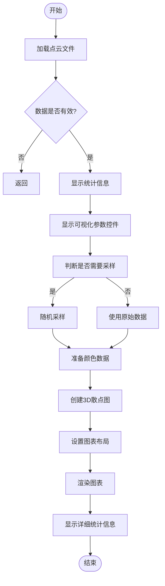
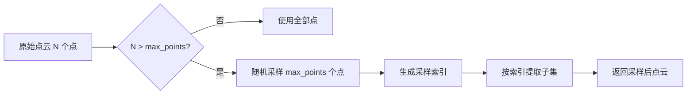

# 单文件点云可视化

<cite>
**本文档引用的文件**  
- [main.py](file://src/main.py)
- [test_pointcloud_unit.py](file://test/test_pointcloud_unit.py)
</cite>

## 目录
1. [简介](#简介)
2. [核心功能分析](#核心功能分析)
3. [visualize_single_pointcloud 函数实现逻辑](#visualize_single_pointcloud-函数实现逻辑)
4. [点云数据加载机制](#点云数据加载机制)
5. [可视化参数控制界面](#可视化参数控制界面)
6. [性能优化与采样策略](#性能优化与采样策略)
7. [常见问题与容错处理](#常见问题与容错处理)
8. [性能优化建议](#性能优化建议)

## 简介
本系统为无人驾驶数据管理平台，提供点云数据的上传、浏览与可视化功能。其中，单文件点云可视化是核心功能之一，支持多种格式的点云数据加载与交互式渲染，具备统计信息展示、颜色映射选择、视角切换等特性，适用于科研与工程场景下的点云数据分析。

## 核心功能分析
系统通过 `visualize_single_pointcloud` 函数实现单个点云文件的完整可视化流程，涵盖数据加载、统计展示、参数配置、图形渲染与详细信息展开等功能模块。该功能依赖 Streamlit 构建前端交互界面，使用 Plotly 实现高性能 3D 散点图渲染，并结合 NumPy 进行高效数组操作。

**Section sources**
- [main.py](file://src/main.py#L73-L197)

## visualize_single_pointcloud 函数实现逻辑
该函数负责单个点云文件的端到端可视化处理，其执行流程如下：

1. **文件标识显示**：展示当前加载的文件名。
2. **数据加载**：调用 `load_point_cloud` 函数读取点云数据（坐标与颜色）。
3. **异常处理**：若加载失败则直接返回，不继续后续流程。
4. **统计信息展示**：在四个并列列中分别显示点数量及 X/Y/Z 坐标范围。
5. **可视化参数设置**：提供滑块和下拉菜单供用户调节显示参数。
6. **数据采样**：根据最大显示点数进行随机采样以提升性能。
7. **颜色映射处理**：依据用户选择生成对应的颜色值序列。
8. **3D 图形构建**：使用 Plotly 创建交互式 3D 散点图。
9. **布局配置**：设置标题、坐标轴、相机视角与页面布局。
10. **图表渲染**：将图形嵌入 Streamlit 页面。
11. **详细信息展开**：提供可折叠面板展示更全面的统计信息。



**Diagram sources**
- [main.py](file://src/main.py#L73-L197)

**Section sources**
- [main.py](file://src/main.py#L73-L197)

## 点云数据加载机制
`load_point_cloud` 函数支持三种主流点云格式的解析：

- **PCD 格式**：依赖 Open3D 库读取 `.pcd` 文件，提取点坐标与颜色信息。
- **LAS/LAZ 格式**：利用 laspy 库解析 `.las` 或 `.laz` 文件，获取 XYZ 坐标及 RGB 颜色（归一化至 [0,1] 区间）。
- **TXT/XYZ 格式**：通过 `numpy.loadtxt` 读取文本文件，前3列为坐标，第4-6列作为颜色（若存在）。

该函数具备完善的异常捕获机制，对不支持的格式、缺失依赖库或文件损坏等情况均能返回 `None` 并提示错误信息。

```mermaid
classDiagram
class load_point_cloud {
+str file_path
+tuple~np.ndarray, np.ndarray~ load_point_cloud(file_path)
-handle_pcd(file_path) tuple~points, colors~
-handle_las(file_path) tuple~points, colors~
-handle_txt(file_path) tuple~points, colors~
}
load_point_cloud --> "PCD" : uses Open3D
load_point_cloud --> "LAS/LAZ" : uses laspy
load_point_cloud --> "TXT/XYZ" : uses numpy.loadtxt
```

**Diagram sources**
- [main.py](file://src/main.py#L29-L71)

**Section sources**
- [main.py](file://src/main.py#L29-L71)

## 可视化参数控制界面
系统通过 Streamlit 构建直观的可视化参数控制面板，包含以下控件：

### 参数分组布局
使用两列布局（`st.columns(2)`）将参数分为两组：
- **左侧列**：最大显示点数滑块、点大小调节滑块
- **右侧列**：颜色映射模式选择、视角模式选择

### 控件说明
| 控件 | 类型 | 说明 |
|------|------|------|
| 最大显示点数 | 滑块 | 限制渲染点数以优化性能，默认值为10000，上限为100000 |
| 点大小 | 滑块 | 调节点在屏幕上的显示尺寸，范围1-10 |
| 颜色映射 | 下拉框 | 支持“高度 (Z)”、“原始颜色”、“均匀颜色”三种模式 |
| 视角模式 | 下拉框 | 提供3D视角及三个正交投影视角（XY/XZ/YZ） |

### 颜色映射机制
- **高度 (Z)**：以 Z 值作为颜色映射依据，使用 Viridis 色彩方案，并显示颜色条。
- **原始颜色**：直接使用点云自带的颜色信息，转换为 RGB 字符串列表。
- **均匀颜色**：所有点统一显示为蓝色。

### 视角控制
通过预设相机参数实现不同视角切换：
- **3D 视角**：斜视角 `(1.5, 1.5, 1.5)`
- **从上向下 (XY)**：Z 轴正上方 `(0, 0, 3)`
- **从前向后 (XZ)**：Y 轴正前方 `(0, 3, 0)`
- **从左向右 (YZ)**：X 轴正右方 `(3, 0, 0)`

**Section sources**
- [main.py](file://src/main.py#L106-L148)

## 性能优化与采样策略
为应对大规模点云数据带来的性能挑战，系统采用随机采样算法进行降级处理。

### 随机采样实现
当原始点数超过用户设定的 `max_points` 时，系统调用 `np.random.choice` 从全部点中无放回地随机选取指定数量的索引，确保采样结果无重复且具有代表性。

```python
indices = np.random.choice(len(points), max_points, replace=False)
sampled_points = points[indices]
sampled_colors = colors[indices] if colors is not None else None
```

### 单元测试验证
测试用例 `test_sample_large_pointcloud` 验证了采样逻辑的正确性：对包含50000个点的大型点云，限制最大显示点数为10000，最终采样结果点数不超过该限制且保持三维结构。



**Diagram sources**
- [main.py](file://src/main.py#L106-L148)
- [test_pointcloud_unit.py](file://test/test_pointcloud_unit.py#L155-L170)

**Section sources**
- [main.py](file://src/main.py#L106-L148)
- [test_pointcloud_unit.py](file://test/test_pointcloud_unit.py#L155-L170)

## 常见问题与容错处理
系统在设计时充分考虑了实际使用中的各类异常情况，并提供了相应的容错机制。

### 依赖库缺失处理
- 若未安装 Open3D，则无法读取 `.pcd` 文件，系统会显示警告并返回错误。
- 若未安装 laspy，则无法读取 `.las/.laz` 文件，同样提示用户安装对应库。

### 文件格式支持检查
对于不支持的文件格式（如 `.invalid`），系统会明确提示“不支持的点云文件格式”，并通过单元测试验证此行为的正确性。

### 文件读取异常捕获
所有文件读取操作均包裹在 `try-except` 块中，任何异常（如文件不存在、权限不足、格式错误）都会被捕获并以用户友好的方式展示错误信息。

**Section sources**
- [main.py](file://src/main.py#L29-L71)
- [test_pointcloud_unit.py](file://test/test_pointcloud_unit.py#L84-L100)

## 性能优化建议
为保障系统在各种硬件环境下稳定运行，提出以下性能优化建议：

1. **合理设置最大点数**：建议将最大显示点数限制在 100,000 以内，以平衡视觉效果与渲染性能。
2. **优先使用采样模式**：对于超过10万点的数据集，强制启用采样以避免浏览器卡顿或内存溢出。
3. **减少悬停信息量**：仅对前100个点启用悬停提示，避免生成过多 HTML 内容影响性能。
4. **避免频繁重绘**：Streamlit 的 rerun 机制可能导致重复计算，应尽量缓存中间结果。
5. **前端资源优化**：Plotly 图表启用 `use_container_width=True` 以适配响应式布局，提升用户体验。