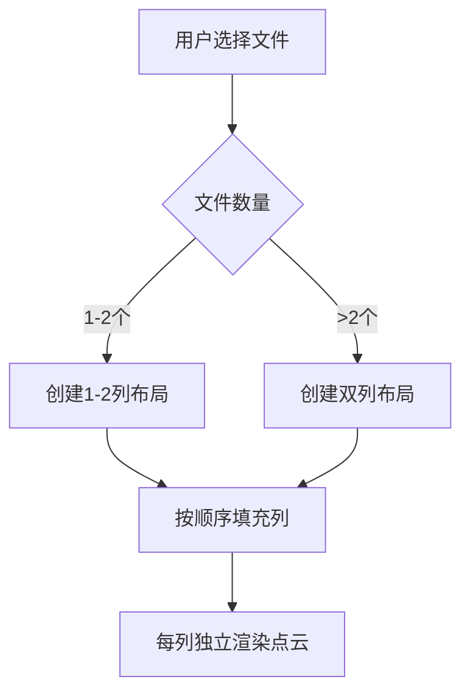
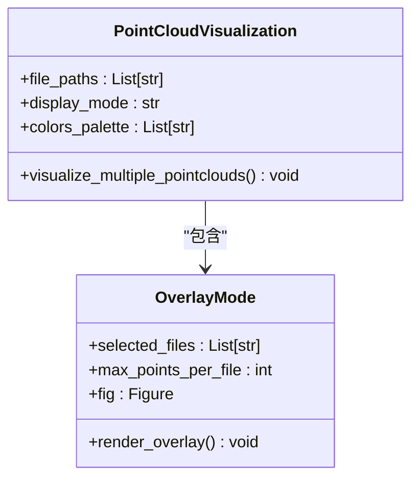
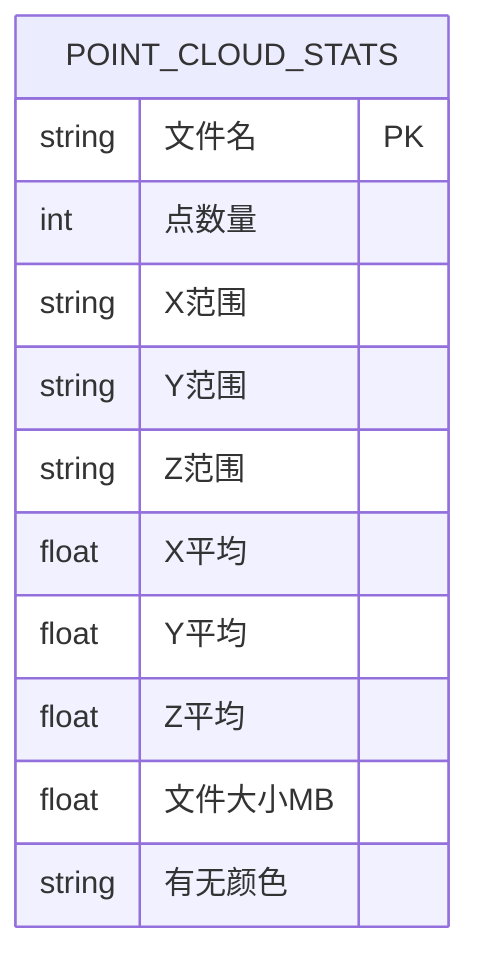
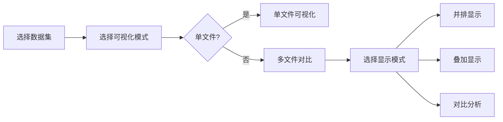

# 多文件点云可视化

<cite>
**本文档引用文件**  
- [main.py](file://src/main.py)
</cite>

## 目录
1. [简介](#简介)
2. [核心功能实现](#核心功能实现)
3. [并排显示模式](#并排显示模式)
4. [叠加显示模式](#叠加显示模式)
5. [统计对比分析模式](#统计对比分析模式)
6. [用户交互逻辑](#用户交互逻辑)
7. [性能优化与异常处理](#性能优化与异常处理)
8. [性能调优建议](#性能调优建议)

## 简介
本系统提供多文件点云数据的可视化对比功能，支持三种显示模式：并排显示、叠加显示和统计对比分析。用户可通过图形化界面选择多个点云文件进行对比分析，系统基于Streamlit框架构建，利用Plotly实现3D点云渲染，支持多种点云格式（PCD、LAS/LAZ、TXT/XYZ）。

## 核心功能实现

**Section sources**
- [main.py](file://src/main.py#L199-L349)

## 并排显示模式

### 列布局设计
系统采用Streamlit的`st.columns`方法实现响应式列布局，最多支持两列并排显示。当选择的文件数量超过两个时，自动按模2分配到左右两列中，确保界面整洁有序。



**Diagram sources**
- [main.py](file://src/main.py#L208-L231)

### 性能优化策略
为提升渲染效率，系统在并排显示模式下强制限制最大显示点数为5000个。当原始点云数据超过此阈值时，采用随机采样策略进行降采样：

```python
max_points = 5000
if len(points) > max_points:
    indices = np.random.choice(len(points), max_points, replace=False)
    sampled_points = points[indices]
```

该策略显著降低了GPU渲染负载，确保在普通硬件上也能流畅交互。

**Section sources**
- [main.py](file://src/main.py#L229)

## 剥叠显示模式

### 颜色区分机制
系统为不同点云文件分配预定义的颜色调色板，确保叠加显示时各数据集可清晰区分：

```python
colors_palette = ['red', 'blue', 'green', 'orange', 'purple', 'brown', 'pink', 'gray']
color = colors_palette[i % len(colors_palette)]
```

每个点云使用不同颜色渲染，并在图例中显示文件名，便于识别。



**Diagram sources**
- [main.py](file://src/main.py#L258-L290)

用户可通过滑块控件调节每个文件的最大显示点数（100-5000），平衡视觉效果与性能。

**Section sources**
- [main.py](file://src/main.py#L266-L270)

## 统计对比分析模式

### 数据聚合方法
系统自动计算各点云文件的统计特征并生成对比表格，包括：
- 点数量
- 坐标范围（X/Y/Z）
- 坐标均值（X/Y/Z）
- 文件大小
- 颜色信息存在性



同时生成柱状图对比点数量和文件大小，直观展示数据差异。

**Section sources**
- [main.py](file://src/main.py#L318-L349)

## 用户交互逻辑

### 控件设计
系统采用直观的控件组合实现用户交互：
- **多选框**：`st.multiselect`用于选择要对比的文件
- **单选按钮**：`st.radio`用于切换三种显示模式
- **滑块**：`st.slider`用于调节显示参数



**Diagram sources**
- [main.py](file://src/main.py#L689-L713)

### 功能复用
多文件可视化功能复用单文件加载和采样逻辑：
- 调用`load_point_cloud()`函数加载数据
- 复用`visualize_single_pointcloud()`中的采样算法
- 共享异常处理机制

**Section sources**
- [main.py](file://src/main.py#L29-L71)

## 性能优化与异常处理

### 异常处理
系统在文件加载环节设置多层异常处理：
- 格式不支持：提示"不支持的点云文件格式"
- 文件损坏：捕获异常并显示错误信息
- 依赖缺失：检测Open3D/laspy库是否安装

### 内存占用控制
通过以下策略控制内存使用：
- 逐个加载文件而非批量加载
- 及时释放临时变量
- 限制最大显示点数
- 使用生成器模式处理大数据

**Section sources**
- [main.py](file://src/main.py#L56-L71)

## 性能调优建议

### 预采样策略
对于大规模数据集，建议预先进行降采样处理：
```python
# 预处理阶段
if len(points) > 100000:
    indices = np.random.choice(len(points), 50000, replace=False)
    points = points[indices]
```

### 异步加载
可采用异步加载提升用户体验：
```python
# 伪代码示例
async def load_files_async(file_paths):
    tasks = [async_load_point_cloud(fp) for fp in file_paths]
    return await asyncio.gather(*tasks)
```

### 其他优化建议
1. **客户端硬件加速**：启用WebGL渲染
2. **数据分块加载**：对于超大点云，分块加载显示
3. **缓存机制**：缓存已加载的点云数据
4. **LOD（细节层次）**：根据视距调整显示精度

这些策略可显著提升大规模点云数据的对比分析效率。