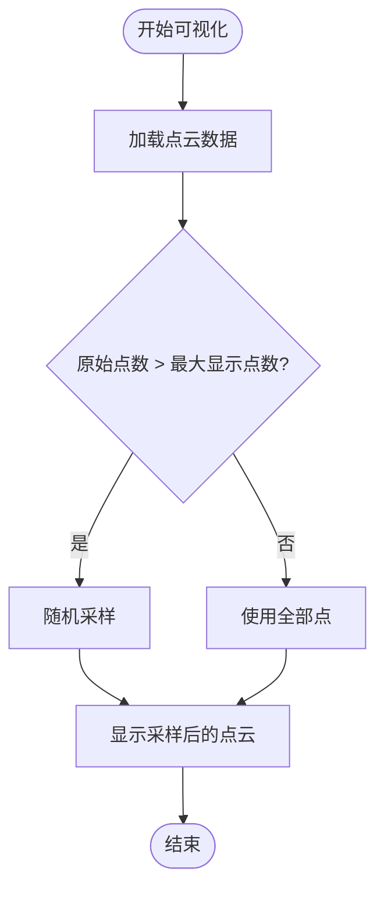
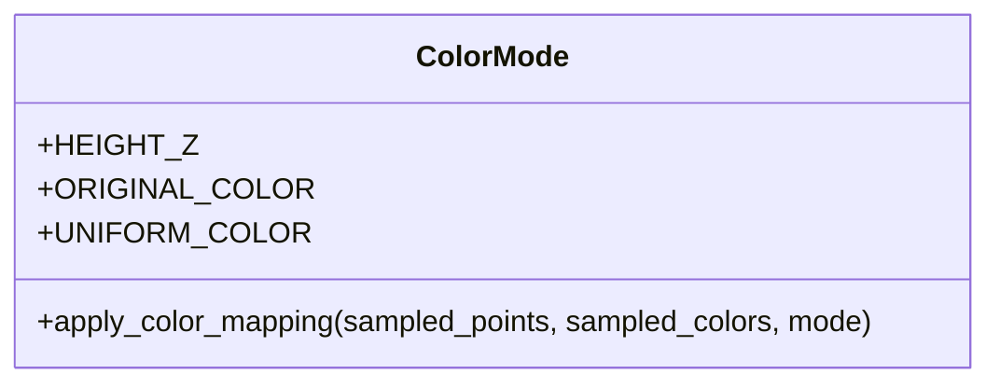
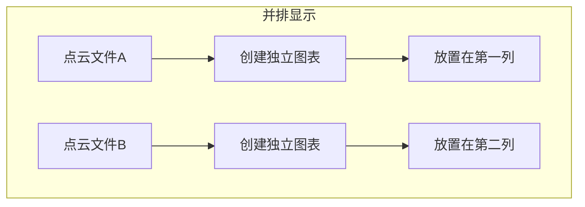
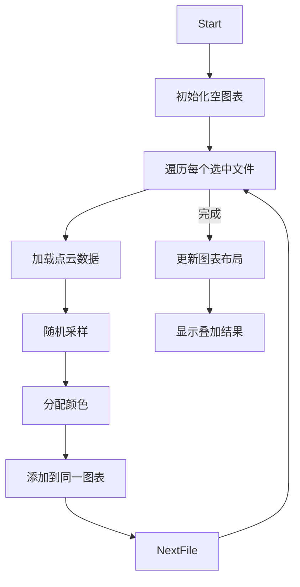
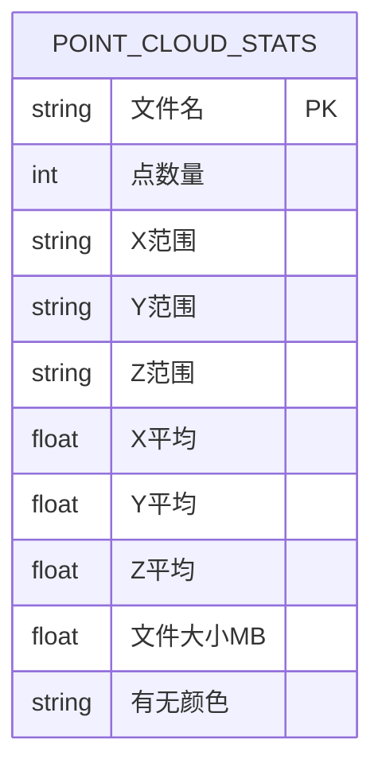
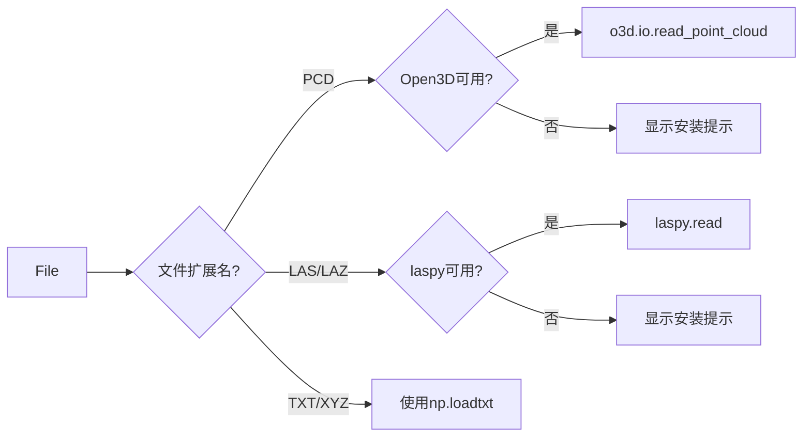
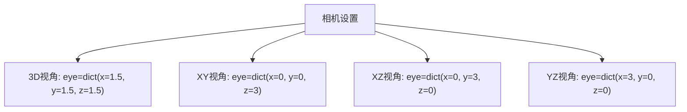
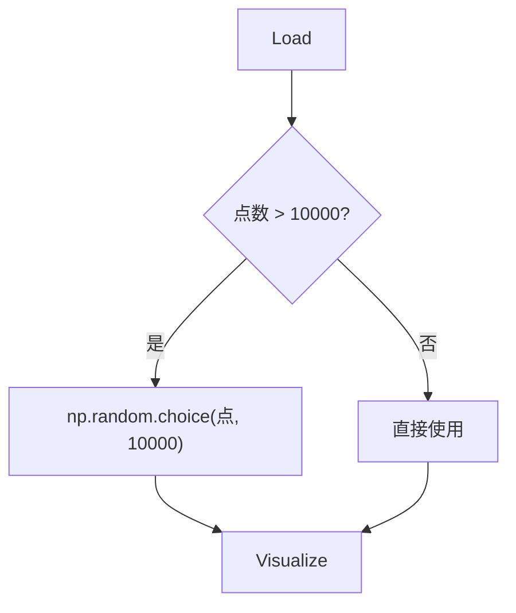

# 点云可视化

<cite>
**Referenced Files in This Document**   
- [main.py](file://src/main.py)
- [requirements.txt](file://config/requirements.txt)
- [test_pointcloud_unit.py](file://test/test_pointcloud_unit.py)
</cite>

## 目录
1. [单文件点云可视化](#单文件点云可视化)
2. [多文件点云对比可视化](#多文件点云对比可视化)
3. [点云数据加载机制](#点云数据加载机制)
4. [Plotly 3D图表配置](#plotly-3d图表配置)
5. [性能优化与异常处理](#性能优化与异常处理)

## 单文件点云可视化

该功能通过 `visualize_single_pointcloud` 函数实现，提供交互式参数控制，支持对单个点云文件进行详细可视化。

**Section sources**
- [main.py](file://src/main.py#L73-L197)

### 采样策略

系统采用随机采样策略来处理大规模点云数据。当点云的原始点数超过用户设定的“最大显示点数”时，系统会使用 `np.random.choice` 从原始点云中随机抽取指定数量的点进行显示，确保可视化性能。



**Diagram sources**
- [main.py](file://src/main.py#L106-L115)

### 颜色映射方式

系统提供三种颜色映射模式：
- **高度 (Z)**：根据点的Z坐标值进行颜色映射，使用Viridis色谱
- **原始颜色**：显示点云文件中自带的颜色信息
- **均匀颜色**：所有点显示为统一的蓝色



**Diagram sources**
- [main.py](file://src/main.py#L106-L148)

### 交互式参数控制

用户可通过以下交互式控件调整可视化效果：
- **最大显示点数**：滑块控件，范围1000至100000，用于控制性能
- **点大小**：滑块控件，范围1至10，调整点的视觉大小
- **颜色模式**：下拉选择框，选择三种颜色映射方式
- **视角模式**：下拉选择框，选择3D、XY、XZ或YZ视角

**Section sources**
- [main.py](file://src/main.py#L84-L106)

## 多文件点云对比可视化

`visualize_multiple_pointclouds` 函数提供三种模式的多文件对比可视化功能。

**Section sources**
- [main.py](file://src/main.py#L199-L380)

### 并排显示模式

该模式将选中的多个点云文件在并排的子图中分别显示，便于直观比较不同点云的结构特征。



**Diagram sources**
- [main.py](file://src/main.py#L199-L231)

### 前端显示限制
- 每次最多显示两个文件（两列布局）
- 每个文件最大显示点数限制为5000，以保证性能
- 使用较小的点大小（size=2）和较低的透明度（opacity=0.7）

### 前端叠加显示模式

该模式将多个点云叠加在同一3D空间中显示，使用不同的颜色区分各个文件。



**Diagram sources**
- [main.py](file://src/main.py#L258-L290)

### 前端统计对比分析模式

该模式不进行3D可视化，而是提取各点云文件的统计信息，以表格和柱状图形式进行对比分析。



**Diagram sources**
- [main.py](file://src/main.py#L318-L349)

## 点云数据加载机制

`load_point_cloud` 函数负责支持多种点云格式的加载，并处理外部依赖。

**Section sources**
- [main.py](file://src/main.py#L29-L71)

### 格式支持机制

| 格式 | 支持状态 | 依赖库 | 颜色支持 |
|------|---------|--------|---------|
| PCD | ✅ | Open3D | ✅ |
| LAS/LAZ | ✅ | laspy | ✅ |
| TXT/XYZ | ✅ | NumPy | ✅ (第4-6列) |



**Diagram sources**
- [main.py](file://src/main.py#L29-L71)
- [requirements.txt](file://config/requirements.txt)

### 依赖处理

系统通过try-except块动态检测Open3D和laspy库的可用性，并在库未安装时提供友好的错误提示，而非程序崩溃。

```python
try:
    import open3d as o3d
    OPEN3D_AVAILABLE = True
except ImportError:
    OPEN3D_AVAILABLE = False
    st.warning("⚠️ Open3D库未安装，点云可视化功能将受限。请运行: pip install open3d")
```

**Section sources**
- [main.py](file://src/main.py#L10-L27)

## Plotly 3D图表配置

系统使用Plotly库创建高质量的3D点云可视化图表。

**Section sources**
- [main.py](file://src/main.py#L144-L185)

### 相机视角配置

| 视角模式 | 相机位置 (x,y,z) | 用途 |
|--------|----------------|------|
| 3D视角 | (1.5, 1.5, 1.5) | 全面观察 |
| 从上向下 (XY) | (0, 0, 3) | 平面分布分析 |
| 从前向后 (XZ) | (0, 3, 0) | 侧面轮廓分析 |
| 从左向右 (YZ) | (3, 0, 0) | 侧面轮廓分析 |



**Diagram sources**
- [main.py](file://src/main.py#L144-L185)

### 标记样式与布局

- **标记大小**：由用户通过滑块控制（1-10）
- **透明度**：固定为0.8，确保点云内部结构可见
- **布局高度**：600像素，确保足够显示空间
- **边距**：四边距设为0，最大化利用容器空间
- **长宽比**：设置为'cube'，保持坐标轴比例一致

**Section sources**
- [main.py](file://src/main.py#L144-L185)

## 性能优化与异常处理

系统实现了多种机制来处理大数据集和异常情况。

### 大文件加载优化

对于大文件加载缓慢的情况，系统采用随机采样策略：



**Diagram sources**
- [test_pointcloud_unit.py](file://test/test_pointcloud_unit.py#L155-L170)

### Open3D未安装降级处理

当Open3D库未安装时，系统不会崩溃，而是显示友好提示：

```python
if OPEN3D_AVAILABLE:
    # 正常加载PCD文件
else:
    st.error("🚫 需要安装 Open3D 库来读取 PCD 文件")
    return None, None
```

**Section sources**
- [main.py](file://src/main.py#L30-L34)

### 性能优化建议

1. **点数限制**：建议最大显示点数不超过100,000
2. **采样算法**：使用随机采样而非均匀采样，保持点云特征
3. **并排显示**：限制每文件5000点，确保流畅性
4. **叠加显示**：限制每文件2000点，避免视觉混乱
5. **悬停信息**：仅对前100个点添加悬停信息，提升性能