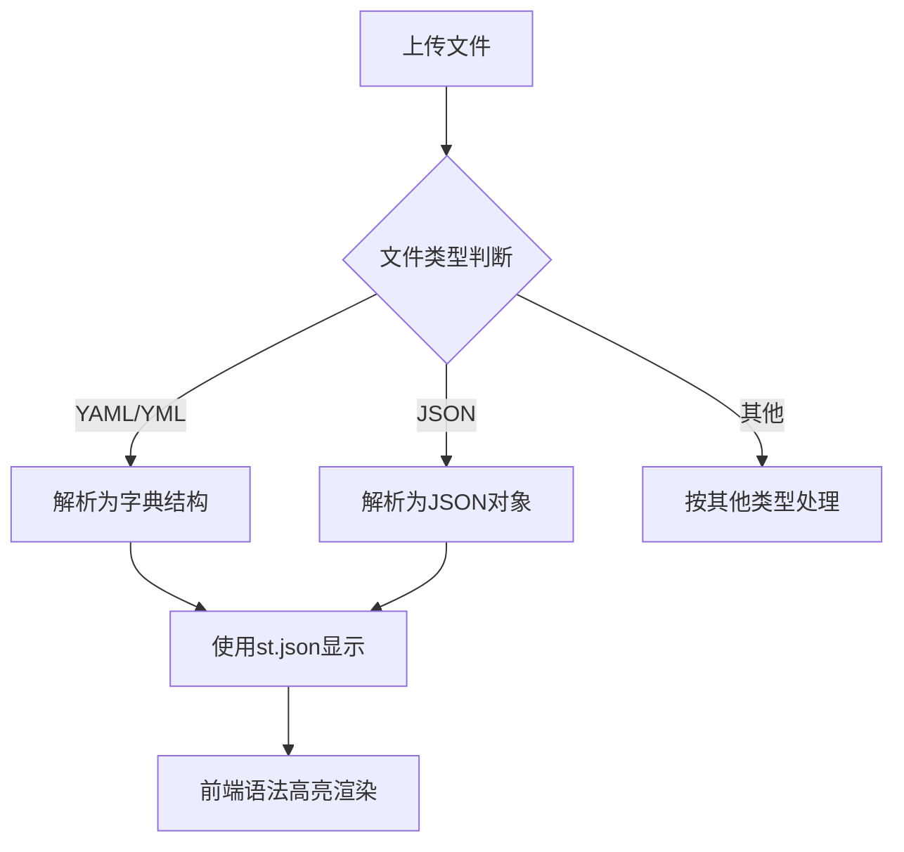
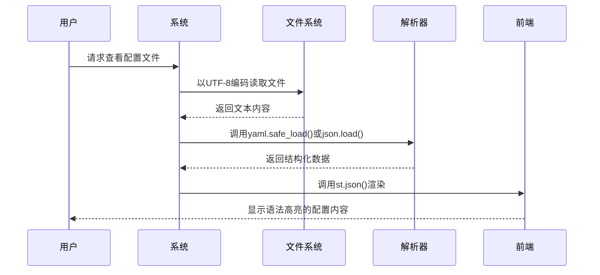
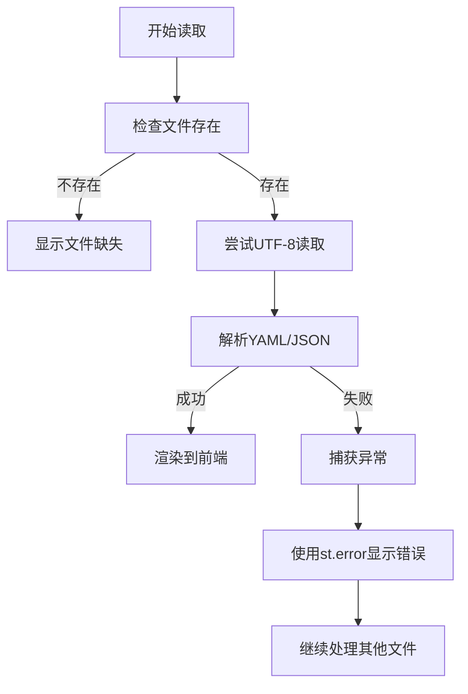

# 配置文件查看

<cite>
**本文档引用的文件**
- [main.py](file://src/main.py#L8-L9)
- [main.py](file://src/main.py#L653-L674)
- [main.py](file://src/main.py#L476-L477)
- [main.py](file://src/main.py#L610-L611)
- [main.py](file://src/main.py#L575-L799)
</cite>

## 目录
1. [功能概述](#功能概述)
2. [配置文件支持格式](#配置文件支持格式)
3. [文件解析逻辑](#文件解析逻辑)
4. [用户界面体验](#用户界面体验)
5. [异常处理与错误提示](#异常处理与错误提示)
6. [性能优化与建议](#性能优化与建议)

## 功能概述

本系统提供对YAML、JSON等文本型配置文件的安全读取与可视化查看功能。通过集成`yaml`和`json`模块，系统能够在Web界面中安全地解析并高亮显示结构化配置内容，支持缩进清晰呈现，便于用户快速理解复杂配置结构。

该功能主要服务于自动驾驶数据管理平台中的元数据与参数配置查看需求，确保研究人员和工程师能够直观浏览传感器配置、数据集描述等关键信息。

**Section sources**
- [main.py](file://src/main.py#L575-L799)

## 配置文件支持格式

系统支持以下配置文件格式：
- **YAML/YML**: 用于存储结构化配置，如传感器参数、算法设置
- **JSON**: 用于存储元数据、接口数据交换格式

在文件上传和可视化模块中，系统明确将`.yaml`、`.yml`、`.json`列为受支持的文件类型，并在前端界面中进行相应分类展示。

**Diagram sources**
- [main.py](file://src/main.py#L476-L477)
- [main.py](file://src/main.py#L610-L611)

## 文件解析逻辑

系统在`main.py`中实现了统一的配置文件解析流程，核心逻辑如下：

1. **字符编码处理**：所有文件均以`utf-8`编码打开，确保中文及特殊字符正确读取
2. **安全解析**：
   - YAML文件使用`yaml.safe_load()`防止执行任意代码
   - JSON文件使用标准`json.load()`进行解析
3. **格式验证**：通过异常捕获机制验证文件语法正确性
4. **结构转换**：将配置文件转换为Python字典或JSON对象，供前端展示

解析过程封装在`show_visualization_page()`函数中，针对不同文件类型进行分类处理。

**Diagram sources**
- [main.py](file://src/main.py#L658-L661)
- [main.py](file://src/main.py#L671-L674)

**Section sources**
- [main.py](file://src/main.py#L653-L674)

## 用户界面体验

系统通过Streamlit框架提供友好的配置文件查看体验：

- **可折叠节点**：使用`st.json()`自动实现JSON/YAML数据的树状展开与折叠
- **语法高亮**：内置语法着色，区分字符串、数字、布尔值等类型
- **只读模式**：所有配置文件以只读方式展示，防止意外修改
- **搜索功能**：浏览器原生支持页面内搜索（Ctrl+F），可快速定位配置项
- **结构清晰**：自动缩进显示层级关系，支持多层嵌套结构展开

在可视化页面中，YAML和JSON文件分别归类于"配置文件"和"JSON数据"子标题下，便于用户识别。

**Section sources**
- [main.py](file://src/main.py#L653-L674)

## 异常处理与错误提示

系统实现了完善的错误处理机制：

- **文件不存在**：检查`os.path.exists()`确保文件可访问
- **编码异常**：指定`utf-8`编码，避免乱码问题
- **语法错误**：捕获`yaml.YAMLError`或`json.JSONDecodeError`等异常
- **错误提示**：使用`st.error()`在前端显示红色警告信息

当配置文件解析失败时，系统不会崩溃，而是向用户展示清晰的错误信息，如"无法读取YAML文件: 语法错误"等。

**Diagram sources**
- [main.py](file://src/main.py#L656-L661)
- [main.py](file://src/main.py#L669-L674)

**Section sources**
- [main.py](file://src/main.py#L653-L674)

## 性能优化与建议

针对大配置文件可能引起的卡顿问题，提出以下优化方案：

1. **懒加载建议**：对于超大配置文件，可考虑分块读取或仅加载首部摘要
2. **预解析校验**：在上传时进行语法校验，避免无效配置进入系统
3. **缓存机制**：对频繁访问的配置文件建立内存缓存，减少重复解析开销
4. **限制大小**：设置上传文件大小上限，防止极端情况下的内存溢出
5. **异步加载**：未来可引入异步读取机制，避免阻塞主线程

当前系统已通过异常捕获和前端流式渲染保证基本稳定性，但对于超过10MB的配置文件建议拆分使用。

**Section sources**
- [main.py](file://src/main.py#L653-L674)