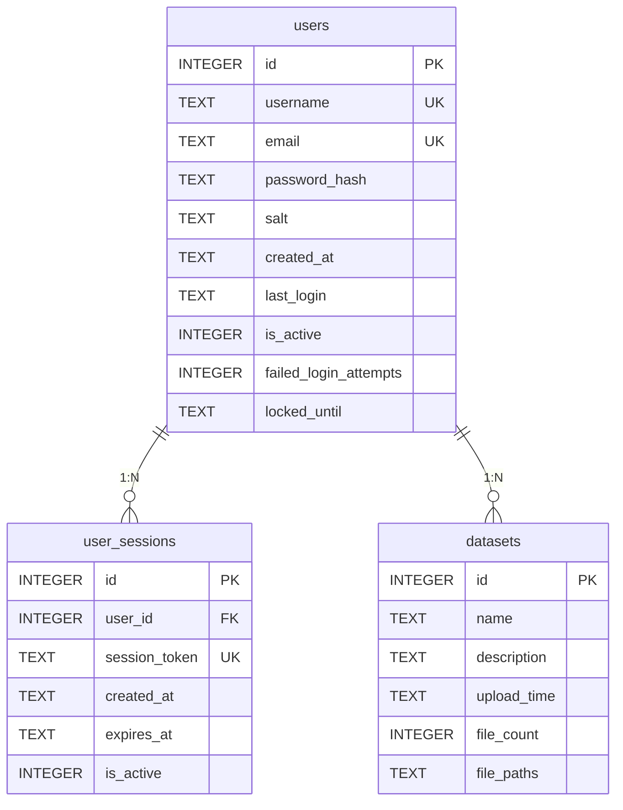
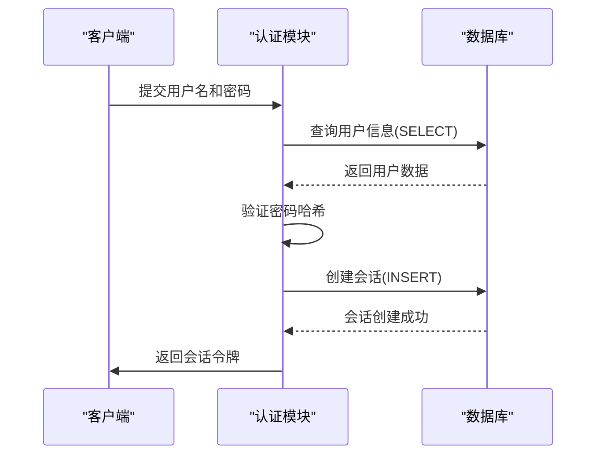

# 数据库设计

<cite>
**本文档引用的文件**
- [auth.py](file://src/auth.py#L46-L98)
- [main.py](file://src/main.py#L382-L418)
- [auth.py](file://src/auth.py#L38-L80)
- [main.py](file://src/main.py#L525-L557)
- [main.py](file://src/main.py#L494-L523)
- [auth.py](file://src/auth.py#L294-L341)
- [auth.py](file://src/auth.py#L246-L296)
- [auth.py](file://src/auth.py#L76-L116)
</cite>

## 目录
1. [引言](#引言)
2. [核心表结构](#核心表结构)
3. [表间关系与ER图](#表间关系与er图)
4. [数据库初始化函数](#数据库初始化函数)
5. [数据访问模式](#数据访问模式)
6. [业务规则与验证逻辑](#业务规则与验证逻辑)
7. [数据库管理建议](#数据库管理建议)
8. [结论](#结论)

## 引言
本文档详细描述了无人驾驶数据管理平台的SQLite数据库设计。系统采用三个核心表：`users`（用户信息）、`user_sessions`（用户会话）和`datasets`（数据集元数据），通过合理的结构设计和约束条件保障数据完整性与安全性。数据库支持用户认证、会话管理和多模态传感器数据存储等核心功能。

## 核心表结构

### users 表（用户信息）
存储平台用户的核心身份信息，包含密码哈希和安全控制字段。

**字段定义：**
- `id`: INTEGER，主键，自增
- `username`: TEXT，唯一且非空，用户名
- `email`: TEXT，唯一且非空，邮箱地址
- `password_hash`: TEXT，非空，PBKDF2-SHA256哈希值
- `salt`: TEXT，非空，密码加盐值
- `created_at`: TEXT，非空，创建时间（ISO格式）
- `last_login`: TEXT，最后登录时间
- `is_active`: INTEGER，默认值1，账户激活状态
- `failed_login_attempts`: INTEGER，默认值0，失败登录尝试次数
- `locked_until`: TEXT，账户锁定截止时间

**约束条件：**
- 主键：`id`
- 唯一性：`username`、`email`
- 非空：`username`、`email`、`password_hash`、`salt`、`created_at`

**业务规则：**
- 用户名长度3-20字符，仅允许字母、数字和下划线
- 邮箱需符合标准格式
- 密码至少6位，必须包含字母和数字

**Section sources**
- [auth.py](file://src/auth.py#L46-L98)

### user_sessions 表（用户会话）
管理用户会话状态，实现安全的登录会话控制。

**字段定义：**
- `id`: INTEGER，主键，自增
- `user_id`: INTEGER，非空，关联用户ID
- `session_token`: TEXT，唯一且非空，会话令牌
- `created_at`: TEXT，非空，创建时间
- `expires_at`: TEXT，非空，过期时间
- `is_active`: INTEGER，默认值1，会话激活状态

**约束条件：**
- 主键：`id`
- 唯一性：`session_token`
- 非空：`user_id`、`session_token`、`created_at`、`expires_at`
- 外键：`user_id` 引用 `users(id)`

**业务规则：**
- 会话有效期为24小时
- 每个用户仅允许一个活跃会话
- 过期会话自动失效

**Section sources**
- [auth.py](file://src/auth.py#L46-L98)

### datasets 表（数据集元数据）
存储上传数据集的元信息和文件路径列表。

**字段定义：**
- `id`: INTEGER，主键，自增
- `name`: TEXT，非空，数据集名称
- `description`: TEXT，数据集描述
- `upload_time`: TEXT，上传时间
- `file_count`: INTEGER，默认值0，文件数量
- `file_paths`: TEXT，文件路径列表（逗号分隔）

**约束条件：**
- 主键：`id`
- 非空：`name`

**业务规则：**
- 文件路径以逗号分隔存储
- 数据集按上传时间倒序排列
- 支持多种传感器数据格式

**Section sources**
- [main.py](file://src/main.py#L382-L418)

## 表间关系与ER图



**Diagram sources**
- [auth.py](file://src/auth.py#L46-L98)
- [main.py](file://src/main.py#L382-L418)

## 数据库初始化函数

### init_database 函数
初始化数据集管理数据库，创建 `datasets` 表。

**功能：**
- 连接 `data.db` 数据库
- 创建 `datasets` 表（若不存在）
- 定义字段结构和约束条件

**调用时机：**
- 应用程序启动时
- 每次页面加载时检查

**Section sources**
- [main.py](file://src/main.py#L382-L418)

### init_auth_database 函数
初始化用户认证数据库，创建 `users` 和 `user_sessions` 表，并创建默认管理员账户。

**功能：**
- 连接 `data.db` 数据库
- 创建 `users` 表（若不存在）
- 创建 `user_sessions` 表（若不存在）
- 检查并创建默认管理员账户（用户名：admin，密码：admin123）

**安全特性：**
- 密码使用 PBKDF2-SHA256 哈希算法
- 每个用户使用独立的随机盐值
- 默认管理员账户仅在首次初始化时创建

**Section sources**
- [auth.py](file://src/auth.py#L46-L98)

## 数据访问模式

### 用户认证联合查询
用户登录时执行的联合查询，验证会话有效性。



**Diagram sources**
- [auth.py](file://src/auth.py#L294-L341)

### 数据集检索排序逻辑
数据浏览页面的数据集检索和排序逻辑。

**查询语句：**
```sql
SELECT * FROM datasets ORDER BY upload_time DESC
```

**功能特点：**
- 按上传时间倒序排列
- 支持按名称搜索
- 显示数据集基本信息和文件列表
- 提供分页和筛选功能

**数据处理流程：**
1. 从数据库获取所有数据集
2. 按上传时间降序排序
3. 应用搜索过滤条件
4. 渲染数据集列表

**Section sources**
- [main.py](file://src/main.py#L525-L557)

## 业务规则与验证逻辑

### 输入验证规则
系统实施严格的输入验证，防止无效数据和安全漏洞。

**用户名验证：**
- 长度：3-20字符
- 字符：仅允许字母、数字和下划线
- 唯一性：数据库级别唯一约束

**邮箱验证：**
- 格式：符合标准邮箱正则表达式
- 唯一性：数据库级别唯一约束

**密码验证：**
- 长度：至少6位
- 复杂度：必须包含字母和数字
- 存储：PBKDF2-SHA256哈希+盐值

**Section sources**
- [auth.py](file://src/auth.py#L76-L116)

### 安全控制机制
实现多层次的安全控制，保护用户账户安全。

**登录失败处理：**
- 记录失败尝试次数
- 超过5次锁定账户1小时
- 锁定状态存储在数据库中

**会话管理：**
- 会话令牌使用 `secrets.token_urlsafe(32)` 生成
- 每个用户仅允许一个活跃会话
- 会话过期自动失效
- 提供显式注销功能

**Section sources**
- [auth.py](file://src/auth.py#L246-L296)

## 数据库管理建议

### 数据库迁移策略
建议采用版本化迁移脚本管理数据库结构变更。

**最佳实践：**
- 为每次结构变更创建迁移脚本
- 使用 `CREATE TABLE IF NOT EXISTS` 确保兼容性
- 备份数据后再执行迁移
- 测试迁移脚本的回滚能力

### 数据备份方案
实施定期自动备份策略，防止数据丢失。

**推荐方案：**
- 每日自动备份 `data.db` 文件
- 保留最近7天的备份
- 将备份文件存储在独立位置
- 定期验证备份文件的完整性

### 性能调优建议
针对数据库查询进行性能优化。

**优化措施：**
- 为 `datasets.upload_time` 添加索引
- 为 `users.username` 和 `users.email` 添加索引
- 使用连接池管理数据库连接
- 对大数据集查询实施分页
- 定期分析和优化数据库

## 结论
本数据库设计通过合理的表结构、约束条件和业务规则，为无人驾驶数据管理平台提供了可靠的数据存储基础。`users`、`user_sessions` 和 `datasets` 三张核心表有效支持了用户认证、会话管理和数据集管理等关键功能。建议在后续开发中持续优化数据库性能，并加强数据备份和迁移管理，确保系统的稳定性和可维护性。