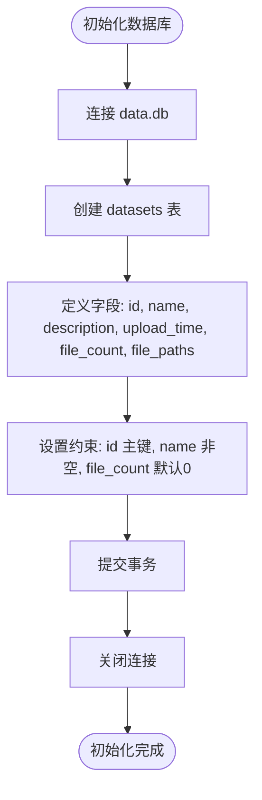
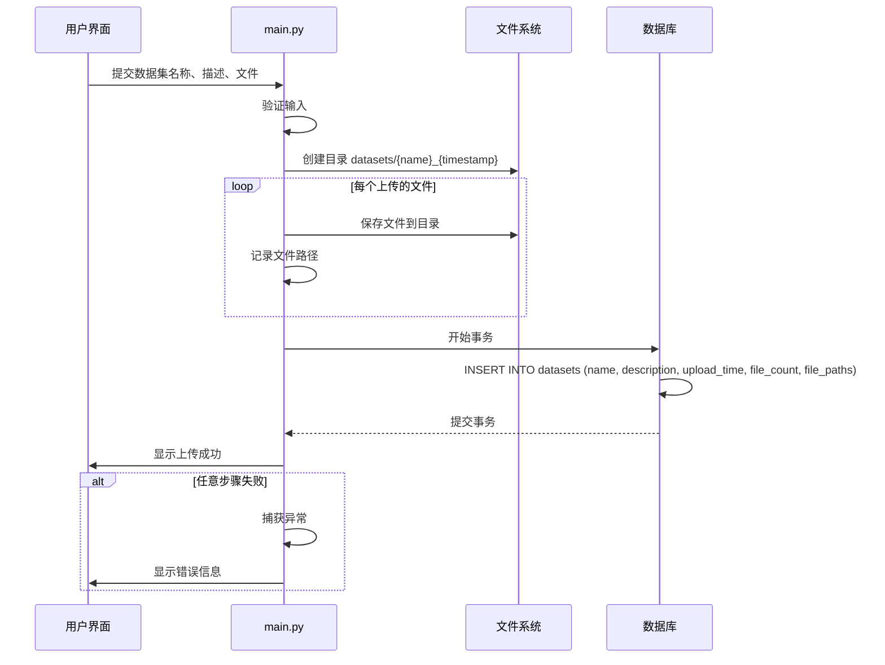

# 数据集表 (datasets)

<cite>
**本文档中引用的文件**  
- [main.py](file://src/main.py)
- [test_basic.py](file://test/test_basic.py)
</cite>

## 目录
1. [简介](#简介)
2. [数据集表结构](#数据集表结构)
3. [file_paths字段设计与处理逻辑](#file_paths字段设计与处理逻辑)
4. [数据库初始化](#数据库初始化)
5. [数据访问模式](#数据访问模式)
6. [数据上传事务与一致性机制](#数据上传事务与一致性机制)
7. [数据完整性与性能优化建议](#数据完整性与性能优化建议)

## 简介
本项目为无人驾驶数据管理平台，提供数据上传、浏览、可视化等功能。核心数据结构为`datasets`表，用于存储用户上传的数据集元信息，包括名称、描述、上传时间、文件数量及文件路径列表。该表是平台数据管理的中枢，支撑数据浏览、可视化和删除等关键功能。

## 数据集表结构
`datasets`表定义了数据集的核心元数据，其结构如下：

| 字段名 | 类型 | 约束 | 说明 |
|--------|------|------|------|
| id | INTEGER | PRIMARY KEY AUTOINCREMENT | 数据集唯一标识符 |
| name | TEXT | NOT NULL | 数据集名称 |
| description | TEXT | - | 数据集描述信息 |
| upload_time | TEXT | - | 文件上传时间，ISO格式字符串 |
| file_count | INTEGER | DEFAULT 0 | 关联文件数量 |
| file_paths | TEXT | - | 文件路径列表，逗号分隔的字符串 |

该表通过`id`字段作为主键，确保每条记录的唯一性。`name`字段非空，保证数据集具有可识别的名称。`upload_time`以文本形式存储ISO格式时间戳，便于排序和展示。`file_count`和`file_paths`共同维护了数据集与物理文件的映射关系。

**Section sources**
- [main.py](file://src/main.py#L382-L418)
- [test_basic.py](file://test/test_basic.py#L0-L37)

## file_paths字段设计与处理逻辑
`file_paths`字段采用逗号分隔的字符串存储所有文件的相对路径，如`datasets/点云数据集_20240101_120000/point1.pcd,datasets/点云数据集_20240101_120000/image1.png`。

### 设计决策
- **简化存储**：避免使用关联表，减少数据库复杂度。
- **高效读取**：单次查询即可获取所有文件路径，适用于读多写少的场景。
- **灵活性**：支持任意数量的文件，无需预定义列数。

### 处理逻辑
- **上传时**：文件保存后，其完整路径被加入`file_paths`列表，并以逗号连接成字符串存入数据库。
- **删除时**：根据`file_paths`字段解析出所有路径，逐一删除物理文件，并在最后删除空目录。

此设计在保证功能完整性的前提下，最大限度地降低了系统复杂性。

**Section sources**
- [main.py](file://src/main.py#L494-L523)
- [main.py](file://src/main.py#L715-L744)

## 数据库初始化
`init_database`函数负责创建`datasets`表。该函数在应用启动时被调用，确保数据库结构就绪。



**Diagram sources**
- [main.py](file://src/main.py#L382-L418)

**Section sources**
- [main.py](file://src/main.py#L382-L418)

## 数据访问模式
系统根据不同页面需求，采用特定的查询模式访问`datasets`表。

### 浏览页面：按上传时间排序
在`show_browse_page`中，系统执行以下查询：
```sql
SELECT * FROM datasets ORDER BY upload_time DESC
```
此查询按上传时间降序排列所有数据集，确保最新上传的数据集优先展示，符合用户浏览习惯。

### 可视化页面：按ID查询文件路径
在`show_visualization_page`中，当用户选择一个数据集时，系统执行：
```sql
SELECT file_paths FROM datasets WHERE id = ?
```
获取该数据集的所有文件路径，随后按文件类型（图像、CSV、YAML、PCD等）分类处理，为后续的可视化做准备。

**Section sources**
- [main.py](file://src/main.py#L525-L557)
- [main.py](file://src/main.py#L575-L611)

## 数据上传事务与一致性机制
数据上传是一个涉及文件系统和数据库的复合操作，系统通过以下流程保证一致性：



**Diagram sources**
- [main.py](file://src/main.py#L464-L523)

**Section sources**
- [main.py](file://src/main.py#L464-L523)

## 数据完整性与性能优化建议

### 数据完整性保障
- **原子性操作**：文件保存和数据库插入应在同一逻辑单元内完成，避免出现“有文件无记录”或“有记录无文件”的情况。
- **删除时的级联清理**：`delete_dataset`函数先删除物理文件，再删除数据库记录，确保不会留下孤立文件。
- **路径验证**：在访问文件前，应检查`os.path.exists(file_path)`，避免因文件缺失导致程序崩溃。

### 性能优化方案
- **索引优化**：对`upload_time`字段建立索引，可显著提升`ORDER BY upload_time DESC`查询的性能。
  ```sql
  CREATE INDEX idx_upload_time ON datasets(upload_time DESC);
  ```
- **查询优化**：在仅需`id`和`name`的场景（如可视化页面下拉框），使用`SELECT id, name FROM datasets`而非`SELECT *`，减少数据传输量。
- **文件路径缓存**：对于频繁访问的文件路径，可在应用层缓存解析结果，避免重复的字符串分割操作。

**Section sources**
- [main.py](file://src/main.py#L525-L557)
- [main.py](file://src/main.py#L575-L611)