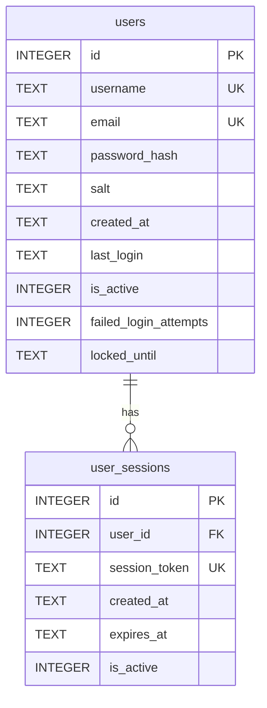
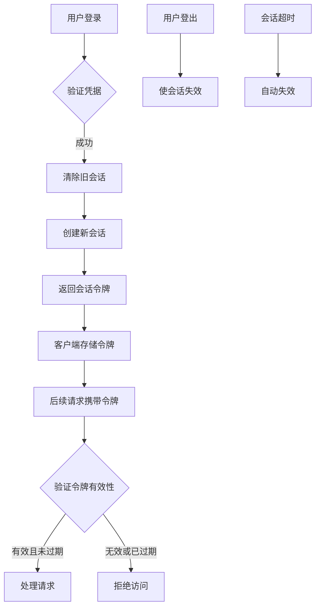
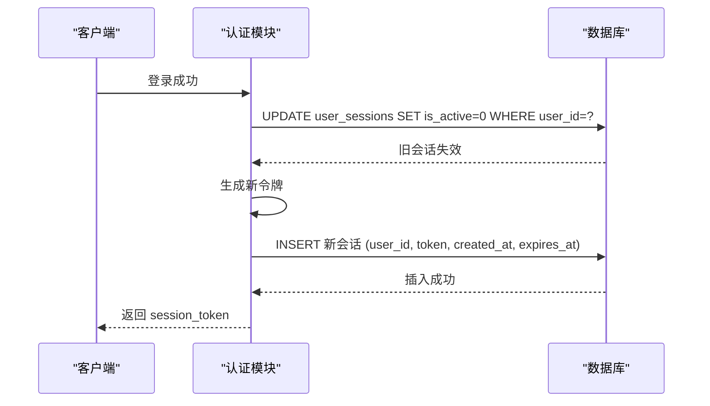
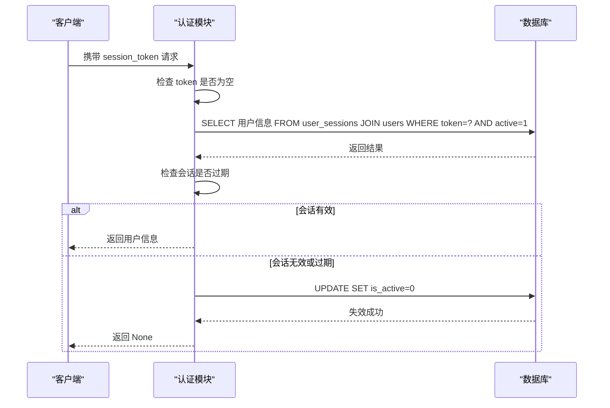

# 用户会话表 (user_sessions)

<cite>
**本文档引用的文件**
- [auth.py](file://src/auth.py#L38-L80)
- [auth.py](file://src/auth.py#L254-L283)
- [auth.py](file://src/auth.py#L285-L317)
- [auth.py](file://src/auth.py#L319-L331)
</cite>

## 目录
1. [简介](#简介)
2. [用户会话表结构](#用户会话表结构)
3. [表间关系与外键约束](#表间关系与外键约束)
4. [会话令牌生成与有效期](#会话令牌生成与有效期)
5. [会话管理流程](#会话管理流程)
6. [核心函数实现细节](#核心函数实现细节)
7. [会话失效机制](#会话失效机制)
8. [会话安全最佳实践](#会话安全最佳实践)
9. [结论](#结论)

## 简介
本项目中的 `user_sessions` 表用于管理用户登录后的会话状态，确保系统安全性和用户身份的持续验证。该表与 `users` 表紧密关联，通过会话令牌（session token）实现无状态的身份验证机制。本文档详细描述该表的结构、行为逻辑、关键函数实现以及安全建议。

## 用户会话表结构
`user_sessions` 表存储所有活跃和非活跃的用户会话信息。其字段定义如下：

| 字段名 | 数据类型 | 是否为空 | 约束 | 说明 |
|--------|--------|--------|------|------|
| id | INTEGER | 否 | PRIMARY KEY, AUTOINCREMENT | 会话记录的唯一标识符 |
| user_id | INTEGER | 否 | NOT NULL | 关联到 `users.id` 的外键 |
| session_token | TEXT | 否 | UNIQUE, NOT NULL | 唯一的会话令牌，用于身份验证 |
| created_at | TEXT | 否 | NOT NULL | 会话创建时间（ISO 8601 格式） |
| expires_at | TEXT | 否 | NOT NULL | 会话过期时间（ISO 8601 格式） |
| is_active | INTEGER | 是 | DEFAULT 1 | 会话状态（1=活跃，0=已失效） |

**Section sources**
- [auth.py](file://src/auth.py#L38-L80)

## 表间关系与外键约束
`user_sessions` 表通过 `user_id` 字段与 `users` 表建立外键关系，确保每个会话都对应一个有效的用户账户。



**Diagram sources**
- [auth.py](file://src/auth.py#L38-L80)

该外键约束定义为：
```sql
FOREIGN KEY (user_id) REFERENCES users (id)
```
此约束确保无法为不存在的用户创建会话，维护了数据的完整性。

**Section sources**
- [auth.py](file://src/auth.py#L38-L80)

## 会话令牌生成与有效期
会话令牌使用 Python 的 `secrets` 模块生成，以确保密码学安全性。

- **生成方式**：`secrets.token_urlsafe(32)` 生成一个 32 字节的随机字节序列，并编码为 URL 安全的 Base64 字符串。
- **长度**：生成的令牌长度约为 43-44 个字符，具有极高的熵值，难以被猜测。
- **有效期**：会话有效期由常量 `SESSION_TIMEOUT_HOURS = 24` 定义，即 24 小时。

```python
session_token = secrets.token_urlsafe(32)
expires_at = datetime.now() + timedelta(hours=SESSION_TIMEOUT_HOURS)  # 24小时
```

**Section sources**
- [auth.py](file://src/auth.py#L42)
- [auth.py](file://src/auth.py#L256-L257)

## 会话管理流程
用户会话的完整生命周期包括创建、验证和失效三个阶段。



**Diagram sources**
- [auth.py](file://src/auth.py#L254-L283)
- [auth.py](file://src/auth.py#L285-L317)

**Section sources**
- [auth.py](file://src/auth.py#L254-L331)

## 核心函数实现细节
### create_user_session 函数
该函数在用户成功登录后调用，负责创建新的会话并使旧会话失效。



**Diagram sources**
- [auth.py](file://src/auth.py#L254-L283)

### verify_session 函数
该函数在每次需要身份验证的请求中调用，用于验证会话令牌的有效性。



**Diagram sources**
- [auth.py](file://src/auth.py#L285-L317)

**Section sources**
- [auth.py](file://src/auth.py#L254-L317)

## 会话失效机制
会话在以下两种情况下会被标记为失效（`is_active = 0`）：

### 用户主动登出
当用户点击“退出登录”按钮时，调用 `logout_user()` 函数，该函数内部调用 `invalidate_session()`。

```python
def logout_user():
    if 'session_token' in st.session_state:
        invalidate_session(st.session_state.session_token)
    # 清除本地状态
```

### 会话超时
在 `verify_session()` 函数中，会检查当前时间是否超过 `expires_at`。如果会话已过期，则自动调用 `invalidate_session()` 使其失效。

```python
if datetime.now() > datetime.fromisoformat(expires_at):
    invalidate_session(session_token)
    return None
```

**Section sources**
- [auth.py](file://src/auth.py#L319-L331)
- [auth.py](file://src/auth.py#L285-L317)

## 会话安全最佳实践
为确保会话系统的安全性，建议遵循以下最佳实践：

1. **防止会话固定攻击（Session Fixation）**  
   在 `create_user_session` 中，每次登录都会先清除该用户的所有旧会话，有效防止攻击者预先设置会话 ID。

2. **定期清理过期会话**  
   虽然当前系统通过 `is_active` 标记失效会话，但建议定期运行清理任务删除 `expires_at < NOW()` 且 `is_active = 0` 的记录，以减少数据库膨胀。

3. **HTTPS 传输**  
   所有包含会话令牌的请求必须通过 HTTPS 传输，防止中间人攻击窃取令牌。

4. **安全的令牌存储**  
   客户端应将会话令牌存储在 `HttpOnly` 和 `Secure` 标记的 Cookie 中，防止 XSS 攻击窃取。

5. **合理的会话超时时间**  
   24 小时的会话有效期适用于大多数场景，但对于敏感操作，建议引入短期令牌或二次验证。

6. **监控异常登录行为**  
   结合 `users` 表中的 `failed_login_attempts` 和 `locked_until` 字段，可有效防止暴力破解。

**Section sources**
- [auth.py](file://src/auth.py#L254-L331)

## 结论
`user_sessions` 表是本系统用户认证机制的核心组成部分。它通过安全的令牌生成、严格的外键约束、自动化的过期检查和主动的失效机制，构建了一个可靠且安全的会话管理体系。开发者在使用时应遵循安全最佳实践，确保用户身份信息不被滥用。