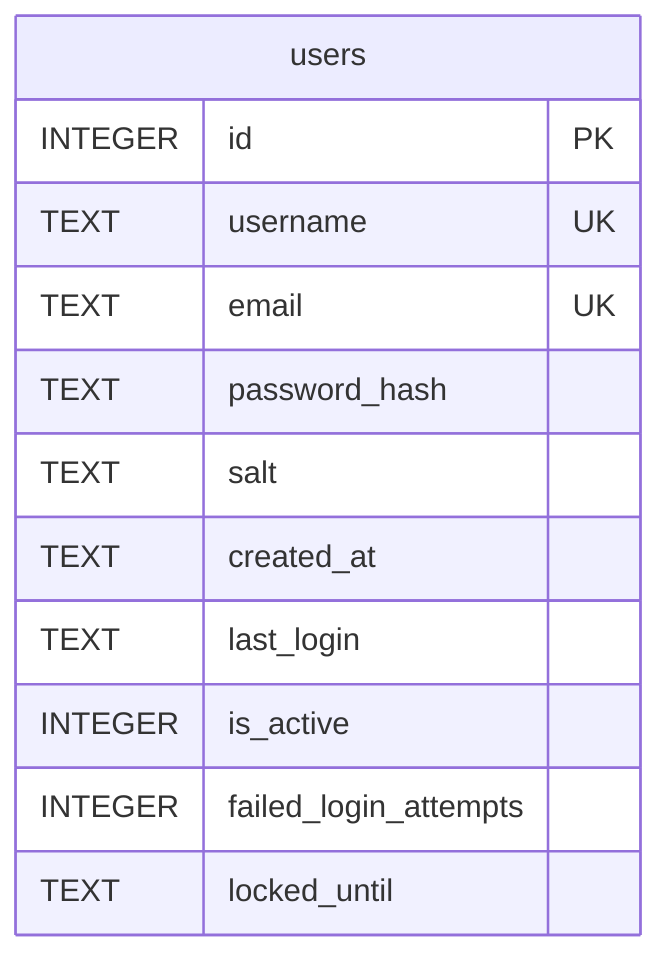
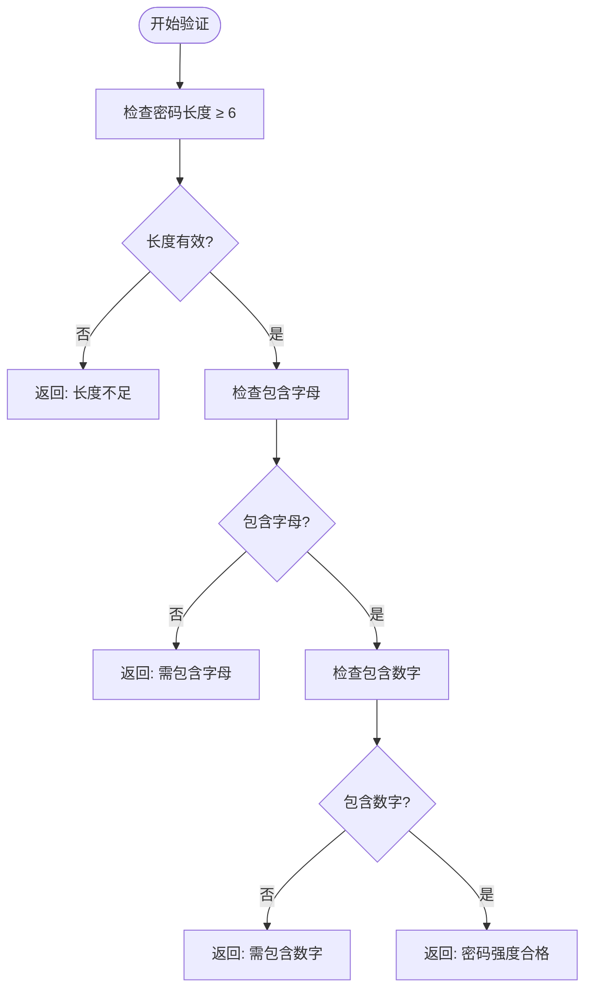
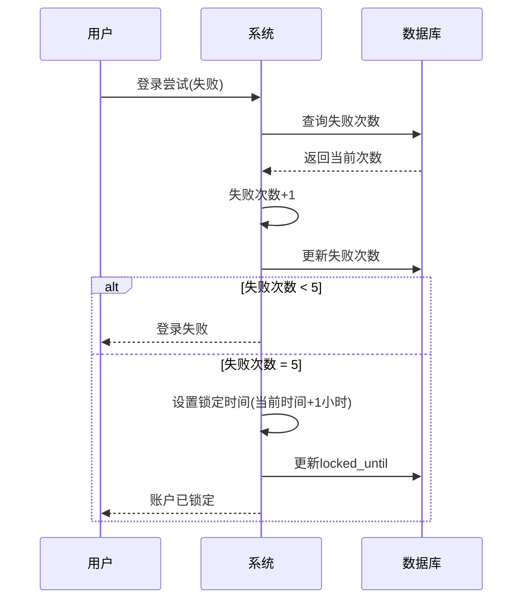
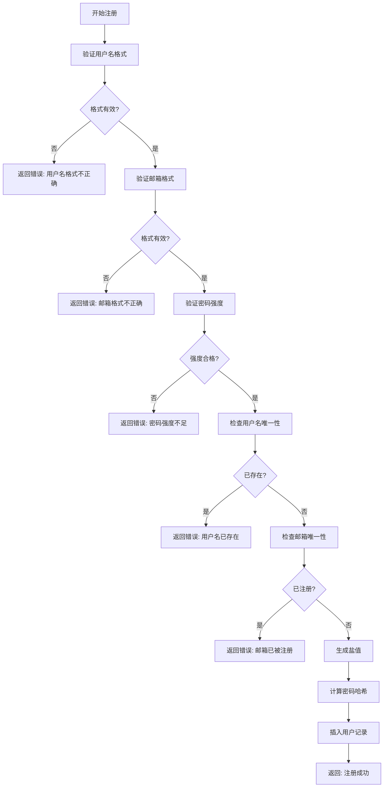

# 用户表 (users)

<cite>
**本文档引用的文件**
- [auth.py](file://src/auth.py#L38-L80)
- [auth.py](file://src/auth.py#L76-L116)
- [auth.py](file://src/auth.py#L114-L159)
- [auth.py](file://src/auth.py#L155-L205)
- [auth.py](file://src/auth.py#L203-L250)
- [auth.py](file://src/auth.py#L294-L341)
- [auth.py](file://src/auth.py#L338-L387)
- [test_auth.py](file://test/test_auth.py#L46-L80)
- [test_auth.py](file://test/test_auth.py#L77-L108)
- [demo_login.py](file://src/demo_login.py#L80-L112)
</cite>

## 目录
1. [用户表结构](#用户表结构)
2. [字段详细说明](#字段详细说明)
3. [约束条件](#约束条件)
4. [密码强度验证规则](#密码强度验证规则)
5. [账户锁定机制](#账户锁定机制)
6. [数据库初始化](#数据库初始化)
7. [用户注册流程](#用户注册流程)
8. [默认管理员账户](#默认管理员账户)
9. [安全最佳实践](#安全最佳实践)

## 用户表结构

用户表 `users` 是系统认证模块的核心数据表，用于存储用户账户信息。该表通过 `init_auth_database` 函数在系统初始化时创建。



**图表来源**
- [auth.py](file://src/auth.py#L38-L80)

## 字段详细说明

| 字段名 | 数据类型 | 是否为空 | 默认值 | 说明 |
|--------|---------|---------|--------|------|
| id | INTEGER | NOT NULL | AUTOINCREMENT | 主键，自增唯一标识 |
| username | TEXT | NOT NULL | - | 用户名，3-20字符，字母数字下划线 |
| email | TEXT | NOT NULL | - | 邮箱地址，符合标准邮箱格式 |
| password_hash | TEXT | NOT NULL | - | PBKDF2-SHA256哈希值 |
| salt | TEXT | NOT NULL | - | 随机生成的盐值，32字节十六进制 |
| created_at | TEXT | NOT NULL | - | 账户创建时间，ISO格式 |
| last_login | TEXT | NULL | - | 最后登录时间，ISO格式 |
| is_active | INTEGER | NOT NULL | 1 | 账户状态（1=激活，0=禁用） |
| failed_login_attempts | INTEGER | NOT NULL | 0 | 连续登录失败次数 |
| locked_until | TEXT | NULL | - | 账户锁定截止时间，ISO格式 |

**本节来源**
- [auth.py](file://src/auth.py#L38-L80)
- [auth.py](file://src/auth.py#L203-L250)

## 约束条件

### 唯一性约束
- **用户名唯一性**：`username` 字段具有唯一性约束（UNIQUE），确保系统中不存在重复用户名
- **邮箱唯一性**：`email` 字段具有唯一性约束（UNIQUE），防止同一邮箱被多个账户使用

### 数据完整性约束
- **非空约束**：`id`、`username`、`email`、`password_hash`、`salt`、`created_at` 字段均设置为 NOT NULL
- **状态约束**：`is_active` 字段为整数类型，仅接受 0 或 1 值
- **计数约束**：`failed_login_attempts` 字段存储非负整数

**本节来源**
- [auth.py](file://src/auth.py#L38-L80)
- [auth.py](file://src/auth.py#L338-L387)

## 密码强度验证规则

系统对用户密码实施严格的安全验证，确保密码强度符合安全要求：

- **长度要求**：密码长度至少为 6 位
- **字符要求**：必须同时包含字母和数字
- **验证逻辑**：
  - 检查密码长度是否满足最小长度要求
  - 验证密码中是否包含至少一个字母字符
  - 验证密码中是否包含至少一个数字字符



**图表来源**
- [auth.py](file://src/auth.py#L114-L159)

## 账户锁定机制

系统实施账户锁定机制以防止暴力破解攻击：

- **触发条件**：连续 5 次登录失败
- **锁定时长**：1 小时
- **状态字段**：`failed_login_attempts` 和 `locked_until`
- **解锁机制**：达到锁定时间后自动解锁



**图表来源**
- [auth.py](file://src/auth.py#L155-L205)
- [auth.py](file://src/auth.py#L203-L250)

## 数据库初始化

`init_auth_database` 函数负责初始化用户认证数据库，创建必要的数据表：

```python
def init_auth_database():
    """初始化用户认证数据库"""
    conn = sqlite3.connect('data.db')
    c = conn.cursor()
    
    # 创建用户表
    c.execute('''
        CREATE TABLE IF NOT EXISTS users (
            id INTEGER PRIMARY KEY AUTOINCREMENT,
            username TEXT UNIQUE NOT NULL,
            email TEXT UNIQUE NOT NULL,
            password_hash TEXT NOT NULL,
            salt TEXT NOT NULL,
            created_at TEXT NOT NULL,
            last_login TEXT,
            is_active INTEGER DEFAULT 1,
            failed_login_attempts INTEGER DEFAULT 0,
            locked_until TEXT
        )
    ''')
```

该函数还同时创建会话表 `user_sessions` 用于管理用户会话状态。

**本节来源**
- [auth.py](file://src/auth.py#L38-L80)

## 用户注册流程

新用户注册时，系统执行以下验证和处理流程：

1. 验证用户名格式（3-20位，字母数字下划线）
2. 验证邮箱格式（标准邮箱正则表达式）
3. 验证密码强度（至少6位，包含字母和数字）
4. 检查用户名是否已存在
5. 检查邮箱是否已被注册
6. 生成随机盐值
7. 计算密码哈希值
8. 插入新用户记录



**本节来源**
- [auth.py](file://src/auth.py#L338-L387)
- [demo_login.py](file://src/demo_login.py#L80-L112)

## 默认管理员账户

系统在首次初始化时自动创建默认管理员账户：

- **用户名**：admin
- **密码**：admin123
- **邮箱**：admin@platform.com

创建逻辑：
1. 检查是否存在用户名为 'admin' 的用户
2. 如果不存在，则创建默认管理员账户
3. 使用 PBKDF2-SHA256 算法对密码进行哈希处理
4. 生成随机盐值
5. 记录账户创建时间

```python
# 创建默认管理员账户
c.execute("SELECT COUNT(*) FROM users WHERE username = 'admin'")
if c.fetchone()[0] == 0:
    admin_salt = secrets.token_hex(32)
    admin_password_hash = hash_password("admin123", admin_salt)
    
    c.execute('''
        INSERT INTO users (username, email, password_hash, salt, created_at)
        VALUES (?, ?, ?, ?, ?)
    ''', (
        'admin',
        'admin@platform.com',
        admin_password_hash,
        admin_salt,
        datetime.now().isoformat()
    ))
```

**本节来源**
- [auth.py](file://src/auth.py#L76-L116)
- [test_auth.py](file://test/test_auth.py#L46-L80)

## 安全最佳实践

### 密码哈希处理
- 使用 PBKDF2-SHA256 算法进行密码哈希
- 采用 100,000 次迭代增强安全性
- 为每个用户生成唯一的随机盐值（32字节十六进制）

```python
def hash_password(password: str, salt: str) -> str:
    """对密码进行哈希处理"""
    return hashlib.pbkdf2_hmac('sha256', password.encode('utf-8'), salt.encode('utf-8'), 100000).hex()
```

### 会话管理
- 会话令牌使用 `secrets.token_urlsafe(32)` 生成
- 会话有效期为 24 小时（可配置）
- 每次登录时清除用户之前的活跃会话
- 会话过期后自动失效
- 提供显式注销功能清除会话

### 其他安全措施
- 所有时间戳使用 ISO 格式存储
- 敏感操作（如密码验证）在服务端完成
- 输入数据进行严格验证和清理
- 错误信息不泄露敏感细节
- 建议首次使用后修改默认管理员密码

**本节来源**
- [auth.py](file://src/auth.py#L246-L296)
- [auth.py](file://src/auth.py#L294-L341)
- [auth.py](file://src/auth.py#L76-L116)