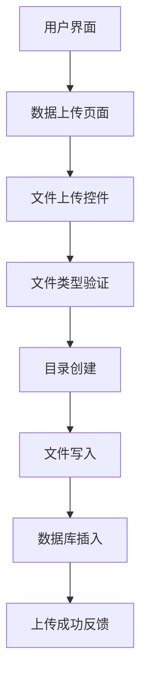
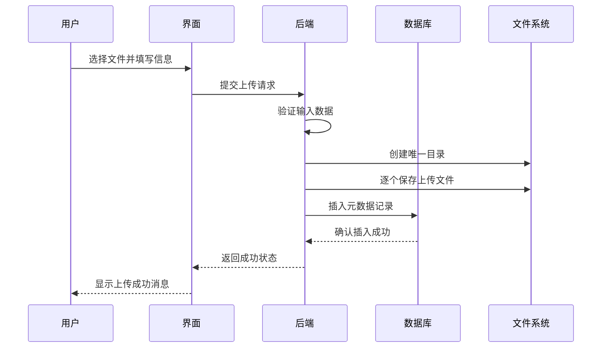
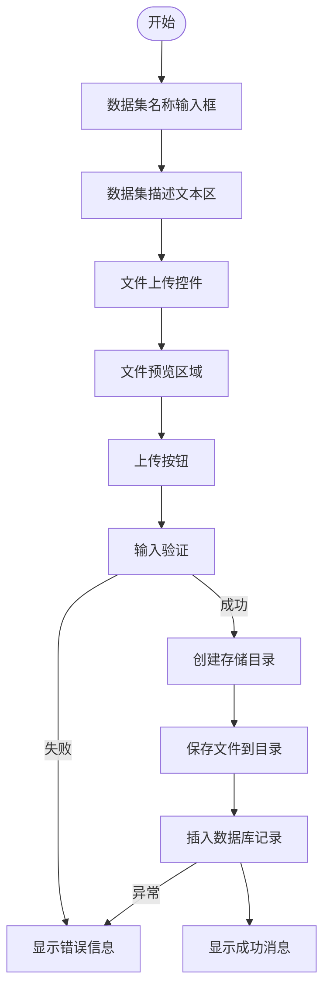
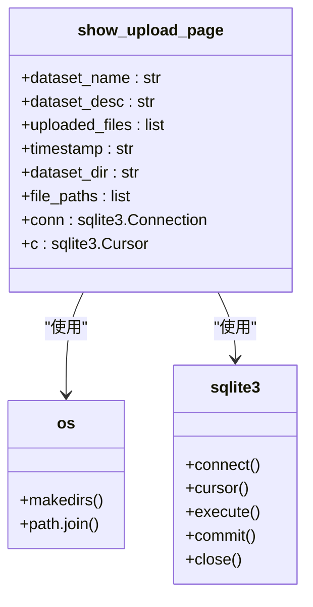
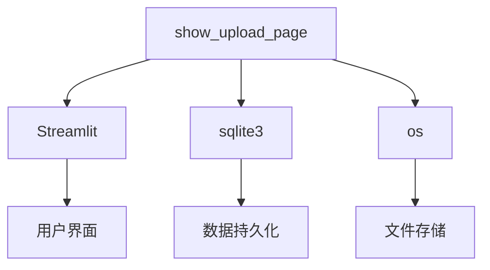

# 数据上传功能

<cite>
**本文档引用的文件**
- [main.py](file://src/main.py)
- [auth.py](file://src/auth.py)
</cite>

## 目录
1. [简介](#简介)
2. [项目结构](#项目结构)
3. [核心组件](#核心组件)
4. [架构概述](#架构概述)
5. [详细组件分析](#详细组件分析)
6. [依赖分析](#依赖分析)
7. [性能考虑](#性能考虑)
8. [故障排除指南](#故障排除指南)
9. [结论](#结论)

## 简介
本文档详细阐述了无人驾驶数据管理平台中数据上传功能的实现机制。该功能允许用户通过Web界面上传多模态传感器数据，包括激光雷达、摄像头、GPS、IMU等数据类型。系统支持多种文件格式如.bag、.pcd、.png、.jpg、.yaml、.yml、.csv和.json。上传的数据集被保存在服务器端的datasets/目录下，并将元数据（名称、描述、上传时间、文件路径列表）存入SQLite数据库中进行持久化管理。

## 项目结构
平台采用模块化设计，主要功能集中在src目录下。数据上传功能的核心逻辑位于main.py文件中，通过Streamlit框架构建用户界面。系统使用SQLite作为轻量级数据库存储数据集元数据，文件实际存储在本地文件系统的datasets/目录中。配置文件和依赖管理分别由pyproject.toml和requirements.txt维护。

**图示来源**
- [main.py](file://src/main.py#L464-L523)

**本节来源**
- [main.py](file://src/main.py#L1-L806)

## 核心组件
数据上传功能涉及多个核心组件的协同工作：show_upload_page函数负责渲染上传界面并处理用户输入；os模块用于文件系统操作，包括目录创建和文件写入；sqlite3模块负责与数据库交互，存储元数据；Streamlit组件提供用户界面元素如文本输入、文件上传器和按钮。

**本节来源**
- [main.py](file://src/main.py#L464-L523)

## 架构概述
系统采用前后端分离的架构模式，前端由Streamlit动态生成HTML界面，后端处理文件上传和数据存储逻辑。当用户提交数据集时，系统首先验证必填字段，然后创建以数据集名称和时间戳命名的唯一目录，将所有上传文件保存到该目录中，最后将元数据插入SQLite数据库的datasets表中。

**图示来源**
- [main.py](file://src/main.py#L464-L523)
- [main.py](file://src/main.py#L382-L418)

## 详细组件分析

### 数据上传页面分析
show_upload_page函数实现了完整的文件上传流程，从用户界面交互到服务器端存储的全过程。

#### 用户界面组件

**图示来源**
- [main.py](file://src/main.py#L464-L523)

#### 文件上传逻辑

**图示来源**
- [main.py](file://src/main.py#L464-L523)

**本节来源**
- [main.py](file://src/main.py#L464-L523)

## 依赖分析
数据上传功能依赖于多个Python库和系统组件。Streamlit提供Web界面和交互功能，sqlite3实现数据库操作，os模块处理文件系统操作。这些依赖关系确保了功能的完整性和稳定性。

**图示来源**
- [main.py](file://src/main.py#L464-L523)

**本节来源**
- [main.py](file://src/main.py#L1-L806)
- [auth.py](file://src/auth.py#L1-L98)

## 性能考虑
系统在设计时考虑了文件上传的性能和可靠性。通过使用with语句确保文件操作的原子性，采用事务处理保证数据库写入的完整性。对于大文件上传，系统使用分块写入方式避免内存溢出。目录命名策略结合数据集名称和时间戳，既保证了唯一性又便于后续检索。

## 故障排除指南
常见问题包括文件上传失败、数据库插入错误和目录创建权限问题。系统通过try-catch机制捕获异常并提供友好的错误提示。上传失败时会显示具体错误信息，帮助用户快速定位问题。数据库连接失败通常与data.db文件权限或路径有关，需要检查文件系统权限设置。

**本节来源**
- [main.py](file://src/main.py#L497-L523)

## 结论
数据上传功能实现了从用户界面到服务器存储的完整数据管道，具有良好的用户体验和可靠的数据管理能力。系统设计考虑了扩展性，可通过修改文件类型列表轻松支持新格式。建议未来增加上传进度显示、断点续传和并发上传控制等高级功能以进一步提升用户体验。