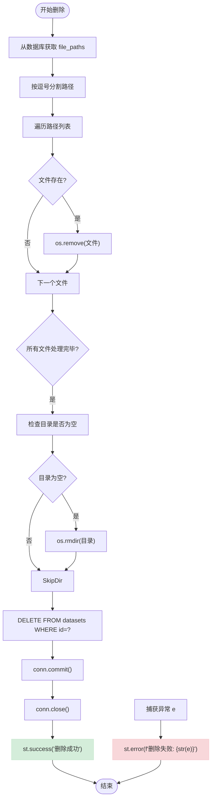
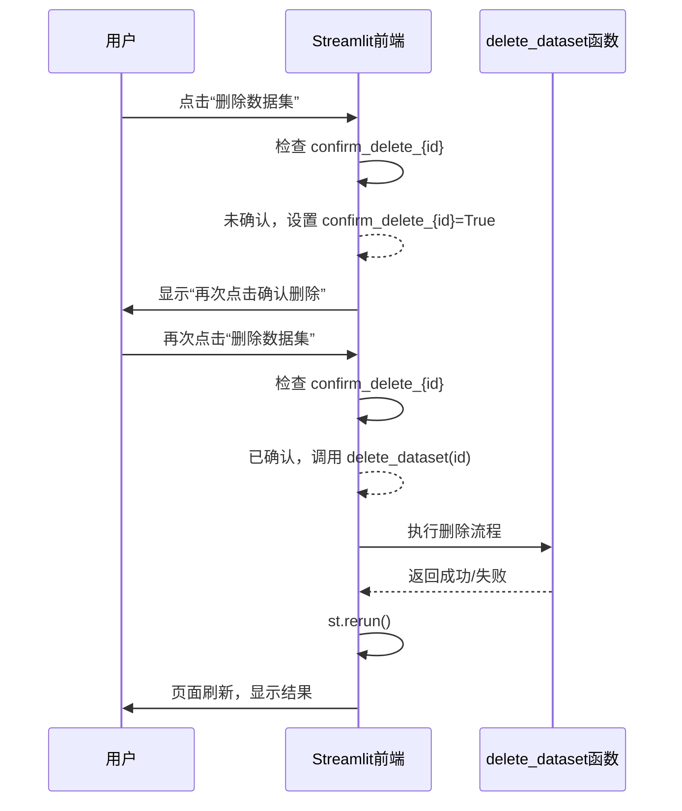

# 数据删除功能

<cite>
**本文档中引用的文件**
- [main.py](file://src/main.py#L715-L744)
- [main.py](file://src/main.py#L556-L573)
- [main.py](file://src/main.py#L382-L418)
</cite>

## 目录
1. [简介](#简介)
2. [核心组件](#核心组件)
3. [删除流程详解](#删除流程详解)
4. [异常处理机制](#异常处理机制)
5. [目录清理逻辑](#目录清理逻辑)
6. [前端二次确认机制](#前端二次确认机制)
7. [事务处理建议](#事务处理建议)
8. [软删除与硬删除扩展性分析](#软删除与硬删除扩展性分析)
9. [结论](#结论)

## 简介
本系统提供完整的数据集管理功能，支持数据上传、浏览、可视化和删除操作。数据集信息存储于SQLite数据库中，文件路径以逗号分隔的形式保存在`file_paths`字段中。删除功能涉及数据库记录清除与磁盘文件物理删除，需确保操作的原子性与系统一致性。

## 核心组件

`delete_dataset`函数是数据删除功能的核心实现，负责根据数据集ID从数据库获取文件路径列表，依次删除磁盘上的物理文件，并最终清除数据库中的记录。该函数封装了完整的删除逻辑，包括文件存在性检查、目录清理判断及用户反馈机制。

**Section sources**
- [main.py](file://src/main.py#L715-L744)

## 删除流程详解

数据删除流程遵循“先物理后逻辑”的原则，具体步骤如下：

1. **获取文件路径**：通过数据集ID查询`datasets`表的`file_paths`字段，获取以逗号分隔的文件路径字符串。
2. **分割路径列表**：将字符串按逗号拆分为文件路径数组。
3. **逐个删除文件**：遍历路径数组，检查每个文件是否存在，若存在则调用`os.remove()`进行删除。
4. **清理空目录**：提取第一个文件的父目录路径，检查该目录是否存在且为空，若满足条件则执行`os.rmdir()`。
5. **删除数据库记录**：执行SQL DELETE语句，移除对应ID的数据集记录。
6. **提交事务并关闭连接**：调用`conn.commit()`提交更改，关闭数据库连接。
7. **用户反馈**：操作成功后显示“数据集删除成功”，失败时捕获异常并提示错误信息。

**Diagram sources**
- [main.py](file://src/main.py#L715-L744)

**Section sources**
- [main.py](file://src/main.py#L715-L744)

## 异常处理机制

系统采用`try-except`结构对删除过程中的异常进行统一捕获。任何阶段发生的错误（如文件被占用、权限不足、磁盘I/O错误等）都会中断当前流程，并通过`st.error()`向用户展示具体的错误信息。此机制确保了程序不会因单个错误而崩溃，同时提供了调试线索。

然而，当前实现存在**原子性缺陷**：若在删除部分文件后发生异常，已删除的文件无法恢复，而数据库记录仍被删除，导致系统状态不一致。建议引入事务回滚或临时备份机制以增强鲁棒性。

**Section sources**
- [main.py](file://src/main.py#L715-L744)

## 目录清理逻辑

目录清理逻辑设计谨慎，仅在满足以下两个条件时才执行`rmdir`操作：
1. 文件路径列表非空（即`if file_paths:`）；
2. 目录存在且为空（即`not os.listdir(dataset_dir)`）。

此策略有效防止了误删其他数据集共享的目录。例如，多个数据集可能存储在同一父目录下，只有当某个数据集独占该目录且被完全删除后，目录才会被清理。

**Section sources**
- [main.py](file://src/main.py#L715-L744)

## 前端二次确认机制

前端通过Streamlit的会话状态（`st.session_state`）实现二次确认机制，防止用户误操作：

1. 用户首次点击“删除数据集”按钮时，系统将`confirm_delete_{dataset_id}`状态设为`True`，并显示黄色警告“再次点击确认删除”。
2. 用户需再次点击同一按钮，此时状态已为`True`，触发`delete_dataset(dataset['id'])`调用，执行实际删除操作。
3. 操作完成后调用`st.rerun()`刷新页面。

该机制提升了操作安全性，避免了误触导致的数据丢失。

**Diagram sources**
- [main.py](file://src/main.py#L556-L573)

**Section sources**
- [main.py](file://src/main.py#L556-L573)

## 事务处理建议

当前删除操作虽使用了数据库事务（`conn.commit()`），但未涵盖文件系统的操作，无法保证跨系统的原子性。为增强一致性，建议采用以下改进方案：

### 方案一：两阶段提交模拟
1. **准备阶段**：将所有待删文件移动至临时回收站目录，记录映射关系。
2. **提交阶段**：确认所有文件移动成功后，删除数据库记录，并清空回收站。

### 方案二：日志先行（WAL）
1. 在删除前写入操作日志（如JSON文件），包含数据集ID、文件路径列表、时间戳。
2. 完成所有删除操作后删除日志。
3. 系统启动时检查日志，若有残留则提示用户恢复或继续删除。

### 方案三：软删除标记
引入`is_deleted`布尔字段，删除时仅更新此标记，后台任务定期清理标记为删除的记录及其文件。

## 软删除与硬删除扩展性分析

| 特性 | 软删除 | 硬删除 |
|------|--------|--------|
| **数据可恢复性** | 高（仅标记） | 低（物理删除） |
| **存储占用** | 持续占用 | 即时释放 |
| **实现复杂度** | 中等（需清理任务） | 简单 |
| **一致性风险** | 低 | 高（当前实现） |
| **审计支持** | 易于实现 | 需额外日志 |

建议采用**混合模式**：默认执行软删除，提供“永久删除”选项供高级用户使用。同时增加`deleted_at`时间戳字段，支持自动清理过期数据。

**Section sources**
- [main.py](file://src/main.py#L382-L418)

## 结论

`delete_dataset`函数实现了基本的数据删除功能，具备文件路径解析、物理删除、目录清理和数据库同步能力。前端二次确认机制有效防止了误操作。然而，其异常处理机制缺乏事务回滚支持，存在数据不一致风险。建议重构为软删除为主、硬删除为辅的模式，并引入操作日志以提升系统可靠性与可维护性。