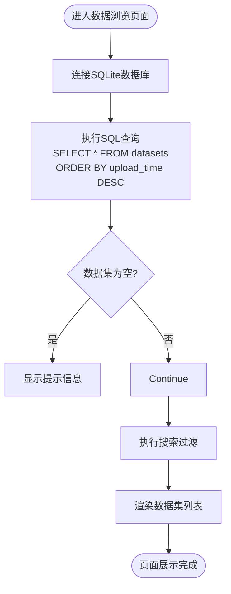

# 数据浏览功能

<cite>
**本文档中引用的文件**  
- [main.py](file://src/main.py)
</cite>

## 目录
1. [数据浏览功能](#数据浏览功能)
2. [核心组件分析](#核心组件分析)
3. [数据查询与排序机制](#数据查询与排序机制)
4. [搜索过滤功能实现](#搜索过滤功能实现)
5. [数据集条目展示设计](#数据集条目展示设计)
6. [用户交互与状态管理](#用户交互与状态管理)
7. [数据处理与性能优化](#数据处理与性能优化)
8. [删除操作流程分析](#删除操作流程分析)

## 核心组件分析

`show_browse_page` 函数是数据浏览功能的核心实现，负责从数据库获取数据集列表并渲染前端界面。该函数通过 Streamlit 框架构建用户界面，结合 Pandas 和 SQLite 实现数据查询与展示。

**Section sources**
- [main.py](file://src/main.py#L525-L573)

## 数据查询与排序机制

`show_browse_page` 函数首先建立与 SQLite 数据库的连接，并使用 `pd.read_sql_query` 执行 SQL 查询语句 `"SELECT * FROM datasets ORDER BY upload_time DESC"`，从 `datasets` 表中获取所有数据集记录，并按照上传时间倒序排列。查询结果被封装为 Pandas DataFrame 对象，便于后续的数据处理与筛选。

若数据库中无任何数据集记录，则显示提示信息“暂无数据集，请先上传数据”，并终止页面渲染流程。

**Diagram sources**
- [main.py](file://src/main.py#L525-L532)

**Section sources**
- [main.py](file://src/main.py#L525-L532)

## 搜索过滤功能实现

前端搜索功能通过 `st.text_input` 组件实现，用户在输入框中键入关键词后，系统会实时获取输入内容 `search_term`。若输入非空，则利用 Pandas 的字符串匹配方法 `str.contains` 对 `datasets` DataFrame 中的 `name` 字段进行模糊匹配（忽略大小写），从而实现数据集名称的搜索过滤。

该过滤逻辑在内存中完成，具有较高的响应速度，适用于中小型数据集。

**Diagram sources**
- [main.py](file://src/main.py#L534-L536)

**Section sources**
- [main.py](file://src/main.py#L534-L536)

## 数据集条目展示设计

每个数据集以可展开的 `st.expander` 组件呈现，标题包含数据集名称和文件数量。展示区域分为左右两栏：

- **左栏**：显示数据集描述、上传时间（格式化为 `YYYY-MM-DD HH:MM:SS`）以及文件列表。文件列表通过解析 `file_paths` 字段（以逗号分隔的路径字符串）生成，遍历每个文件路径，检查文件是否存在，并显示文件名及大小（字节）。
- **右栏**：提供“查看详情”和“删除数据集”两个按钮。

**Diagram sources**
- [main.py](file://src/main.py#L538-L557)

**Section sources**
- [main.py](file://src/main.py#L538-L557)

## 用户交互与状态管理

用户点击“查看详情”按钮时，通过设置 `st.session_state.selected_dataset_id` 将当前数据集 ID 存储到会话状态中，供其他页面（如可视化页面）读取使用。

“删除数据集”按钮采用二次确认机制防止误操作：首次点击时，将 `st.session_state[f"confirm_delete_{dataset['id']}"]` 设为 `True` 并显示警告信息；再次点击时，确认状态为 `True`，调用 `delete_dataset(dataset['id'])` 函数执行删除，并通过 `st.rerun()` 重新加载页面。

**Diagram sources**
- [main.py](file://src/main.py#L552-L557)

**Section sources**
- [main.py](file://src/main.py#L552-L557)

## 数据处理与性能优化

系统使用 Pandas 与 SQLite 交互，通过 `pd.read_sql_query` 将查询结果直接转换为 DataFrame，便于进行后续的数据筛选和处理。对于大数据集，当前实现方式将所有数据加载到内存中进行搜索和展示，可能在数据量极大时影响性能。

**优化建议**：
1. 实现分页机制，限制每次查询返回的数据量。
2. 将搜索功能下推至数据库层，使用 `WHERE name LIKE ?` 实现服务端过滤。
3. 缓存频繁访问的数据集元信息。
4. 异步加载文件大小等耗时信息。

**Section sources**
- [main.py](file://src/main.py#L525-L573)

## 删除操作流程分析

`delete_dataset` 函数负责执行数据集删除操作。流程如下：
1. 根据 `dataset_id` 查询数据库获取 `file_paths`。
2. 遍历文件路径列表，删除对应文件。
3. 若文件所在目录为空，则删除该目录。
4. 从数据库中删除该数据集记录。
5. 提示删除成功或失败。

该函数确保了文件系统与数据库的一致性。

**Diagram sources**
- [main.py](file://src/main.py#L715-L744)

**Section sources**
- [main.py](file://src/main.py#L715-L744)