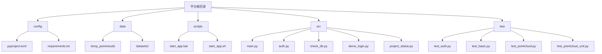
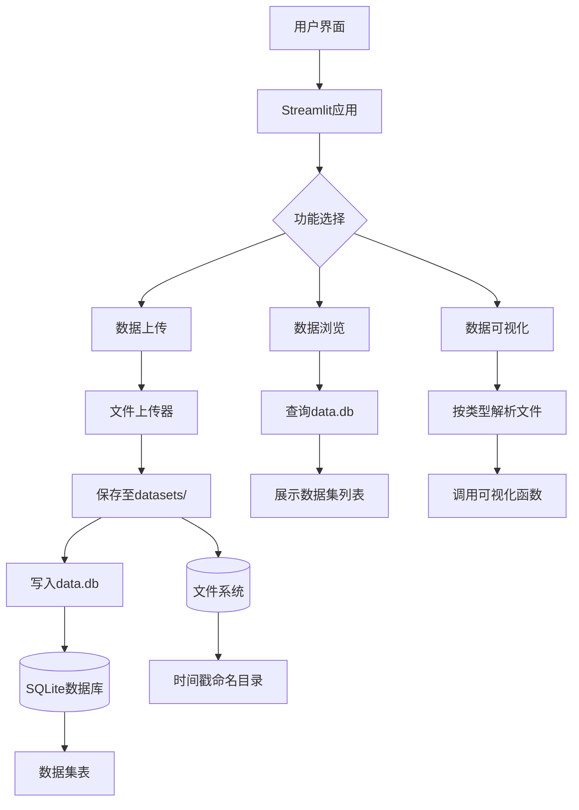
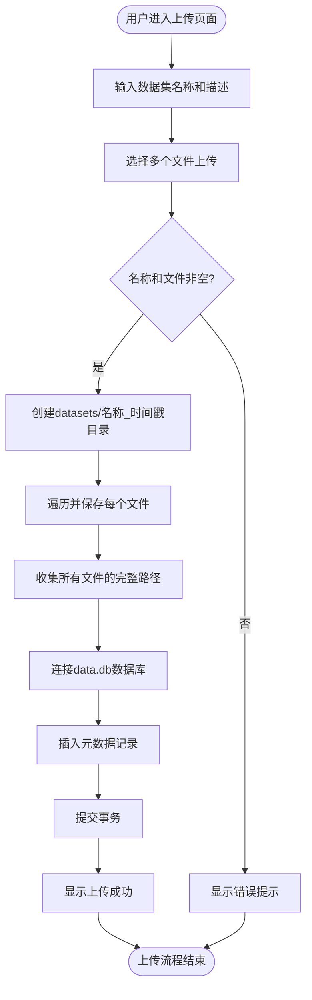
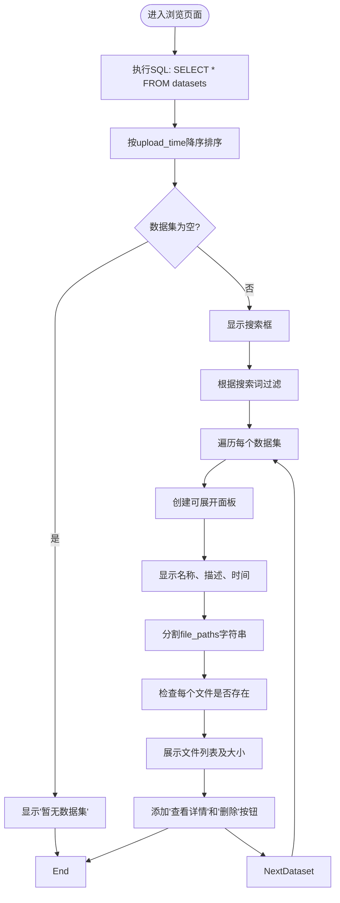
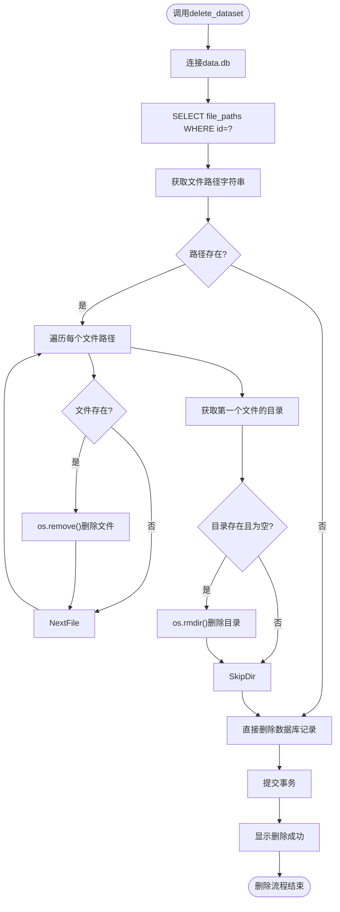
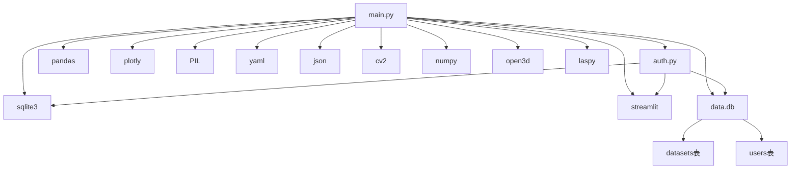

# 数据管理系统

<cite>
**本文档引用的文件**  
- [main.py](file://src/main.py)
- [auth.py](file://src/auth.py)
- [check_db.py](file://src/check_db.py)
- [data.db](file://data/data.db)
</cite>

## 目录
1. [简介](#简介)
2. [项目结构](#项目结构)
3. [核心组件](#核心组件)
4. [架构概述](#架构概述)
5. [详细组件分析](#详细组件分析)
6. [依赖分析](#依赖分析)
7. [性能考虑](#性能考虑)
8. [故障排除指南](#故障排除指南)
9. [结论](#结论)

## 简介
本文档详细阐述无人驾驶数据管理平台的实现机制，重点分析数据集上传、浏览、可视化及删除功能的完整流程。系统基于Streamlit构建，采用SQLite作为元数据存储，支持多模态传感器数据的统一管理。文档深入解析`main.py`中`show_upload_page`、`show_browse_page`等关键函数的实现逻辑，说明文件存储策略、路径管理与并发控制机制，并为开发者提供扩展支持的指导方案。

## 项目结构
系统采用模块化设计，主要分为配置、数据、脚本、源码和测试五大目录。源码集中于`src`目录，核心功能由`main.py`驱动，`auth.py`负责用户认证，`check_db.py`用于数据库调试。数据文件存储在`datasets/`目录，元数据统一管理于`data.db`数据库中。

**Diagram sources**
- [main.py](file://src/main.py#L1-L806)
- [project_structure](file://.)

**Section sources**
- [main.py](file://src/main.py#L1-L806)
- [project_structure](file://.)

## 核心组件
系统核心功能由`main.py`中的多个函数实现，包括数据上传、浏览、可视化及删除。`init_database`负责初始化SQLite数据库结构，`show_upload_page`处理文件上传逻辑，`show_browse_page`提供数据集列表展示，`delete_dataset`确保文件与数据库记录的安全删除。用户认证由`auth.py`模块独立管理，保障系统访问安全。

**Section sources**
- [main.py](file://src/main.py#L382-L805)
- [auth.py](file://src/auth.py#L1-L562)

## 架构概述
系统采用前后端一体化架构，Streamlit作为前端框架直接渲染Python逻辑。用户通过Web界面交互，后端处理文件存储与数据库操作。文件物理存储于`datasets/`目录，元数据（名称、描述、路径列表）存入SQLite数据库。各功能模块通过`main.py`中的`main`函数路由调度，形成清晰的控制流。

**Diagram sources**
- [main.py](file://src/main.py#L756-L805)
- [data.db](file://data/data.db)

**Section sources**
- [main.py](file://src/main.py#L756-L805)
- [data.db](file://data/data.db)

## 详细组件分析

### 数据上传流程分析
该模块实现从用户选择文件到元数据入库的完整流程。首先通过`st.file_uploader`获取文件对象，创建以数据集名和时间戳命名的子目录，将文件逐个写入该目录。随后，将文件路径列表以逗号分隔的字符串形式存入数据库的`file_paths`字段，同时记录名称、描述、上传时间等元数据。

**Diagram sources**
- [main.py](file://src/main.py#L464-L498)

**Section sources**
- [main.py](file://src/main.py#L464-L498)

### 数据浏览功能分析
该功能从数据库查询所有数据集，按上传时间倒序排列，并支持名称搜索。对于每个数据集，系统解析其`file_paths`字段，检查文件是否存在，并在前端展示文件名与大小。用户可通过“查看详情”或“删除数据集”按钮进行后续操作。

**Diagram sources**
- [main.py](file://src/main.py#L525-L568)

**Section sources**
- [main.py](file://src/main.py#L525-L568)

### 数据删除机制分析
`delete_dataset`函数实现安全删除。首先根据`dataset_id`查询数据库获取所有文件路径，逐个删除物理文件。随后检查文件所在目录是否为空，若是则删除该目录。最后从数据库中删除对应记录，确保文件系统与数据库状态一致。

**Diagram sources**
- [main.py](file://src/main.py#L715-L749)

**Section sources**
- [main.py](file://src/main.py#L715-L749)

## 依赖分析
系统依赖关系清晰，`main.py`为核心模块，依赖`auth.py`进行用户认证，依赖SQLite进行数据持久化。外部库包括Streamlit（UI）、pandas（数据处理）、plotly（可视化）、open3d/laspy（点云处理）等。数据库`data.db`包含`datasets`和`users`两张表，分别由`main.py`和`auth.py`初始化。

**Diagram sources**
- [main.py](file://src/main.py#L1-L20)
- [auth.py](file://src/auth.py#L1-L20)
- [data.db](file://data/data.db)

**Section sources**
- [main.py](file://src/main.py#L1-L806)
- [auth.py](file://src/auth.py#L1-L562)
- [data.db](file://data/data.db)

## 性能考虑
系统在文件上传和可视化时采用流式处理，避免内存溢出。点云可视化支持采样显示，限制最大点数以保证渲染性能。数据库查询使用`pd.read_sql_query`高效加载数据集列表。建议生产环境对大文件上传增加分块处理，对数据库查询添加索引优化。

## 故障排除指南
常见问题包括文件上传失败（检查目录权限）、点云无法显示（确认Open3D安装）、数据库连接错误（检查`data.db`路径）。可通过运行`check_db.py`验证数据库状态，使用`demo_login.py`测试认证流程。日志信息通过Streamlit的`st.error`和`st.warning`直接反馈给用户。

**Section sources**
- [main.py](file://src/main.py#L494-L497)
- [main.py](file://src/main.py#L745-L748)
- [check_db.py](file://src/check_db.py#L1-L14)

## 结论
本系统实现了完整的数据管理闭环，从上传、存储、浏览到删除，逻辑清晰，结构合理。通过SQLite统一管理元数据，文件系统存储原始数据，兼顾了灵活性与可靠性。代码结构模块化，易于维护和扩展。开发者可参考现有模式添加新文件类型支持或调整存储策略。