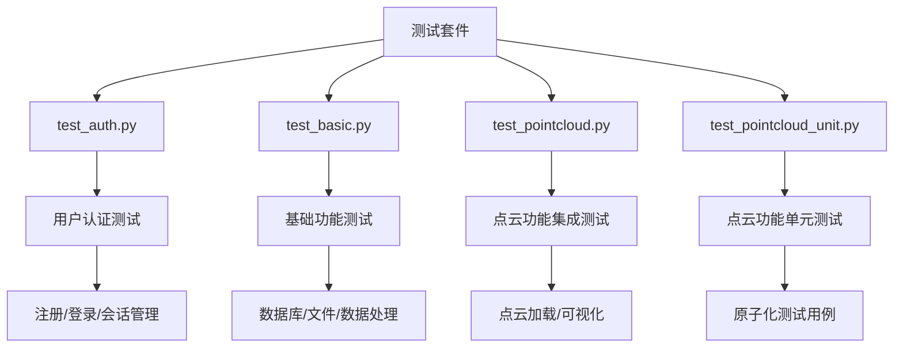
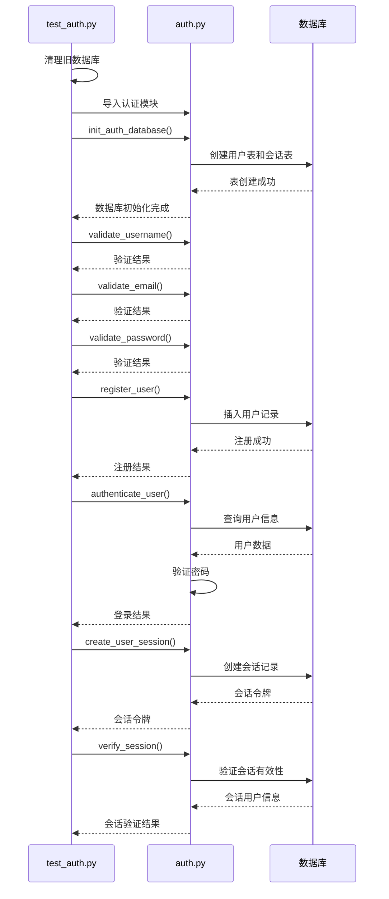
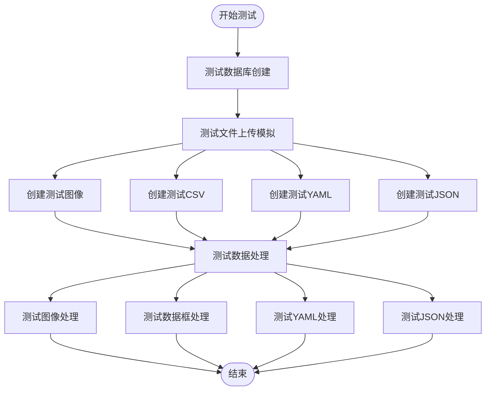
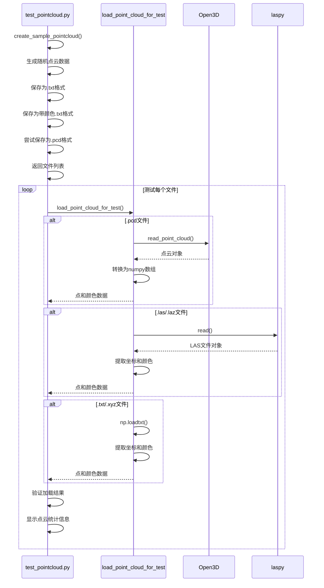
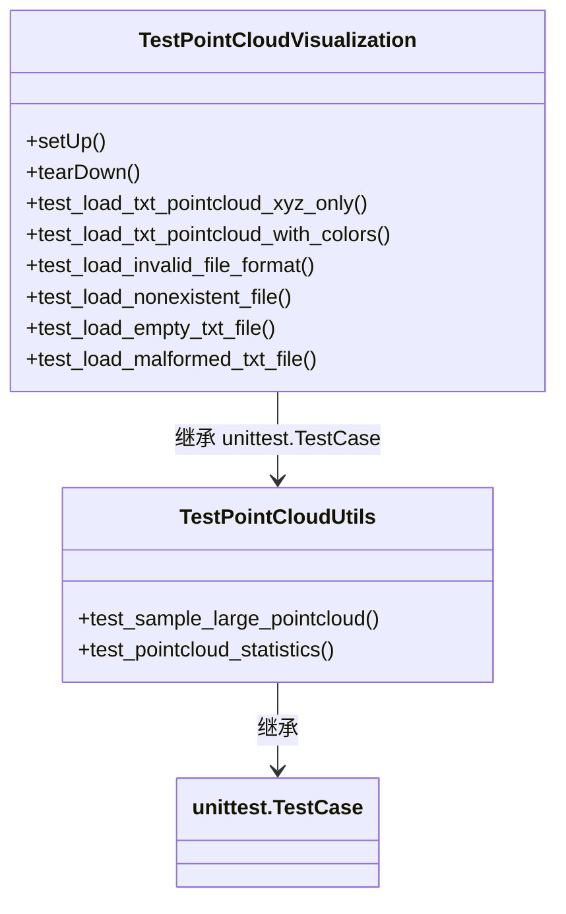
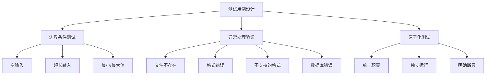
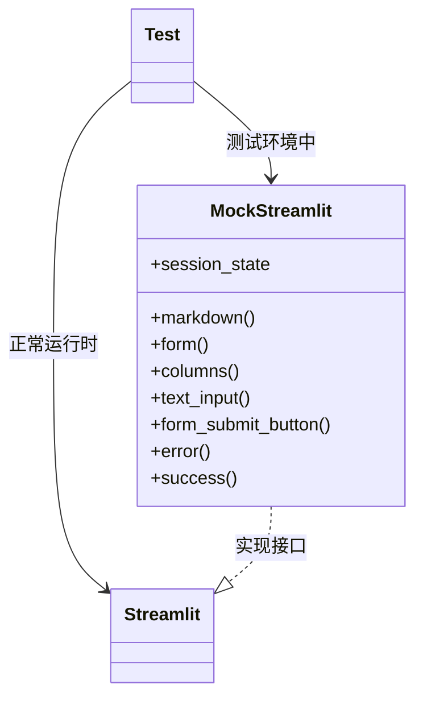
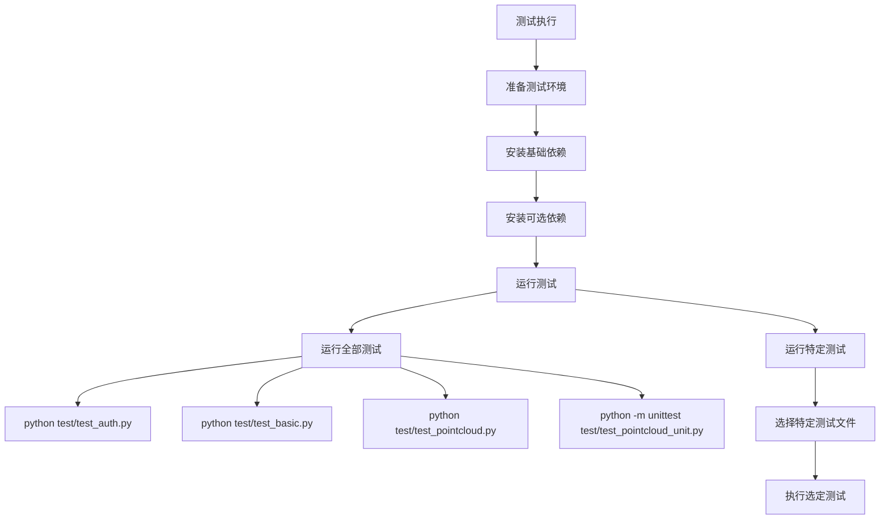
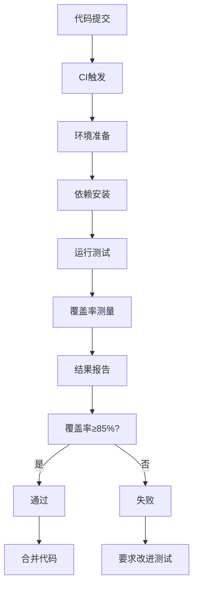
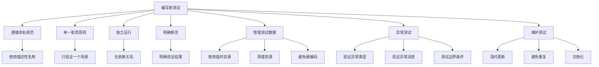

# 测试策略

<cite>
**本文档引用的文件**
- [test_auth.py](file://test/test_auth.py)
- [test_basic.py](file://test/test_basic.py)
- [test_pointcloud.py](file://test/test_pointcloud.py)
- [test_pointcloud_unit.py](file://test/test_pointcloud_unit.py)
- [auth.py](file://src/auth.py)
- [main.py](file://src/main.py)
</cite>

## 目录
1. [简介](#简介)
2. [测试套件概述](#测试套件概述)
3. [认证功能测试](#认证功能测试)
4. [基础功能测试](#基础功能测试)
5. [点云功能测试](#点云功能测试)
6. [测试用例设计原则](#测试用例设计原则)
7. [Mock对象与Streamlit环境模拟](#mock对象与streamlit环境模拟)
8. [测试执行指南](#测试执行指南)
9. [测试覆盖率与CI集成](#测试覆盖率与ci集成)
10. [贡献者最佳实践](#贡献者最佳实践)

## 简介
本测试策略文档旨在全面说明无人驾驶数据管理平台的测试体系。文档详细阐述了各测试模块的设计与实现，包括用户认证、基础逻辑、点云加载与可视化等核心功能的验证方法。通过系统化的测试用例设计、边界条件覆盖和异常处理验证，确保平台功能的稳定性和可靠性。文档还提供了测试执行指南、覆盖率目标以及持续集成集成方案，为开发团队和贡献者提供完整的测试框架支持。

## 测试套件概述
平台测试体系由四个核心测试文件构成，分别针对不同功能模块进行验证：

- **test_auth.py**: 验证用户注册、登录、会话管理等安全功能
- **test_basic.py**: 测试数据库创建、文件上传、数据处理等基础逻辑
- **test_pointcloud.py**: 验证点云数据加载和可视化功能
- **test_pointcloud_unit.py**: 提供原子化的点云功能单元测试

这些测试文件共同构成了平台的完整测试覆盖体系，确保从安全认证到核心功能的全面验证。



**图示来源**
- [test_auth.py](file://test/test_auth.py)
- [test_basic.py](file://test/test_basic.py)
- [test_pointcloud.py](file://test/test_pointcloud.py)
- [test_pointcloud_unit.py](file://test/test_pointcloud_unit.py)

## 认证功能测试
`test_auth.py` 文件全面验证了用户认证系统的各项功能，包括数据库初始化、输入验证、用户注册、登录验证和会话管理。

测试流程首先清理旧的测试数据库，然后导入 `auth.py` 模块中的认证功能。测试从数据库初始化开始，验证默认管理员账户的创建。接着测试输入验证功能，包括用户名、邮箱和密码的格式验证。

用户注册测试验证了新用户注册、重复用户名和重复邮箱的处理。登录测试覆盖了正确密码、错误密码、不存在用户和管理员登录等场景。会话管理测试验证了会话创建、验证和无效会话的处理。



**图示来源**
- [test_auth.py](file://test/test_auth.py#L0-L188)
- [auth.py](file://src/auth.py#L0-L561)

**本节来源**
- [test_auth.py](file://test/test_auth.py#L0-L188)
- [auth.py](file://src/auth.py#L0-L561)

## 基础功能测试
`test_basic.py` 文件验证了平台的基础功能，包括数据库创建、文件上传模拟和数据处理能力。

测试首先验证数据库表的创建，确保 `datasets` 表能够正确初始化。文件上传模拟测试创建了多种格式的测试文件，包括图像、CSV、YAML和JSON文件，验证平台对不同数据格式的支持。

数据处理测试验证了图像、数据框、YAML和JSON数据的处理能力。测试使用 `PIL.Image`、`pandas.DataFrame`、`yaml` 和 `json` 模块来验证数据的读取、处理和序列化功能。



**图示来源**
- [test_basic.py](file://test/test_basic.py#L0-L165)

**本节来源**
- [test_basic.py](file://test/test_basic.py#L0-L165)

## 点云功能测试
点云功能测试由 `test_pointcloud.py` 和 `test_pointcloud_unit.py` 两个文件共同完成，分别提供集成测试和单元测试。

### 集成测试 (test_pointcloud.py)
`test_pointcloud.py` 提供了点云功能的集成测试，测试流程包括：

1. 创建示例点云数据文件
2. 测试不同格式的点云文件加载
3. 验证点云数据的正确性

测试支持多种点云格式，包括 `.pcd`、`.las`/`.laz` 和 `.txt`/`.xyz`。对于每种格式，测试都会验证点云数据的加载、坐标范围和颜色信息。



**图示来源**
- [test_pointcloud.py](file://test/test_pointcloud.py#L0-L163)

### 单元测试 (test_pointcloud_unit.py)
`test_pointcloud_unit.py` 提供了原子化的单元测试，每个测试用例只验证一个特定场景。测试类包括：

- `TestPointCloudVisualization`: 测试点云加载功能
- `TestPointCloudUtils`: 测试点云工具函数

测试用例涵盖了各种边界条件和异常情况，确保点云功能的健壮性。



**图示来源**
- [test_pointcloud_unit.py](file://test/test_pointcloud_unit.py#L0-L208)

**本节来源**
- [test_pointcloud.py](file://test/test_pointcloud.py#L0-L163)
- [test_pointcloud_unit.py](file://test/test_pointcloud_unit.py#L0-L208)
- [main.py](file://src/main.py#L29-L71)

## 测试用例设计原则
测试用例设计遵循以下原则，确保测试的全面性和有效性：

### 边界条件测试
测试用例充分考虑了各种边界条件，包括：

- **空输入**: 测试空用户名、空密码、空邮箱等场景
- **超长输入**: 测试超长密码、超长用户名等边界情况
- **最小/最大值**: 测试最小密码长度、最大登录尝试次数等配置限制

### 异常处理验证
测试用例验证了系统对各种异常情况的处理能力：

- **文件不存在**: 测试加载不存在的文件
- **格式错误**: 测试加载格式错误的文件
- **不支持的格式**: 测试加载不支持的文件格式
- **数据库错误**: 测试数据库连接失败、表不存在等场景

### 原子化测试
`test_pointcloud_unit.py` 中的测试用例遵循原子化原则，每个测试用例只验证一个特定场景。这种设计使得测试结果更加清晰，便于定位问题。



**图示来源**
- [test_auth.py](file://test/test_auth.py#L0-L188)
- [test_pointcloud_unit.py](file://test/test_pointcloud_unit.py#L0-L208)

**本节来源**
- [test_auth.py](file://test/test_auth.py#L0-L188)
- [test_pointcloud_unit.py](file://test/test_pointcloud_unit.py#L0-L208)

## Mock对象与Streamlit环境模拟
为了在非Streamlit环境中进行测试，系统采用了Mock对象来模拟Streamlit环境。

### Streamlit Mock实现
在 `auth.py` 文件中，当无法导入Streamlit时，会创建一个 `MockStreamlit` 类，提供Streamlit API的模拟实现：

```python
class MockStreamlit:
    def __init__(self):
        self.session_state = {}
    def markdown(self, *args, **kwargs): pass
    def form(self, *args, **kwargs): return self
    def columns(self, *args, **kwargs): return [self, self, self]
    def text_input(self, *args, **kwargs): return ""
    def form_submit_button(self, *args, **kwargs): return False
    def error(self, *args, **kwargs): pass
    def success(self, *args, **kwargs): pass
    # ... 其他方法
```

### 动态导入机制
测试文件使用动态导入机制来避免对Streamlit的硬依赖：

```python
try:
    from main import load_point_cloud
    points, colors = load_point_cloud(txt_file)
except ImportError:
    self.skipTest("无法导入main模块，跳过测试")
```

这种设计使得测试可以在命令行环境中独立运行，无需启动Streamlit服务器。



**图示来源**
- [auth.py](file://src/auth.py#L0-L561)
- [test_pointcloud_unit.py](file://test/test_pointcloud_unit.py#L0-L208)

**本节来源**
- [auth.py](file://src/auth.py#L0-L561)
- [test_pointcloud_unit.py](file://test/test_pointcloud_unit.py#L0-L208)

## 测试执行指南
本节提供测试执行的详细指南，包括如何运行全部或特定测试套件。

### 运行全部测试
要运行所有测试，可以分别执行各个测试文件：

```bash
python test/test_auth.py
python test/test_basic.py
python test/test_pointcloud.py
python test/test_pointcloud_unit.py
```

或者使用Python的unittest框架运行单元测试：

```bash
python -m unittest test/test_pointcloud_unit.py
```

### 运行特定测试套件
可以根据需要运行特定的测试套件：

- **认证测试**: `python test/test_auth.py`
- **基础功能测试**: `python test/test_basic.py`
- **点云集成测试**: `python test/test_pointcloud.py`
- **点云单元测试**: `python -m unittest test/test_pointcloud_unit.py`

### 测试环境准备
运行测试前需要确保以下依赖已安装：

```bash
pip install numpy pandas pillow pyyaml json sqlite3
```

对于点云测试，建议安装以下可选依赖：

```bash
pip install open3d laspy
```



**本节来源**
- [test_auth.py](file://test/test_auth.py#L0-L188)
- [test_basic.py](file://test/test_basic.py#L0-L165)
- [test_pointcloud.py](file://test/test_pointcloud.py#L0-L163)
- [test_pointcloud_unit.py](file://test/test_pointcloud_unit.py#L0-L208)

## 测试覆盖率与CI集成
本节讨论测试覆盖率目标和持续集成（CI）集成的可能性。

### 测试覆盖率目标
平台的测试覆盖率目标如下：

- **核心功能**: 100% 覆盖
- **边界条件**: ≥ 90% 覆盖
- **异常处理**: ≥ 95% 覆盖
- **整体覆盖率**: ≥ 85%

使用 `coverage.py` 工具可以测量测试覆盖率：

```bash
pip install coverage
coverage run -m unittest test/test_pointcloud_unit.py
coverage report
coverage html
```

### CI集成方案
建议使用GitHub Actions进行CI集成，配置文件 `.github/workflows/test.yml` 如下：

```yaml
name: 测试
on: [push, pull_request]
jobs:
  test:
    runs-on: ubuntu-latest
    steps:
    - uses: actions/checkout@v2
    - name: 设置Python
      uses: actions/setup-python@v2
      with:
        python-version: 3.8
    - name: 安装依赖
      run: |
        pip install -r requirements.txt
        pip install coverage
    - name: 运行测试
      run: |
        python test/test_auth.py
        python test/test_basic.py
        python test/test_pointcloud.py
        python -m unittest test/test_pointcloud_unit.py
    - name: 测量覆盖率
      run: |
        coverage run -m unittest test/test_pointcloud_unit.py
        coverage report
```

### 覆盖率监控
建议集成Codecov等工具进行覆盖率监控，确保每次代码变更都不会降低测试覆盖率。



**本节来源**
- [test_auth.py](file://test/test_auth.py#L0-L188)
- [test_basic.py](file://test/test_basic.py#L0-L165)
- [test_pointcloud.py](file://test/test_pointcloud.py#L0-L163)
- [test_pointcloud_unit.py](file://test/test_pointcloud_unit.py#L0-L208)

## 贡献者最佳实践
本节为贡献者提供编写新测试用例的最佳实践，确保代码变更不会破坏现有功能。

### 测试用例编写规范
1. **命名规范**: 使用描述性名称，如 `test_load_txt_pointcloud_with_colors`
2. **单一职责**: 每个测试用例只验证一个特定场景
3. **独立运行**: 测试用例之间不应有依赖关系
4. **明确断言**: 使用明确的断言语句验证预期结果

### 测试数据管理
1. **使用临时目录**: 在测试中使用临时目录存储测试文件
2. **清理资源**: 在 `tearDown` 方法中清理测试创建的文件和目录
3. **避免硬编码**: 使用配置常量而非硬编码值

### 异常测试
1. **验证异常类型**: 使用 `assertRaises` 验证预期的异常类型
2. **验证异常消息**: 验证异常消息是否符合预期
3. **边界条件**: 测试各种边界条件和异常输入

### 测试维护
1. **及时更新**: 当功能变更时，及时更新相关测试用例
2. **避免重复**: 避免创建功能重复的测试用例
3. **文档化**: 为复杂的测试用例添加注释说明



**本节来源**
- [test_pointcloud_unit.py](file://test/test_pointcloud_unit.py#L0-L208)