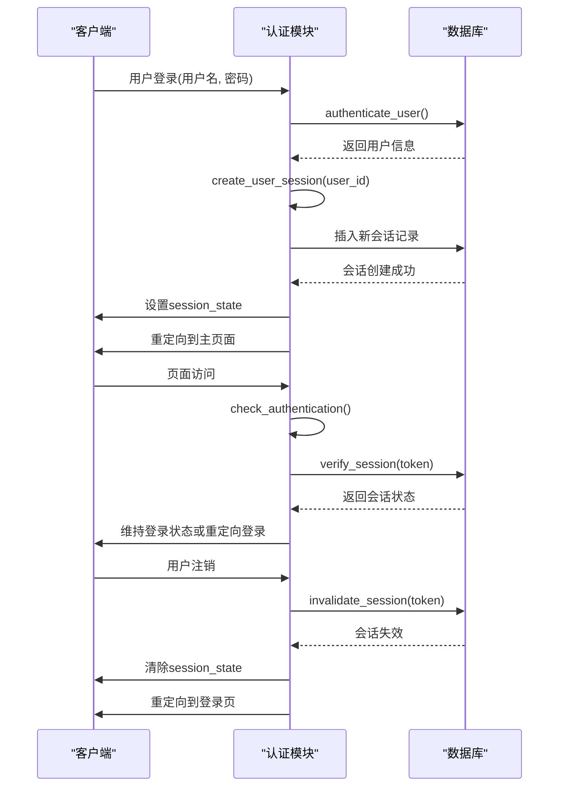
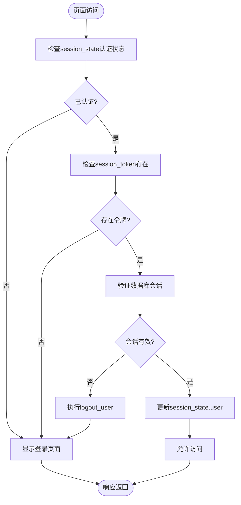

# 会话管理机制

<cite>
**本文档中引用的文件**
- [auth.py](file://src/auth.py)
- [test_auth.py](file://test/test_auth.py)
</cite>

## 目录
1. [简介](#简介)
2. [会话创建机制](#会话创建机制)
3. [会话验证与过期管理](#会话验证与过期管理)
4. [会话状态存储与同步](#会话状态存储与同步)
5. [会话生命周期完整示例](#会话生命周期完整示例)
6. [会话验证中间件](#会话验证中间件)
7. [测试用例分析](#测试用例分析)
8. [常见问题与解决方案](#常见问题与解决方案)
9. [架构升级指导](#架构升级指导)

## 简介
本项目实现了一套完整的会话管理机制，用于无人驾驶数据管理平台的用户认证系统。该机制基于SQLite数据库持久化存储会话信息，并结合Streamlit的session_state实现客户端状态管理。系统提供了会话创建、验证、注销等核心功能，确保用户身份的安全性和会话状态的一致性。

## 会话创建机制

`create_user_session`函数负责创建新的用户会话。当用户成功通过身份验证后，系统会调用此函数为用户生成唯一的会话令牌并存储到数据库中。

该函数首先使用`secrets.token_urlsafe(32)`生成一个32字节的URL安全令牌，确保令牌的随机性和不可预测性。然后根据`SESSION_TIMEOUT_HOURS`常量（默认24小时）计算会话的过期时间。在创建新会话之前，系统会先将该用户的所有旧会话标记为非活跃状态，确保同一用户在同一时间只能有一个活跃会话。新会话信息包括用户ID、会话令牌、创建时间和过期时间被插入到`user_sessions`表中。

**Section sources**
- [auth.py](file://src/auth.py#L246-L296)

## 会话验证与过期管理

`verify_session`函数负责验证会话的有效性。该函数接收会话令牌作为参数，通过查询数据库来验证会话是否存在且未过期。

验证过程首先检查会话令牌是否为空，然后在数据库中查找对应的会话记录。查询语句通过JOIN操作同时验证用户和会话的活跃状态。如果找到匹配的记录，函数会进一步检查当前时间是否已超过会话的过期时间。如果会话已过期，系统会自动调用`invalidate_session`函数使该会话失效，并返回None表示验证失败。否则，返回包含用户基本信息的字典。

`invalidate_session`函数通过更新数据库中对应会话记录的`is_active`字段为0来使会话失效，这是一种软删除机制，保留了会话的历史记录。

**Section sources**
- [auth.py](file://src/auth.py#L294-L341)

## 会话状态存储与同步

系统利用Streamlit的`session_state`对象在客户端存储会话相关状态。当用户成功登录后，系统会将会话令牌、用户信息和认证状态保存到`st.session_state`中。

关键的存储项包括：
- `st.session_state.user`：存储经过验证的用户信息
- `st.session_state.session_token`：存储当前会话令牌
- `st.session_state.authenticated`：布尔值，表示用户的认证状态

这种双重存储机制（数据库+session_state）确保了会话状态在服务器端和客户端之间的一致性。每次页面访问时，系统会先检查`session_state`中的认证状态，然后通过`verify_session`函数验证数据库中的会话有效性，实现状态的同步更新。

**Section sources**
- [auth.py](file://src/auth.py#L428-L430)
- [auth.py](file://src/auth.py#L533)

## 会话生命周期完整示例

**Diagram sources**
- [auth.py](file://src/auth.py#L246-L341)
- [auth.py](file://src/auth.py#L528-L533)

## 会话验证中间件

`check_authentication`函数作为会话验证中间件，在每次页面访问时拦截请求并验证用户认证状态。该函数首先检查`session_state`中是否存在认证标记，然后验证会话令牌的有效性。

如果会话验证失败，函数会自动调用`logout_user`清除客户端状态，确保安全退出。该中间件被`require_authentication`装饰器使用，可以方便地应用于需要认证的页面或功能模块。在`main.py`的主函数中，系统在路由前调用`check_authentication`，实现了全局的访问控制。

**Diagram sources**
- [auth.py](file://src/auth.py#L528-L540)
- [main.py](file://src/main.py#L746-L805)

## 测试用例分析

`test_auth.py`文件包含了对会话管理机制的全面测试。测试用例覆盖了会话创建、有效/无效令牌验证等关键场景。

测试流程首先初始化测试数据库，然后创建测试用户并尝试登录以获取用户信息。使用该用户ID调用`create_user_session`创建会话，并通过`verify_session`验证会话的有效性。测试还包括对无效令牌的验证，确保系统能正确拒绝非法访问。最后，测试脚本会输出数据库统计信息，包括用户总数和活跃会话数，用于验证测试的完整性。

这些测试确保了会话管理功能的可靠性，为系统的稳定运行提供了保障。

**Section sources**
- [test_auth.py](file://test/test_auth.py#L137-L169)

## 常见问题与解决方案

### 会话超时不准确
由于系统使用`datetime.now()`获取当前时间，如果服务器时间不准确或存在时区问题，可能导致会话超时计算错误。解决方案是确保服务器时间同步，并在生产环境中使用UTC时间进行存储和比较。

### 多设备登录冲突
当前实现中，同一用户的新登录会自动使旧会话失效，这可能导致用户在其他设备上的会话突然中断。如果需要支持多设备同时登录，可以修改`create_user_session`函数，移除清除旧会话的逻辑，并在数据库查询时增加设备标识字段。

### 会话固定攻击风险
系统目前没有实现会话令牌的定期轮换机制。建议在用户权限变更或敏感操作后重新生成会话令牌，以降低会话固定攻击的风险。

## 架构升级指导

### 迁移到Redis存储
将会话存储从SQLite迁移到Redis可以显著提高性能和可扩展性。Redis的键值存储特性非常适合会话管理，支持自动过期机制。迁移时需要修改`create_user_session`、`verify_session`和`invalidate_session`函数，将数据库操作替换为Redis命令，并利用Redis的TTL功能自动管理会话过期。

### 迁移到JWT
采用JWT（JSON Web Token）可以实现无状态的会话管理，减轻服务器存储压力。JWT将用户信息和过期时间编码在令牌本身，服务器无需存储会话数据。实现时需要使用`PyJWT`库生成和验证令牌，并在前端存储JWT。需要注意JWT的撤销机制，可以结合短期令牌和刷新令牌的策略。

**Section sources**
- [auth.py](file://src/auth.py#L246-L341)
- [test_auth.py](file://test/test_auth.py#L137-L169)