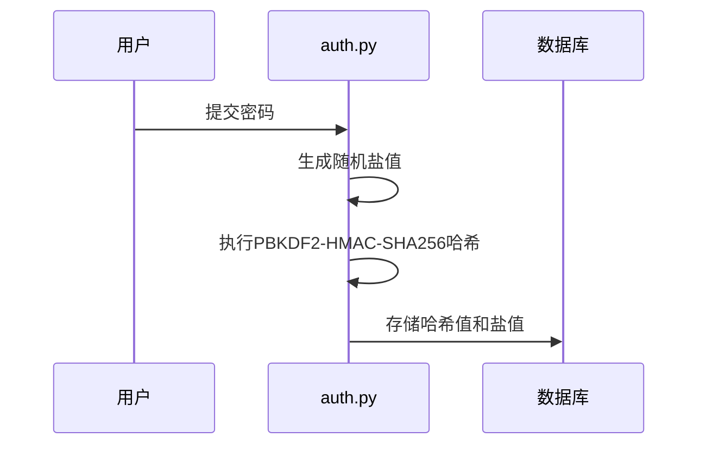
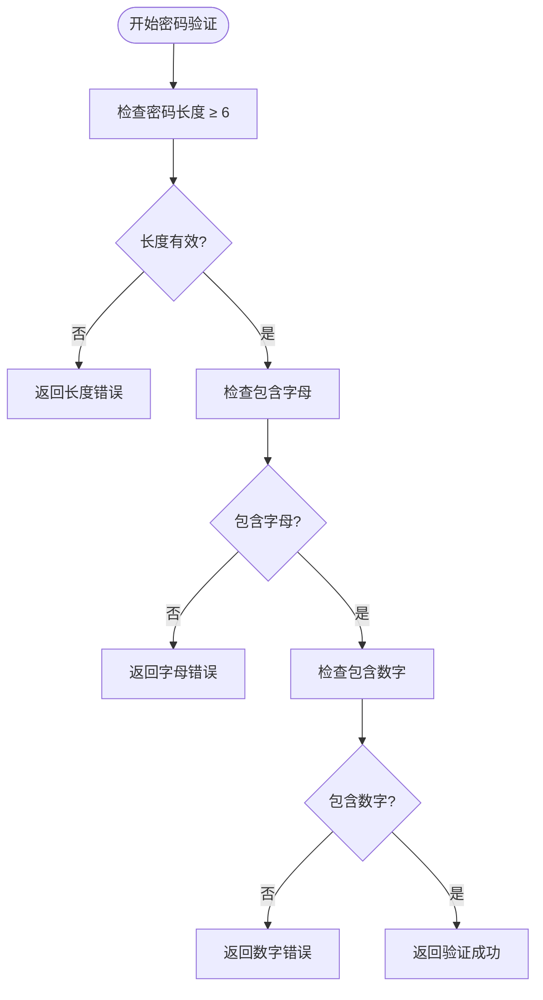
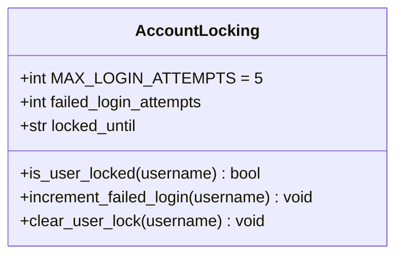
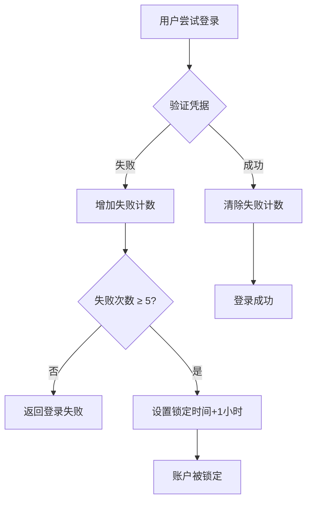
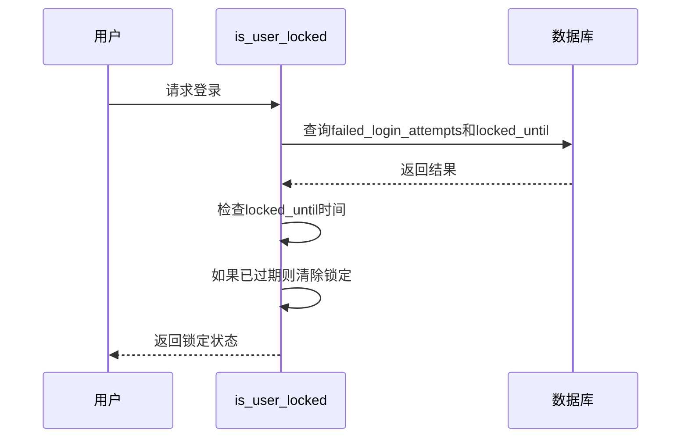
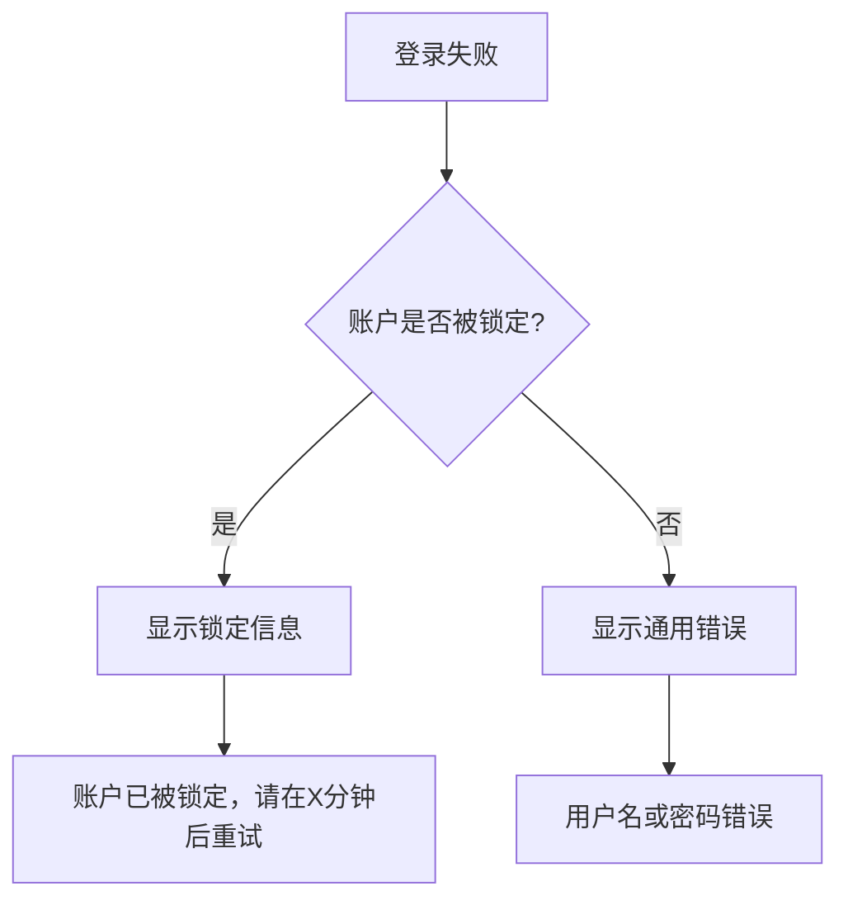
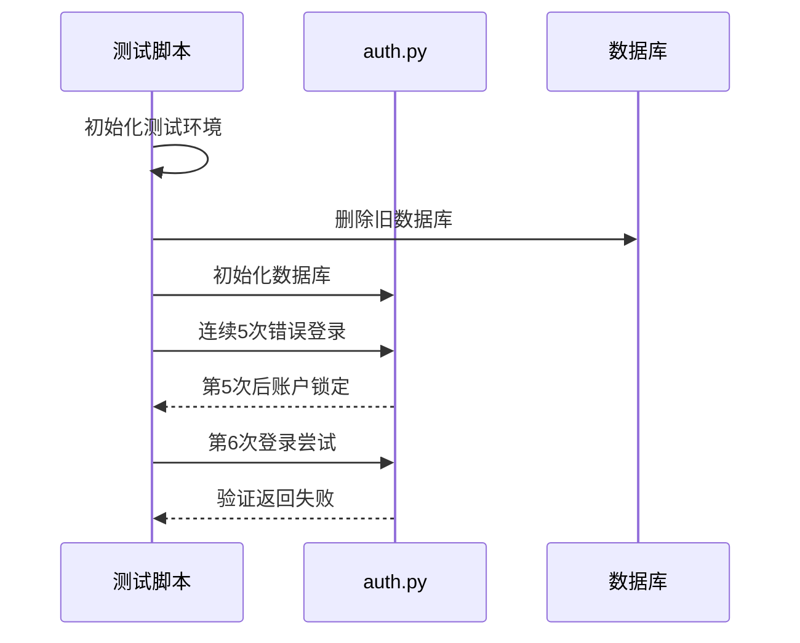
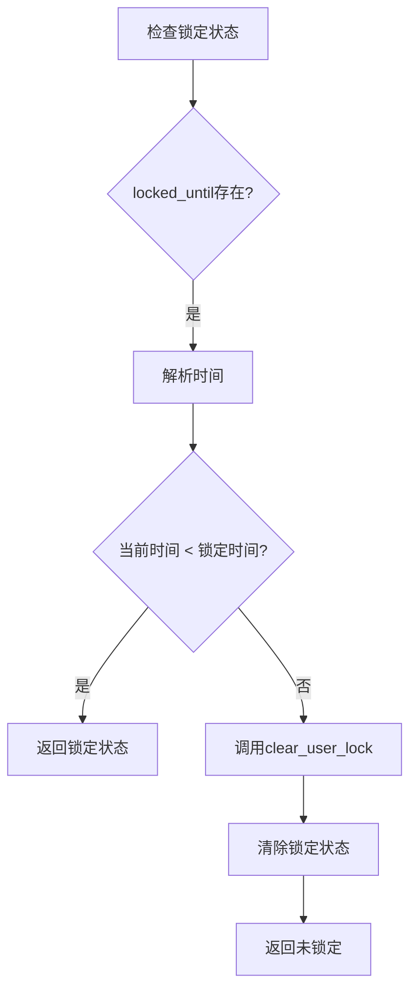
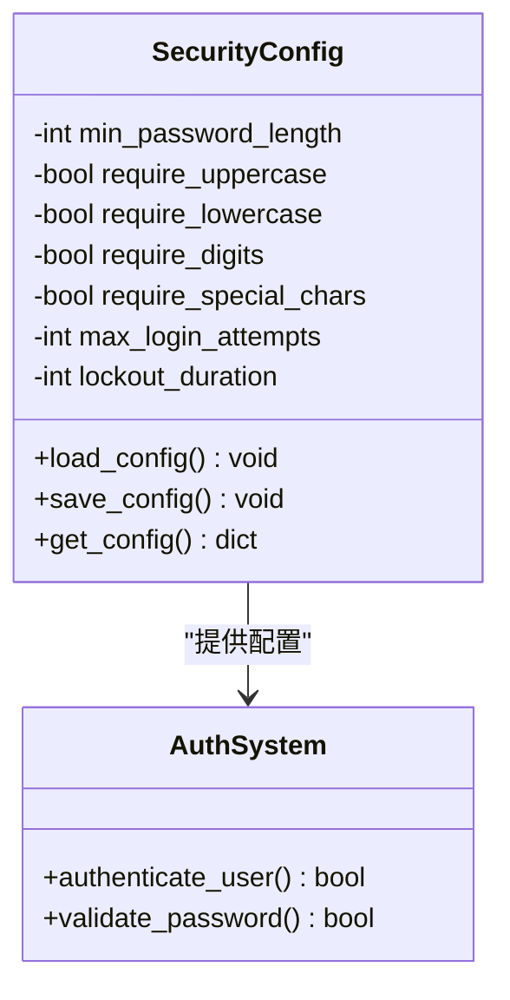
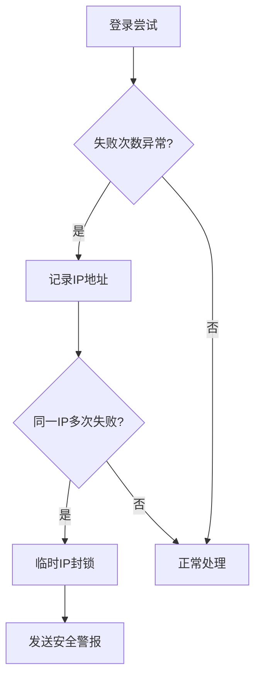

# 安全特性实现

<cite>
**本文档中引用的文件**   
- [auth.py](file://src/auth.py)
- [test_auth.py](file://test/test_auth.py)
</cite>

## 目录
1. [安全机制概述](#安全机制概述)
2. [密码哈希与强度验证](#密码哈希与强度验证)
3. [账户锁定策略](#账户锁定策略)
4. [错误信息模糊化处理](#错误信息模糊化处理)
5. [测试验证机制](#测试验证机制)
6. [常见问题与解决方案](#常见问题与解决方案)
7. [扩展方案建议](#扩展方案建议)

## 安全机制概述

本系统实现了全面的安全特性，包括基于PBKDF2-HMAC-SHA256的密码哈希、账户锁定策略、密码强度验证和会话管理等机制。这些安全措施共同保障了用户认证系统的安全性。

**Section sources**
- [auth.py](file://src/auth.py#L38-L80)

## 密码哈希与强度验证

### 密码哈希实现
系统采用PBKDF2-HMAC-SHA256算法对用户密码进行哈希处理，通过100,000次迭代增强安全性，有效抵御彩虹表攻击。

**Diagram sources**
- [auth.py](file://src/auth.py#L100-L102)

### 密码强度验证规则
系统实施严格的密码强度策略，确保用户创建安全的密码：

| 验证规则 | 实现逻辑 | 错误提示 |
|---------|--------|--------|
| 最小长度 | 检查密码长度是否小于MIN_PASSWORD_LENGTH | "密码长度至少为6位" |
| 包含字母 | 使用正则表达式检查是否存在字母字符 | "密码必须包含字母" |
| 包含数字 | 使用正则表达式检查是否存在数字字符 | "密码必须包含数字" |

**Diagram sources**
- [auth.py](file://src/auth.py#L114-L125)

**Section sources**
- [auth.py](file://src/auth.py#L114-L125)

## 账户锁定策略

### 锁定机制实现
系统实现了基于失败尝试计数的账户锁定机制，有效防止暴力破解攻击。

**Diagram sources**
- [auth.py](file://src/auth.py#L44-L63)

### 登录失败处理流程
从多次登录失败到账户锁定的完整流程如下：

**Diagram sources**
- [auth.py](file://src/auth.py#L155-L205)

### 锁定状态检查
系统在每次登录尝试前检查用户锁定状态，确保安全策略的有效执行。

**Diagram sources**
- [auth.py](file://src/auth.py#L135-L159)

**Section sources**
- [auth.py](file://src/auth.py#L135-L159)

## 错误信息模糊化处理

### 敏感操作错误处理
系统对敏感操作的错误信息进行模糊化处理，防止信息泄露：

- 登录失败时统一显示"❌ 用户名或密码错误"，不区分具体原因
- 账户锁定时显示"🔒 账户已被锁定，请在X分钟后重试"，不透露具体锁定原因
- 注册时用户名或邮箱已存在，分别提示"用户名已存在"或"邮箱已被注册"，避免暴露其他用户信息

**Diagram sources**
- [auth.py](file://src/auth.py#L416-L434)

**Section sources**
- [auth.py](file://src/auth.py#L416-L434)

## 测试验证机制

### 测试用例设计
`test_auth.py`文件中实现了对账户锁定机制的完整测试验证。

**Diagram sources**
- [test_auth.py](file://test/test_auth.py#L0-L188)

### 测试流程说明
测试脚本通过模拟连续失败登录来验证锁定机制：

1. 清除旧的测试数据库
2. 初始化认证数据库
3. 执行5次错误密码登录尝试
4. 验证第6次登录被正确拒绝
5. 检查数据库中的failed_login_attempts和locked_until字段

**Section sources**
- [test_auth.py](file://test/test_auth.py#L0-L47)

## 常见问题与解决方案

### 锁定状态未正确清除
**问题描述**：用户在锁定时间过后仍无法登录  
**根本原因**：`is_user_locked`函数中未正确处理过期锁定状态的清除  
**解决方案**：确保`clear_user_lock`函数被正确调用

**Section sources**
- [auth.py](file://src/auth.py#L148-L154)

### 时区导致的锁定时间异常
**问题描述**：在不同时区环境下锁定时间计算出现偏差  
**根本原因**：使用本地时间而非UTC时间进行比较  
**解决方案**：统一使用UTC时间存储和比较锁定时间

## 扩展方案建议

### 密码策略动态配置
为支持密码策略的动态配置，建议实现配置管理模块：

**Section sources**
- [auth.py](file://src/auth.py#L38-L44)

### 入侵检测扩展
建议增加基于行为分析的入侵检测功能：

