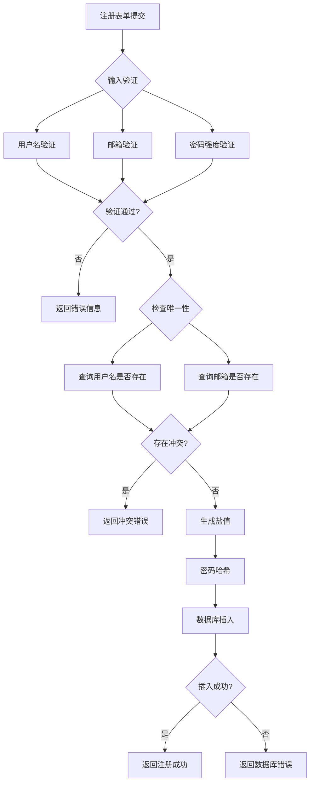
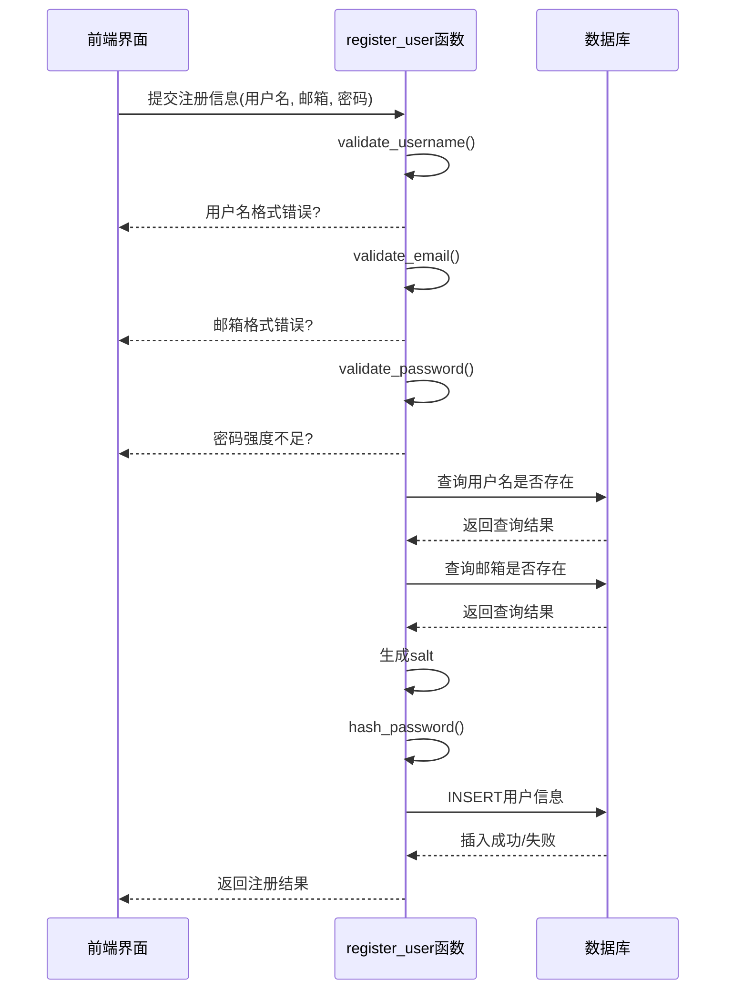
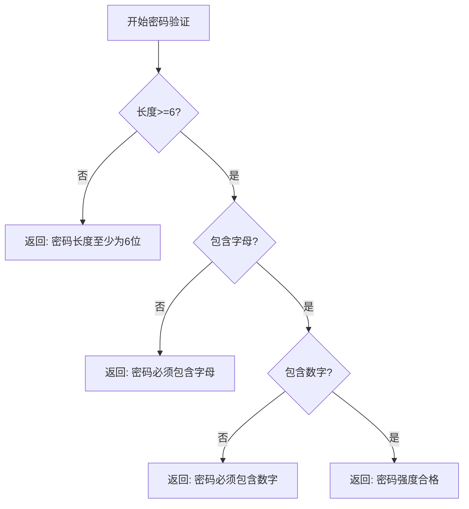
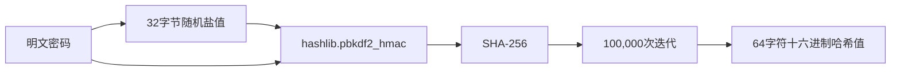
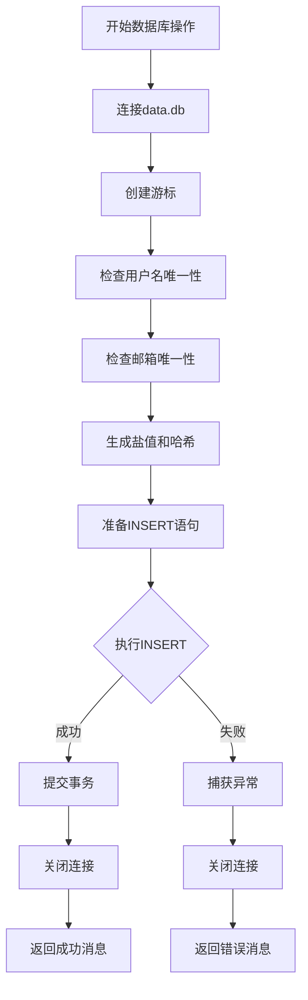
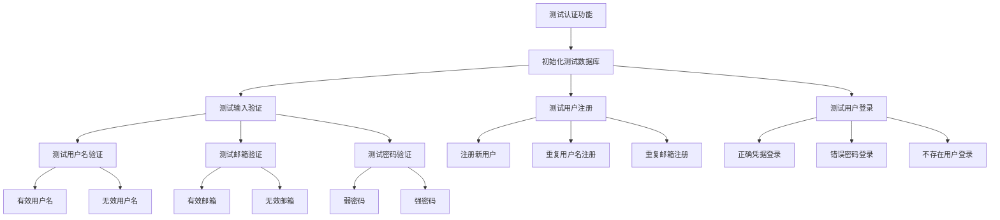

# 用户注册功能

<cite>
**本文档中引用的文件**   
- [auth.py](file://src/auth.py)
- [test_auth.py](file://test/test_auth.py)
</cite>

## 目录
1. [用户注册功能](#用户注册功能)
2. [核心组件分析](#核心组件分析)
3. [注册流程详细实现](#注册流程详细实现)
4. [输入验证规则](#输入验证规则)
5. [密码哈希与盐值机制](#密码哈希与盐值机制)
6. [数据库操作与异常处理](#数据库操作与异常处理)
7. [测试用例分析](#测试用例分析)
8. [常见问题与解决方案](#常见问题与解决方案)
9. [扩展集成指导](#扩展集成指导)

## 核心组件分析

用户注册功能的核心实现位于 `auth.py` 文件中，主要由 `register_user` 函数驱动，该函数依赖多个辅助函数完成完整的注册流程。注册流程与用户验证、密码哈希、数据库交互等模块紧密耦合。

**Diagram sources**
- [auth.py](file://src/auth.py#L333-L383)

**Section sources**
- [auth.py](file://src/auth.py#L333-L383)

## 注册流程详细实现

`register_user` 函数实现了用户注册的完整业务逻辑，从表单提交到数据库持久化。该函数接收用户名、邮箱和密码三个参数，返回一个包含布尔值和消息的元组，指示注册是否成功。

注册流程首先对输入进行验证，包括用户名、邮箱和密码的格式检查。验证通过后，函数会检查用户名和邮箱在数据库中的唯一性。如果所有检查都通过，则生成盐值并对密码进行哈希处理，最后将用户信息插入数据库。

**Diagram sources**
- [auth.py](file://src/auth.py#L333-L383)
- [auth.py](file://src/auth.py#L109-L127)

**Section sources**
- [auth.py](file://src/auth.py#L333-L383)

## 输入验证规则

### 用户名验证
用户名验证规则定义在 `validate_username` 函数中，包含以下要求：
- 长度必须在3-20个字符之间
- 只能包含字母、数字和下划线
- 不能包含特殊字符或空格

### 邮箱验证
邮箱验证规则定义在 `validate_email` 函数中，使用正则表达式进行格式检查：
- 必须符合标准邮箱格式
- 本地部分可包含字母、数字及特殊字符（._%+-）
- 域名部分可包含字母、数字及连字符
- 必须有有效的顶级域名（至少2个字符）

### 密码验证
密码验证规则定义在 `validate_password` 函数中，包含以下强度要求：
- 长度至少为6位（由 `MIN_PASSWORD_LENGTH` 常量定义）
- 必须包含至少一个字母
- 必须包含至少一个数字
- 不能仅为纯字母或纯数字

**Diagram sources**
- [auth.py](file://src/auth.py#L104-L127)
- [auth.py](file://src/auth.py#L38-L39)

**Section sources**
- [auth.py](file://src/auth.py#L104-L127)

## 密码哈希与盐值机制

### 盐值生成
系统使用 `secrets.token_hex(32)` 生成32字节的随机盐值。`secrets` 模块是Python标准库中用于生成加密安全随机数的模块，比 `random` 模块更安全，专门用于处理密码、令牌等敏感数据。

### 密码哈希
密码哈希使用 `hashlib.pbkdf2_hmac` 函数实现，具体参数如下：
- 哈希算法：SHA-256
- 迭代次数：100,000次
- 盐值：32字节随机字符串
- 输出格式：十六进制字符串

高迭代次数增加了暴力破解的难度，即使攻击者获取了哈希值，也需要极长时间才能破解原始密码。

**Diagram sources**
- [auth.py](file://src/auth.py#L100-L102)
- [auth.py](file://src/auth.py#L363-L363)

**Section sources**
- [auth.py](file://src/auth.py#L100-L102)

## 数据库操作与异常处理

### 数据库表结构
用户信息存储在 `users` 表中，表结构如下：
- id: 主键，自增
- username: 用户名，唯一约束
- email: 邮箱，唯一约束
- password_hash: 密码哈希值
- salt: 盐值
- created_at: 创建时间
- last_login: 最后登录时间
- is_active: 账户状态
- failed_login_attempts: 登录失败次数
- locked_until: 锁定截止时间

### 唯一性检查
在插入新用户前，系统会执行两次查询来检查唯一性约束：
1. 检查用户名是否已存在
2. 检查邮箱是否已被注册

这种检查机制防止了违反数据库唯一约束的异常。

### 异常处理策略
注册过程中使用了try-except块来捕获可能的数据库异常。如果插入操作失败，函数会关闭数据库连接并返回包含错误信息的消息，而不是让异常向上抛出。

**Diagram sources**
- [auth.py](file://src/auth.py#L333-L383)
- [auth.py](file://src/auth.py#L76-L80)

**Section sources**
- [auth.py](file://src/auth.py#L333-L383)

## 测试用例分析

`test_auth.py` 文件包含了对用户注册功能的全面测试，验证了各种正常和异常场景。

### 有效注册测试
测试脚本创建了一个新用户（testuser），验证注册功能是否能正确处理有效输入。测试包括完整的用户名、有效邮箱和符合强度要求的密码。

### 重复用户名/邮箱测试
测试脚本验证了系统对重复用户名和邮箱的处理：
- 使用已存在的用户名注册，应返回"用户名已存在"错误
- 使用已注册的邮箱注册，应返回"邮箱已被注册"错误

### 密码强度验证测试
测试脚本验证了密码验证规则的正确性，包括：
- 太短的密码（如"123"）
- 只有字母的密码（如"password"）
- 只有数字的密码（如"123456"）
- 符合要求的密码（如"pass123"）

**Diagram sources**
- [test_auth.py](file://test/test_auth.py#L46-L185)

**Section sources**
- [test_auth.py](file://test/test_auth.py#L46-L185)

## 常见问题与解决方案

### 注册后未自动登录
当前实现中，注册成功后用户需要手动登录。解决方案是在 `register_user` 函数成功后，自动调用登录相关函数创建会话。

### 邮箱格式验证不严格
当前邮箱正则表达式可能允许一些边缘情况。可以考虑使用更严格的验证模式，或集成第三方邮箱验证服务。

### 默认管理员账户安全
系统创建了默认管理员账户（admin/admin123），建议在生产环境中强制用户首次登录时修改密码。

### 数据库连接管理
当前实现中，数据库连接在异常情况下可能未正确关闭。建议使用上下文管理器确保连接总是被正确关闭。

## 扩展集成指导

### 邮箱验证功能
要添加邮箱验证功能，可以：
1. 在用户表中添加 `email_verified` 字段
2. 注册时生成验证令牌并发送验证邮件
3. 提供验证链接，点击后更新 `email_verified` 状态
4. 登录时检查邮箱验证状态

### 第三方注册
要支持第三方注册（如微信、Google），可以：
1. 在用户表中添加 `oauth_provider` 和 `oauth_id` 字段
2. 实现第三方认证回调处理
3. 创建或关联现有账户
4. 生成本地会话

### 多因素认证
要添加多因素认证，可以：
1. 在用户表中添加 `mfa_enabled` 和 `mfa_secret` 字段
2. 注册时可选择启用MFA
3. 登录时检查MFA状态并要求验证码
4. 集成TOTP或短信验证码服务