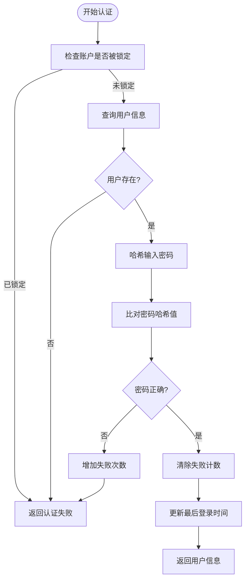
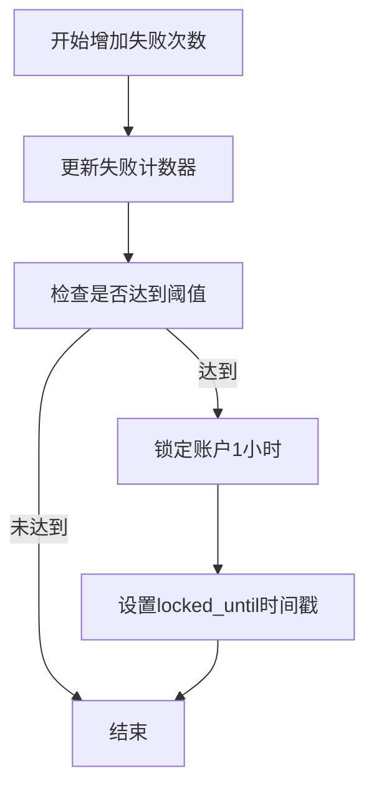
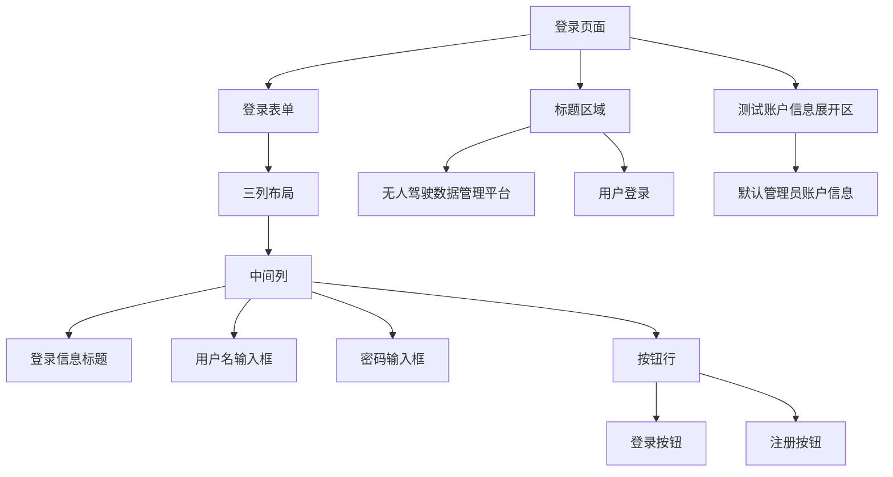
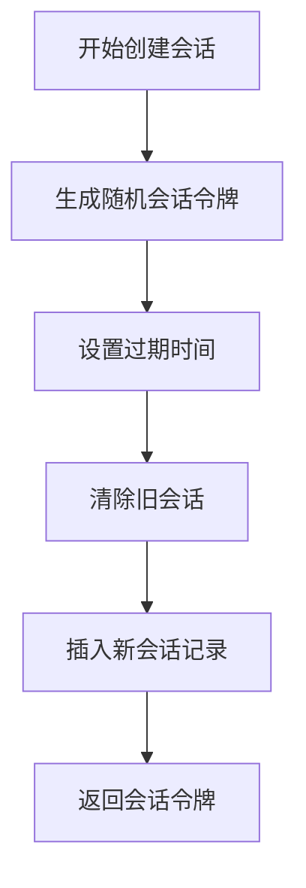
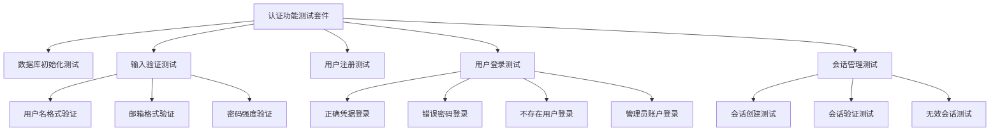

# 用户登录功能

<cite>
**本文档中引用的文件**
- [auth.py](file://src/auth.py)
- [test_auth.py](file://test/test_auth.py)
- [main.py](file://src/main.py)
</cite>

## 目录
1. [简介](#简介)
2. [认证流程详解](#认证流程详解)
3. [登录界面组件结构](#登录界面组件结构)
4. [会话创建与状态管理](#会话创建与状态管理)
5. [完整登录流程代码路径](#完整登录流程代码路径)
6. [测试用例分析](#测试用例分析)
7. [常见问题与解决方案](#常见问题与解决方案)
8. [扩展建议](#扩展建议)

## 简介
本系统提供完整的用户认证功能，包括用户登录、注册、会话管理和身份验证。核心功能由`auth.py`模块实现，通过SQLite数据库存储用户信息和会话数据。系统支持默认管理员账户（admin/admin123），并集成了Streamlit前端界面，为无人驾驶数据管理平台提供安全的访问控制。

**Section sources**
- [auth.py](file://src/auth.py#L1-L50)
- [main.py](file://src/main.py#L1-L50)

## 认证流程详解

### 凭据验证流程
用户认证流程从`authenticate_user`函数开始，该函数执行多层安全验证：

1. **账户锁定检查**：首先调用`is_user_locked`函数检查用户是否因多次登录失败而被锁定
2. **用户存在性验证**：查询数据库确认用户名是否存在且账户处于激活状态
3. **密码哈希比对**：使用PBKDF2-HMAC-SHA256算法对输入密码进行哈希处理，并与数据库中存储的哈希值比对

**Diagram sources**
- [auth.py](file://src/auth.py#L203-L252)

**Section sources**
- [auth.py](file://src/auth.py#L203-L252)

### 失败尝试计数机制
`increment_failed_login`函数负责管理登录失败尝试的计数和账户锁定逻辑：

1. 更新用户记录中的`failed_login_attempts`字段，将其值加1
2. 检查失败次数是否达到预设阈值（默认5次）
3. 若达到阈值，将账户锁定1小时，设置`locked_until`时间戳

该机制有效防止暴力破解攻击，同时允许系统在锁定时间过后自动解锁账户。

**Diagram sources**
- [auth.py](file://src/auth.py#L172-L201)

**Section sources**
- [auth.py](file://src/auth.py#L172-L201)

## 登录界面组件结构

### Streamlit组件布局
`show_login_page`函数构建了用户友好的登录界面，采用响应式布局设计：

1. **标题区域**：居中显示平台名称和"用户登录"标题
2. **表单容器**：使用`st.form`创建登录表单，确保提交行为可预测
3. **列布局**：通过`st.columns([1, 2, 1])`创建三列布局，将表单内容居中
4. **输入组件**：
   - `st.text_input`用于用户名输入，带有人性化占位符
   - `st.text_input(type="password")`用于密码输入，隐藏实际字符
5. **按钮布局**：两个按钮并排显示，分别用于登录和注册

**Diagram sources**
- [auth.py](file://src/auth.py#L385-L450)

**Section sources**
- [auth.py](file://src/auth.py#L385-L450)

### 用户交互逻辑
登录界面的交互逻辑通过事件驱动方式实现：

1. **登录按钮点击**：
   - 验证用户名和密码是否为空
   - 检查账户锁定状态
   - 调用`authenticate_user`进行认证
   - 根据结果显示成功或错误消息

2. **注册按钮点击**：
   - 设置`show_register`状态标志
   - 触发页面重载以显示注册表单

3. **状态反馈**：
   - 使用`st.error`显示错误消息
   - 使用`st.success`显示成功消息
   - 使用`st.info`显示提示信息

## 会话创建与状态管理

### 会话创建机制
`create_user_session`函数负责创建安全的用户会话：

1. 生成32字节的URL安全随机令牌作为会话标识
2. 计算会话过期时间（默认24小时后）
3. 在数据库中清除用户的所有旧会话
4. 将新会话信息插入`user_sessions`表

**Diagram sources**
- [auth.py](file://src/auth.py#L254-L283)

**Section sources**
- [auth.py](file://src/auth.py#L254-L283)

### 状态更新机制
登录成功后，系统执行以下状态更新操作：

1. 将用户信息存储在`st.session_state.user`
2. 保存会话令牌到`st.session_state.session_token`
3. 设置`st.session_state.authenticated = True`
4. 调用`st.rerun()`刷新页面以显示认证后的内容

`check_authentication`函数在每次页面加载时验证会话有效性，确保用户状态的持久性和安全性。

## 完整登录流程代码路径
从表单提交到会话建立的完整流程涉及多个函数的协同工作：

[SPEC SYMBOL](file://src/auth.py#L385-L450) → [SPEC SYMBOL](file://src/auth.py#L203-L252) → [SPEC SYMBOL](file://src/auth.py#L254-L283) → [SPEC SYMBOL](file://src/main.py#L525-L539)

1. `show_login_page`：渲染登录界面并处理表单提交
2. `authenticate_user`：验证用户凭据
3. `create_user_session`：创建新的会话记录
4. `check_authentication`：验证会话状态并维护用户登录状态

## 测试用例分析

### 测试覆盖范围
`test_auth.py`文件中的测试用例全面验证了认证系统的各项功能：

**Diagram sources**
- [test_auth.py](file://test/test_auth.py#L60-L60)

**Section sources**
- [test_auth.py](file://test/test_auth.py#L1-L189)

### 关键测试场景
1. **正确凭据登录**：验证有效用户名和密码能够成功登录
2. **错误密码处理**：确认系统正确拒绝错误密码并增加失败计数
3. **不存在用户**：验证系统对不存在的用户名返回适当错误
4. **重复注册检测**：测试用户名和邮箱的唯一性约束
5. **会话生命周期**：验证会话创建、验证和失效的完整流程

## 常见问题与解决方案

### 登录状态未持久化
**问题描述**：用户登录后刷新页面仍显示登录界面

**解决方案**：
1. 确保`st.session_state`正确保存了认证状态
2. 验证`check_authentication`函数被正确调用
3. 检查会话令牌是否有效且未过期
4. 确认数据库连接正常，能够查询会话记录

### 界面跳转异常
**问题描述**：点击注册按钮后未正确跳转到注册页面

**解决方案**：
1. 确保`st.session_state.show_register`状态被正确设置
2. 验证`st.rerun()`被调用以触发页面重载
3. 检查`show_auth_page`函数根据状态正确选择显示登录或注册页面
4. 确认Streamlit版本支持状态管理功能

### 账户锁定问题
**问题描述**：账户被锁定后无法自动解锁

**解决方案**：
1. 验证`is_user_locked`函数正确比较当前时间与`locked_until`
2. 确保`clear_user_lock`函数在锁定过期后被调用
3. 检查数据库中`locked_until`字段的ISO格式时间戳是否正确

## 扩展建议

### 双因素认证集成
为增强安全性，建议实现双因素认证（2FA）：

1. **TOTP实现**：使用`pyotp`库生成基于时间的一次性密码
2. **短信验证**：集成短信服务提供商API发送验证码
3. **邮件验证**：通过SMTP服务发送一次性登录链接
4. **状态管理**：在用户表中添加`two_factor_enabled`和`two_factor_secret`字段

### 生物识别登录
支持现代浏览器的Web Authentication API：

1. **指纹/面部识别**：利用`navigator.credentials`进行生物特征认证
2. **密钥注册**：允许用户将设备注册为安全密钥
3. **回退机制**：保持传统密码登录作为备用方案
4. **数据库扩展**：添加`public_keys`表存储用户的公钥凭证

### 单点登录（SSO）
集成主流身份提供商：

1. **OAuth 2.0**：支持Google、GitHub等第三方登录
2. **OpenID Connect**：实现标准化的身份验证流程
3. **JWT令牌**：使用JSON Web Token进行跨系统身份传递
4. **身份映射**：在本地数据库中维护外部ID与本地用户的映射关系