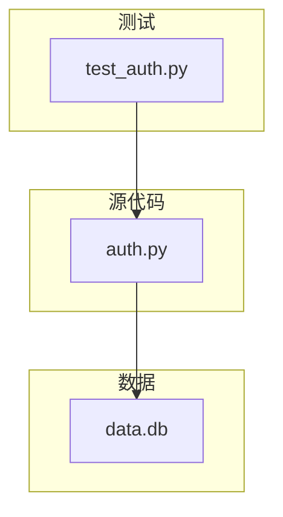
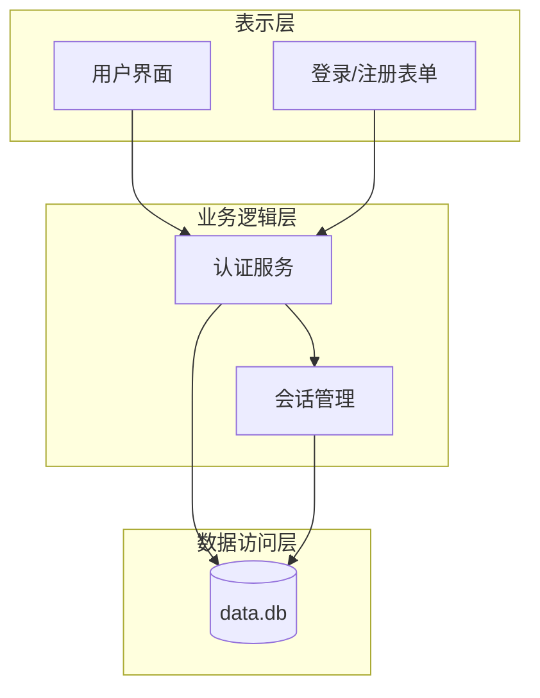
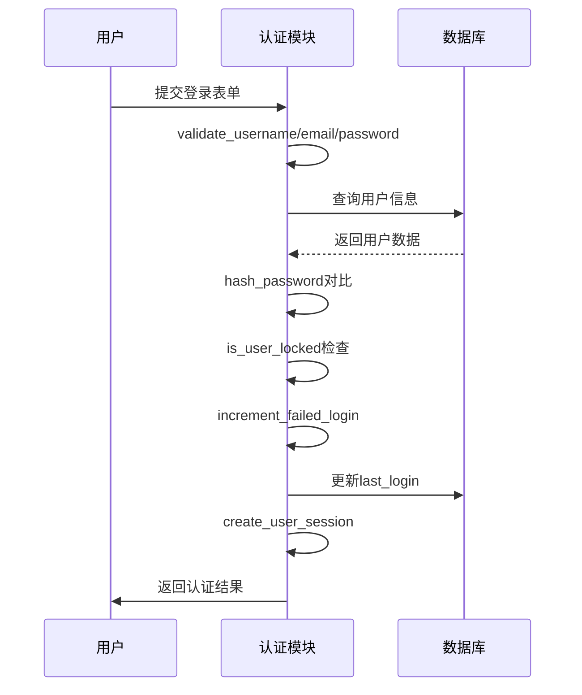
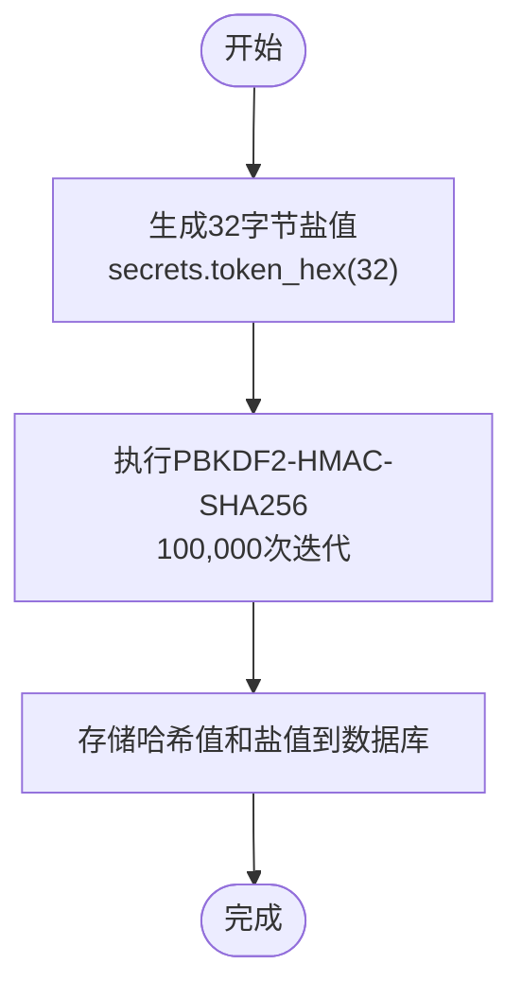
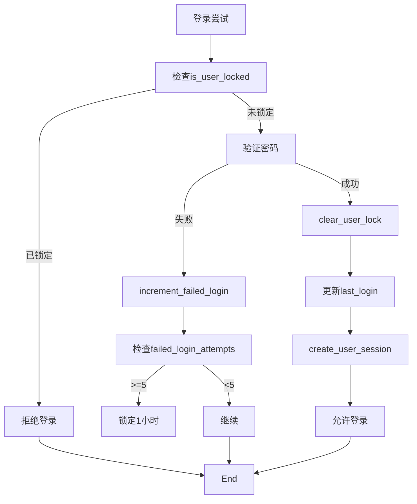
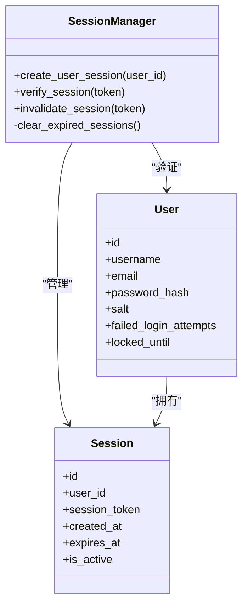
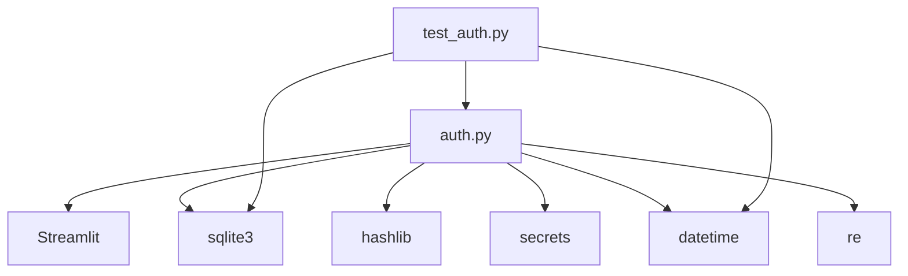

# 用户认证系统

<cite>
**本文档引用的文件**
- [auth.py](file://src/auth.py)
- [test_auth.py](file://test/test_auth.py)
</cite>

## 目录
1. [简介](#简介)
2. [项目结构](#项目结构)
3. [核心组件](#核心组件)
4. [架构概述](#架构概述)
5. [详细组件分析](#详细组件分析)
6. [依赖分析](#依赖分析)
7. [性能考虑](#性能考虑)
8. [故障排除指南](#故障排除指南)
9. [结论](#结论)

## 简介
本系统实现了一个完整的用户认证解决方案，支持注册、登录、会话管理和账户安全功能。系统采用PBKDF2-HMAC-SHA256密码哈希算法，结合盐值生成机制，确保用户密码的安全存储。通过会话令牌管理、失败尝试锁定机制（MAX_LOGIN_ATTEMPTS=5）和会话超时（SESSION_TIMEOUT_HOURS=24）等特性，提供了多层次的安全保障。

## 项目结构
系统主要由两个核心文件构成：`src/auth.py` 实现认证逻辑，`test/test_auth.py` 提供功能测试。数据库使用SQLite存储用户信息和会话数据。

**图示来源**
- [auth.py](file://src/auth.py#L1-L50)
- [test_auth.py](file://test/test_auth.py#L1-L20)

**本节来源**
- [auth.py](file://src/auth.py#L1-L50)
- [test_auth.py](file://test/test_auth.py#L1-L10)

## 核心组件
系统包含用户注册、登录验证、会话管理三大核心功能模块。密码哈希使用PBKDF2-HMAC-SHA256算法，盐值通过`secrets.token_hex(32)`生成。会话令牌通过`secrets.token_urlsafe(32)`创建，有效期为24小时。

**本节来源**
- [auth.py](file://src/auth.py#L100-L150)
- [auth.py](file://src/auth.py#L254-L317)

## 架构概述
系统采用分层架构设计，包括数据访问层、业务逻辑层和表示层。各组件通过清晰的函数接口进行交互，确保代码的可维护性和可测试性。

**图示来源**
- [auth.py](file://src/auth.py#L203-L331)
- [auth.py](file://src/auth.py#L333-L364)

## 详细组件分析

### 认证流程分析
系统实现了完整的用户认证流程，包括注册、登录和会话验证。

#### 关键函数调用关系

**图示来源**
- [auth.py](file://src/auth.py#L203-L252)
- [auth.py](file://src/auth.py#L116-L130)

**本节来源**
- [auth.py](file://src/auth.py#L100-L364)

### 安全特性实现

#### 密码哈希与盐值管理
系统使用PBKDF2-HMAC-SHA256算法进行密码哈希处理，迭代次数为100,000次，有效抵御暴力破解攻击。

**图示来源**
- [auth.py](file://src/auth.py#L100-L102)
- [auth.py](file://src/auth.py#L225-L228)

#### 登录失败锁定机制
系统实现五次失败尝试锁定机制，保护账户免受暴力破解攻击。

**图示来源**
- [auth.py](file://src/auth.py#L172-L201)
- [auth.py](file://src/auth.py#L146-L170)

### 会话管理机制
系统实现基于令牌的会话管理，确保用户会话的安全性。

**图示来源**
- [auth.py](file://src/auth.py#L254-L331)
- [auth.py](file://src/auth.py#L43-L45)

**本节来源**
- [auth.py](file://src/auth.py#L254-L331)

## 依赖分析
系统依赖Streamlit进行界面展示，SQLite进行数据持久化，以及Python标准库中的hashlib、secrets和datetime模块。

**图示来源**
- [auth.py](file://src/auth.py#L1-L30)
- [test_auth.py](file://test/test_auth.py#L1-L10)

**本节来源**
- [auth.py](file://src/auth.py#L1-L50)
- [test_auth.py](file://test/test_auth.py#L1-L20)

## 性能考虑
系统在每次登录验证时进行密码哈希计算（100,000次迭代），这会消耗一定的CPU资源，但有效提高了安全性。会话验证通过数据库索引查询，性能良好。建议在高并发场景下考虑引入缓存机制。

## 故障排除指南
### 常见问题及解决方案

**账户锁定恢复**
当用户因多次登录失败被锁定时，系统会在一小时后自动解锁。开发者可通过调用`clear_user_lock(username)`函数手动解锁。

**密码重置流程缺失**
当前系统未实现密码重置功能。建议扩展系统以支持通过邮箱验证的密码重置流程。

**OAuth/LDAP集成指导**
为支持OAuth或LDAP集成，建议：
1. 创建新的认证提供者接口
2. 实现相应的认证适配器
3. 修改`authenticate_user`函数以支持多种认证方式
4. 更新数据库模式以存储外部认证信息

**本节来源**
- [auth.py](file://src/auth.py#L150-L170)
- [auth.py](file://src/auth.py#L333-L364)

## 结论
该用户认证系统实现了基本的注册、登录和会话管理功能，具备良好的安全特性。通过PBKDF2-HMAC-SHA256密码哈希、盐值生成、会话令牌管理和失败尝试锁定等机制，提供了多层次的安全保障。测试文件`test_auth.py`验证了核心功能的正确性。系统具有良好的扩展性，可进一步增强密码重置功能，并集成OAuth或LDAP等外部认证方式。