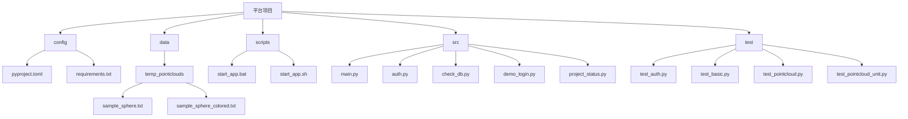

# 目录结构说明

<cite>
**本文档引用的文件**   
- [pyproject.toml](file://config/pyproject.toml)
- [requirements.txt](file://config/requirements.txt)
- [sample_sphere.txt](file://data/temp_pointclouds/sample_sphere.txt)
- [sample_sphere_colored.txt](file://data/temp_pointclouds/sample_sphere_colored.txt)
- [start_app.bat](file://scripts/start_app.bat)
- [start_app.sh](file://scripts/start_app.sh)
- [main.py](file://src/main.py)
- [auth.py](file://src/auth.py)
- [check_db.py](file://src/check_db.py)
- [demo_login.py](file://src/demo_login.py)
- [project_status.py](file://src/project_status.py)
- [test_auth.py](file://test/test_auth.py)
- [test_basic.py](file://test/test_basic.py)
- [test_pointcloud.py](file://test/test_pointcloud.py)
- [test_pointcloud_unit.py](file://test/test_pointcloud_unit.py)
</cite>

## 目录结构

项目采用分层目录结构，包含配置、数据、脚本、源码和测试五个核心目录，通过清晰的职责划分提升代码可维护性和团队协作效率。

**Diagram sources**
- [config](file://config)
- [data](file://data)
- [scripts](file://scripts)
- [src](file://src)
- [test](file://test)

## 配置目录

config/目录包含项目配置文件，用于管理开发工具配置和Python依赖。

### pyproject.toml文件用途
该文件配置Pyright静态类型检查器，包含代码分析规则、排除路径和Python版本要求。通过类型检查提升代码质量和可维护性，确保团队成员遵循统一的编码规范。

**Section sources**
- [pyproject.toml](file://config/pyproject.toml#L1-L6)

### requirements.txt文件用途
该文件列出项目运行所需的所有Python包及其版本，确保开发环境一致性。包含Streamlit、Pandas、Open3D等核心库，支持Web界面、数据处理和点云可视化功能。

**Section sources**
- [requirements.txt](file://config/requirements.txt#L1-L12)

## 数据目录

data/目录存放项目运行所需的示例数据和临时文件。

### temp_pointclouds目录作用
该目录包含示例点云数据文件，用于功能演示和测试验证。sample_sphere.txt为无色球体点云，sample_sphere_colored.txt为彩色球体点云，提供不同格式的测试数据支持开发和调试。

**Section sources**
- [sample_sphere.txt](file://data/temp_pointclouds/sample_sphere.txt#L1-L546)
- [sample_sphere_colored.txt](file://data/temp_pointclouds/sample_sphere_colored.txt#L1-L546)

## 脚本目录

scripts/目录包含跨平台启动脚本，简化应用部署流程。

### start_app.bat运行机制
Windows批处理脚本，依次执行Python版本检查、依赖安装、测试数据生成和Streamlit应用启动。提供详细的执行状态反馈和访问指引，确保新用户能顺利启动平台。

**Section sources**
- [start_app.bat](file://scripts/start_app.bat#L1-L27)

### start_app.sh运行机制
Linux/Unix Shell脚本，功能与批处理脚本相同但使用bash语法。通过统一的启动流程实现跨平台兼容性，降低不同操作系统下的使用门槛。

**Section sources**
- [start_app.sh](file://scripts/start_app.sh#L1-L25)

## 源码目录

src/目录存放核心Python模块，按功能进行模块化划分。

### main.py模块功能
主应用程序入口，基于Streamlit构建Web界面。实现数据上传、浏览、可视化三大核心功能，集成用户认证和数据库管理，提供完整的无人驾驶数据管理解决方案。

**Section sources**
- [main.py](file://src/main.py#L1-L806)

### auth.py模块功能
用户认证模块，提供注册、登录、会话管理功能。包含密码哈希、输入验证、账户锁定等安全机制，通过SQLite数据库存储用户信息，确保平台访问安全性。

**Section sources**
- [auth.py](file://src/auth.py#L1-L562)

### 工具脚本功能
check_db.py用于检查数据库状态，demo_login.py演示命令行登录流程，project_status.py验证项目功能完整性。这些工具脚本辅助开发调试，提高开发效率。

**Section sources**
- [check_db.py](file://src/check_db.py#L1-L14)
- [demo_login.py](file://src/demo_login.py#L1-L148)
- [project_status.py](file://src/project_status.py#L1-L148)

## 测试目录

test/目录包含各类测试文件，确保代码质量和功能稳定性。

### 测试文件覆盖范围
test_auth.py测试用户认证功能，test_basic.py验证基础数据处理能力，test_pointcloud.py检查点云加载功能，test_pointcloud_unit.py提供单元测试用例。形成多层次测试体系，保障核心功能可靠性。

**Section sources**
- [test_auth.py](file://test/test_auth.py#L1-L189)
- [test_basic.py](file://test/test_basic.py#L1-L166)
- [test_pointcloud.py](file://test/test_pointcloud.py#L1-L164)
- [test_pointcloud_unit.py](file://test/test_pointcloud_unit.py#L1-L209)

## 分层结构优势

这种分层结构通过职责分离促进代码可维护性。配置、数据、代码、测试物理隔离，降低模块间耦合度。团队成员可并行开发不同模块，通过明确的接口约定协作，减少代码冲突。目录结构直观反映系统架构，新成员能快速理解项目组织方式。

## 最佳实践建议

在现有结构下添加新功能时，应遵循目录约定。新配置放入config/，新数据放入data/，新脚本放入scripts/，新模块放入src/，新测试放入test/。修改现有组件需同步更新相关测试，确保功能完整性。保持目录结构清晰，避免跨目录依赖，通过接口而非直接文件引用实现模块通信。

## 访问权限与生命周期

配置文件由项目负责人维护，数据文件根据敏感程度设置访问权限，脚本文件对所有开发者开放，源码文件按模块分配维护责任，测试文件由质量保证团队管理。生命周期上，配置和源码长期维护，数据和测试文件随版本迭代更新，脚本文件根据部署需求调整。