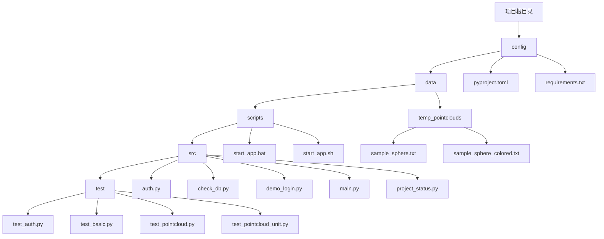
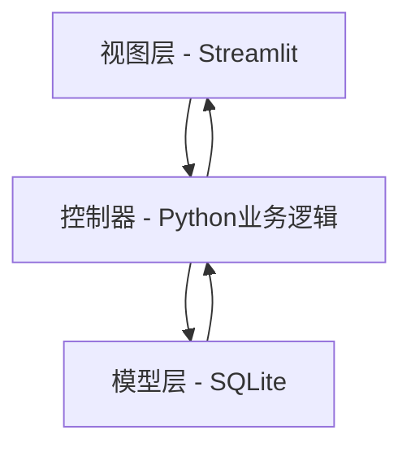
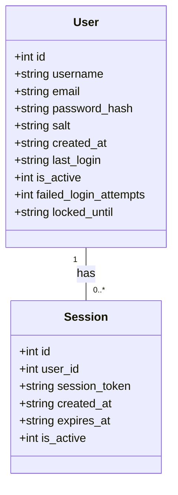
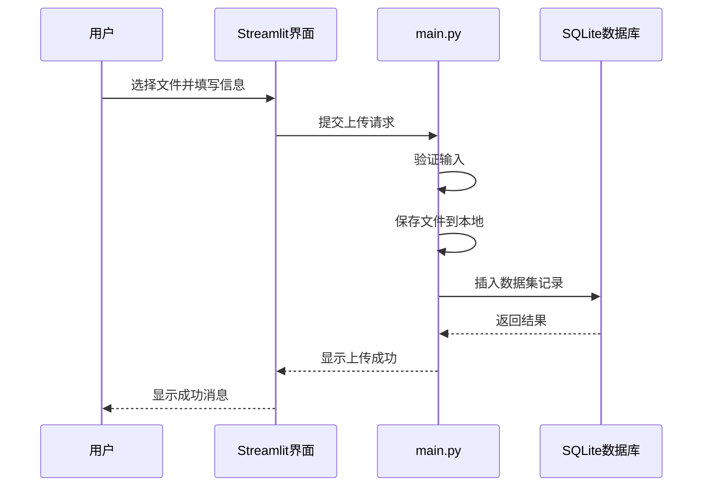
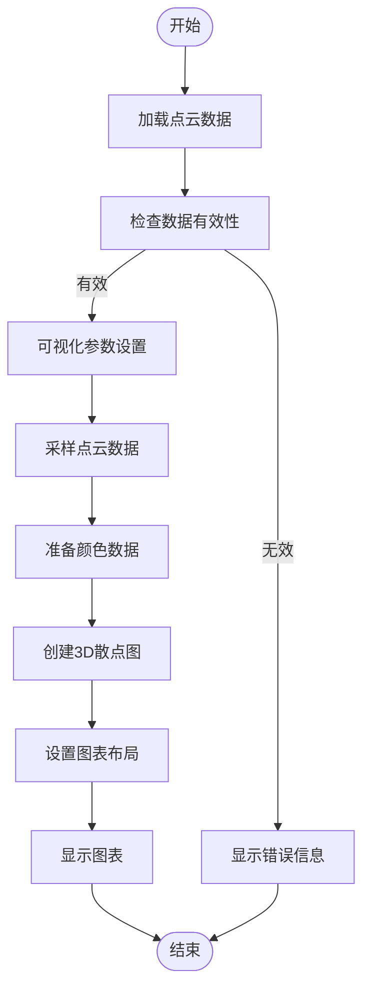
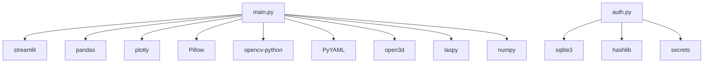

# 项目概述

<cite>
**本文档引用的文件**
- [main.py](file://src/main.py)
- [auth.py](file://src/auth.py)
- [requirements.txt](file://config/requirements.txt)
- [demo_login.py](file://src/demo_login.py)
- [project_status.py](file://src/project_status.py)
</cite>

## 目录
1. [简介](#简介)
2. [项目结构](#项目结构)
3. [核心组件](#核心组件)
4. [架构概述](#架构概述)
5. [详细组件分析](#详细组件分析)
6. [依赖分析](#依赖分析)
7. [性能考虑](#性能考虑)
8. [故障排除指南](#故障排除指南)
9. [结论](#结论)

## 简介
无人驾驶数据管理平台是一个专为自动驾驶多模态传感器数据管理而设计的系统。该平台支持用户认证、数据上传、浏览和可视化等核心功能，旨在为自动驾驶研究人员、高校师生、算法工程师和数据科学家提供一个高效的数据管理解决方案。系统采用MVC架构，其中Streamlit作为视图层，Python业务逻辑作为控制器，SQLite作为模型层。

## 项目结构
项目结构清晰，分为配置、数据、脚本、源代码和测试五个主要目录。源代码位于`src`目录下，包含`main.py`、`auth.py`等核心文件。数据文件存储在`data`目录中，脚本文件用于启动应用，测试文件则用于验证系统功能。

**图源**
- [main.py](file://src/main.py)
- [auth.py](file://src/auth.py)

**本节来源**
- [main.py](file://src/main.py)
- [auth.py](file://src/auth.py)

## 核心组件
系统的核心组件包括用户认证、数据上传、数据浏览和数据可视化。`main.py`文件包含了系统的主函数和各个功能页面的实现，而`auth.py`文件则负责用户认证和会话管理。

**本节来源**
- [main.py](file://src/main.py#L1-L806)
- [auth.py](file://src/auth.py#L1-L562)

## 架构概述
系统采用MVC架构，其中Streamlit作为视图层，Python业务逻辑作为控制器，SQLite作为模型层。用户通过Streamlit界面与系统交互，业务逻辑处理用户请求并操作SQLite数据库。

**图源**
- [main.py](file://src/main.py)
- [auth.py](file://src/auth.py)

## 详细组件分析

### 用户认证分析
用户认证模块提供了登录、注册和会话管理功能。系统使用SQLite数据库存储用户信息，并通过密码哈希和会话令牌确保安全性。

**图源**
- [auth.py](file://src/auth.py#L38-L80)

**本节来源**
- [auth.py](file://src/auth.py#L1-L562)

### 数据上传分析
数据上传功能允许用户上传多种格式的传感器数据，包括ROS数据、点云数据、图像数据等。上传的数据被存储在本地文件系统中，并在数据库中记录元数据。

**图源**
- [main.py](file://src/main.py#L464-L523)

**本节来源**
- [main.py](file://src/main.py#L464-L523)

### 点云数据可视化分析
点云数据可视化功能支持单个和多个点云文件的可视化，提供多种显示模式和参数设置。

**图源**
- [main.py](file://src/main.py#L73-L185)

**本节来源**
- [main.py](file://src/main.py#L73-L185)

## 依赖分析
系统依赖于多个Python库，包括Streamlit、pandas、plotly等。这些依赖在`requirements.txt`文件中定义。

**图源**
- [requirements.txt](file://config/requirements.txt)

**本节来源**
- [requirements.txt](file://config/requirements.txt)

## 性能考虑
系统在处理大量数据时需要考虑性能问题。例如，在可视化点云数据时，系统会限制最大显示点数以保证性能。此外，数据库查询和文件操作也应优化以提高效率。

## 故障排除指南
常见问题包括依赖库未安装、数据库连接失败等。用户应确保所有依赖库已正确安装，并检查数据库文件是否存在。

**本节来源**
- [main.py](file://src/main.py)
- [auth.py](file://src/auth.py)

## 结论
无人驾驶数据管理平台提供了一个完整的解决方案，用于管理自动驾驶多模态传感器数据。系统架构清晰，功能完善，适合自动驾驶领域的研究人员和开发者使用。