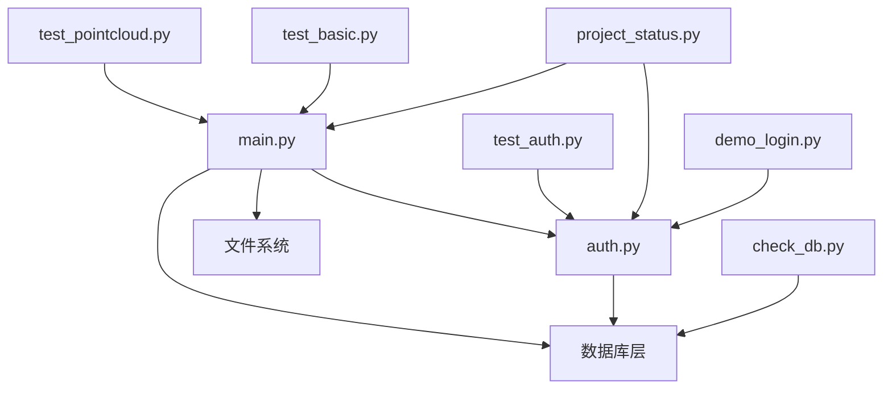

# 无人驾驶数据管理平台模块划分与实现方案

## 1. 模块总体划分

### 1.1 核心模块结构

```
platform/
├── src/                          # 源代码目录
│   ├── auth.py                   # 用户认证模块
│   ├── main.py                   # 主应用程序和UI模块
│   ├── check_db.py              # 数据库检查工具
│   ├── demo_login.py            # 登录演示脚本
│   └── project_status.py        # 项目状态检查
├── test/                        # 测试模块目录
│   ├── test_auth.py             # 认证功能测试
│   ├── test_basic.py            # 基础功能测试
│   ├── test_pointcloud.py       # 点云功能测试
│   └── test_pointcloud_unit.py  # 点云单元测试
├── config/                      # 配置目录
│   ├── requirements.txt         # Python依赖配置
│   └── pyproject.toml          # 项目配置
├── scripts/                     # 脚本目录
│   ├── start_app.bat           # Windows启动脚本
│   └── start_app.sh            # Unix启动脚本
├── data/                       # 数据目录
│   └── temp_pointclouds/       # 临时点云数据
└── docs/                       # 文档目录
    └── 架构设计文档.md          # 架构设计文档
```

### 1.2 模块依赖关系



## 2. 详细模块分析

### 2.1 用户认证模块 (auth.py)

#### 2.1.1 模块职责
该模块负责整个平台的用户身份认证和授权管理，是系统安全的核心模块。

#### 2.1.2 核心功能
```python
# 主要功能类别
1. 用户管理
   - 用户注册 (register_user)
   - 用户验证 (authenticate_user)
   - 用户信息管理

2. 密码安全
   - 密码哈希处理 (hash_password)
   - 密码强度验证 (validate_password)
   - 盐值生成和管理

3. 会话管理
   - 会话创建 (create_user_session)
   - 会话验证 (verify_session)
   - 会话失效处理 (invalidate_session)

4. 安全策略
   - 登录尝试限制
   - 账户锁定机制 (lock_user_account)
   - 解锁处理 (clear_user_lock)

5. 输入验证
   - 用户名格式验证 (validate_username)
   - 邮箱格式验证 (validate_email)
   - 输入安全检查
```

#### 2.1.3 数据结构设计
```sql
-- 用户基础信息表
users {
    id: INTEGER PRIMARY KEY          -- 用户ID
    username: TEXT UNIQUE           -- 用户名
    email: TEXT UNIQUE             -- 邮箱地址
    password_hash: TEXT            -- 密码哈希值
    salt: TEXT                     -- 密码盐值
    created_at: TEXT               -- 创建时间
    last_login: TEXT               -- 最后登录时间
    is_active: INTEGER             -- 账户状态
    failed_login_attempts: INTEGER -- 失败登录次数
    locked_until: TEXT             -- 锁定截止时间
}

-- 用户会话表
user_sessions {
    id: INTEGER PRIMARY KEY        -- 会话ID
    user_id: INTEGER              -- 关联用户ID
    session_token: TEXT UNIQUE    -- 会话令牌
    created_at: TEXT              -- 创建时间
    expires_at: TEXT              -- 过期时间
    is_active: INTEGER            -- 会话状态
}
```

#### 2.1.4 安全特性
```python
# 安全配置常量
SESSION_TIMEOUT_HOURS = 24    # 会话超时时间
MIN_PASSWORD_LENGTH = 6      # 最小密码长度
MAX_LOGIN_ATTEMPTS = 5       # 最大登录尝试次数

# 安全实现
- PBKDF2-HMAC-SHA256 密码加密 (100,000次迭代)
- 32字节随机盐值
- 自动账户锁定 (5次失败锁定1小时)
- 会话令牌自动过期
- 输入格式严格验证
```

#### 2.1.5 Streamlit集成
```python
# UI集成组件
def show_login_page():     # 登录界面
def show_register_page():  # 注册界面
def show_user_info():      # 用户信息显示
def check_authentication(): # 认证状态检查

# 框架解耦设计
- 使用MockStreamlit类进行测试环境适配
- 核心逻辑与UI框架分离
- 支持无GUI环境下的功能测试
```

### 2.2 主应用模块 (main.py)

#### 2.2.1 模块职责
主应用模块是整个平台的核心协调器，负责UI呈现、业务逻辑协调和用户交互处理。

#### 2.2.2 子模块划分

##### A. 数据管理子模块
```python
# 数据集管理
class DatasetManager:
    def init_database():           # 数据库初始化
    def show_upload_page():        # 数据上传界面
    def show_browse_page():        # 数据浏览界面
    def delete_dataset():          # 数据集删除

# 核心功能
- 支持多格式文件上传 (.bag, .pcd, .png, .jpg, .yaml, .csv, .json)
- 数据集元数据管理
- 文件存储和组织
- 搜索和过滤功能
```

##### B. 点云处理子模块
```python
# 点云数据处理
class PointCloudProcessor:
    def load_point_cloud():       # 点云加载
    def visualize_single_pointcloud():  # 单点云可视化
    def visualize_multiple_pointclouds(): # 多点云对比

# 支持格式
- .pcd (Open3D标准格式)
- .las/.laz (激光雷达标准格式)  
- .txt/.xyz (文本格式，支持XYZ和XYZRGB)

# 可视化特性
- 智能采样 (性能优化)
- 多种颜色映射模式
- 交互式3D视角控制
- 统计信息展示
- 多文件对比分析
```

##### C. 可视化引擎子模块
```python
# 可视化核心组件
class VisualizationEngine:
    def create_3d_scatter_plot():  # 3D散点图创建
    def apply_color_mapping():     # 颜色映射
    def setup_camera_views():      # 视角控制
    def generate_statistics():     # 统计信息生成

# 可视化类型
1. 单点云详细可视化
   - 高度颜色映射
   - 原始颜色显示
   - 统一颜色模式
   - 多视角观察

2. 多点云对比可视化
   - 并排显示模式
   - 叠加显示模式
   - 统计对比分析

3. 数据分析图表
   - 点数量对比柱状图
   - 文件大小对比图
   - 坐标分布统计
```

##### D. 用户界面子模块
```python
# 页面管理
class UIManager:
    def show_homepage():          # 首页展示
    def show_navigation():        # 导航菜单
    def show_sidebar_info():      # 侧边栏信息

# 界面结构
- 响应式布局设计
- 侧边栏导航系统
- 动态内容区域
- 进度指示器
- 错误提示系统
```

#### 2.2.3 数据流设计
```python
# 数据处理流程
用户上传 → 文件验证 → 存储组织 → 元数据记录 → 界面展示
    ↓
点云文件 → 格式检测 → 数据加载 → 采样处理 → 3D可视化
    ↓
用户交互 → 参数调整 → 实时更新 → 结果展示 → 统计分析
```

### 2.3 数据库管理模块 (check_db.py)

#### 2.3.1 模块职责
提供数据库状态检查、维护和调试功能。

#### 2.3.2 核心功能
```python
def check_database_health():     # 数据库健康检查
def show_table_structure():      # 表结构显示
def count_records():            # 记录统计
def check_data_integrity():     # 数据完整性检查
```

### 2.4 测试模块组

#### 2.4.1 认证功能测试 (test_auth.py)

```python
# 测试覆盖范围
class AuthTestSuite:
    def test_database_initialization():  # 数据库初始化测试
    def test_input_validation():        # 输入验证测试
    def test_user_registration():       # 用户注册测试
    def test_user_authentication():     # 用户认证测试
    def test_session_management():      # 会话管理测试
    def test_security_features():       # 安全特性测试

# 测试用例设计
- 正向测试: 正常功能流程验证
- 负向测试: 异常输入处理验证
- 边界测试: 极限值处理验证
- 安全测试: 安全机制有效性验证
```

#### 2.4.2 点云功能测试 (test_pointcloud.py)

```python
# 测试功能覆盖
class PointCloudTestSuite:
    def test_pointcloud_loading():      # 点云加载测试
    def test_format_support():          # 格式支持测试
    def test_data_validation():         # 数据验证测试
    def create_sample_data():           # 测试数据生成

# 测试数据生成
- 自动生成球形点云样本
- 创建多种格式测试文件
- 验证数据加载正确性
- 测试可视化功能完整性
```

#### 2.4.3 单元测试 (test_pointcloud_unit.py)

```python
# 原子化测试设计
class UnitTestSuite:
    def test_single_function():         # 单功能测试
    def test_edge_cases():              # 边界情况测试
    def test_error_handling():          # 错误处理测试

# 测试原则
- 每个测试用例只测试一个场景
- 测试独立性，无依赖关系
- 快速执行，便于持续集成
```

### 2.5 工具模块组

#### 2.5.1 项目状态检查 (project_status.py)

```python
# 系统自检功能
class StatusChecker:
    def check_file_integrity():        # 文件完整性检查
    def check_dependencies():          # 依赖检查
    def check_database_status():       # 数据库状态检查
    def check_functionality():         # 功能验证
    def generate_status_report():      # 状态报告生成

# 检查范围
- 必需文件存在性验证
- Python依赖包检查
- 数据库表结构验证
- 核心功能可用性测试
- 推荐使用流程指导
```

#### 2.5.2 登录演示 (demo_login.py)

```python
# 演示功能
class LoginDemo:
    def demonstrate_login_flow():      # 登录流程演示
    def show_security_features():      # 安全特性展示
    def test_user_scenarios():         # 用户场景测试

# 演示内容
- 完整登录注册流程
- 安全机制演示
- 错误处理展示
- 最佳实践指导
```

### 2.6 配置管理模块

#### 2.6.1 依赖配置 (requirements.txt)

```python
# 核心依赖分类
Web框架:
    streamlit==1.29.0              # Web应用框架

数据处理:
    pandas                         # 数据分析
    numpy                          # 数值计算

可视化:
    plotly                         # 交互式图表
    open3d                         # 3D点云处理
    matplotlib                     # 基础绘图

图像处理:
    Pillow                         # 图像处理
    opencv-python                  # 计算机视觉

数据格式:
    PyYAML                         # YAML文件处理
    laspy                          # LAS点云格式

ROS支持:
    rosbag                         # ROS数据包
    rospy                          # ROS Python库
```

#### 2.6.2 项目配置 (pyproject.toml)

```toml
# 代码质量配置
[tool.pyright]
include = ["**/*.py"]              # 包含所有Python文件
exclude = ["**/node_modules", "**/__pycache__"]  # 排除目录
reportMissingImports = false       # 忽略缺失导入
reportOptionalMemberAccess = false # 忽略可选成员访问
pythonVersion = "3.9"              # Python版本要求
```

## 3. 模块间通信机制

### 3.1 数据传递方式

#### 3.1.1 函数调用
```python
# 直接函数调用
auth_result = authenticate_user(username, password)
session_token = create_user_session(user_id)
point_cloud_data = load_point_cloud(file_path)
```

#### 3.1.2 Streamlit Session State
```python
# 会话状态管理
st.session_state.user = user_info
st.session_state.authenticated = True
st.session_state.selected_dataset_id = dataset_id
```

#### 3.1.3 数据库交互
```python
# 统一数据库访问
conn = sqlite3.connect('data.db')
# 执行查询操作
conn.close()
```

### 3.2 错误处理机制

#### 3.2.1 异常传播
```python
# 分层异常处理
try:
    # 业务逻辑
    result = process_data()
except SpecificException as e:
    # 特定异常处理
    handle_specific_error(e)
except Exception as e:
    # 通用异常处理
    log_error(e)
    show_user_friendly_message()
```

#### 3.2.2 用户反馈
```python
# Streamlit用户反馈
st.success("✅ 操作成功")
st.error("❌ 操作失败: {error_message}")
st.warning("⚠️ 警告信息")
st.info("💡 提示信息")
```

## 4. 性能优化策略

### 4.1 数据处理优化

#### 4.1.1 点云采样策略
```python
# 智能采样算法
def intelligent_sampling(points, max_points=10000):
    if len(points) <= max_points:
        return points
    
    # 随机采样
    indices = np.random.choice(len(points), max_points, replace=False)
    return points[indices]

# 分级显示策略
- 概览模式: 1000-5000个点
- 详细模式: 10000-50000个点
- 专业模式: 50000-100000个点
```

#### 4.1.2 内存管理
```python
# 内存优化措施
1. 及时释放大型数组
   del large_array
   
2. 使用生成器减少内存占用
   for chunk in data_generator():
       process_chunk(chunk)
       
3. 缓存机制减少重复计算
   @st.cache_data
   def expensive_computation():
       return result
```

### 4.2 界面响应优化

#### 4.2.1 异步加载
```python
# 分步加载策略
with st.spinner("🔄 正在加载数据..."):
    step1_result = load_metadata()
    
with st.spinner("🔄 正在处理点云..."):
    step2_result = process_pointcloud(step1_result)
    
with st.spinner("🔄 正在生成可视化..."):
    visualization = create_visualization(step2_result)
```

#### 4.2.2 缓存策略
```python
# Streamlit缓存优化
@st.cache_data(ttl=3600)  # 1小时缓存
def load_dataset_list():
    return fetch_from_database()

@st.cache_resource
def initialize_visualization_engine():
    return VisualizationEngine()
```

## 5. 安全实现细节

### 5.1 输入验证

#### 5.1.1 用户输入验证
```python
# 多层验证机制
def validate_user_input(data):
    # 1. 格式验证
    if not validate_format(data):
        raise ValidationError("格式不正确")
    
    # 2. 长度验证
    if not validate_length(data):
        raise ValidationError("长度超出限制")
    
    # 3. 安全验证
    if not validate_security(data):
        raise ValidationError("包含危险字符")
    
    return True
```

#### 5.1.2 文件上传安全
```python
# 文件类型白名单
ALLOWED_EXTENSIONS = {
    'pointcloud': ['.pcd', '.las', '.laz', '.txt', '.xyz'],
    'image': ['.png', '.jpg', '.jpeg'],
    'config': ['.yaml', '.yml'],
    'data': ['.csv', '.json'],
    'ros': ['.bag']
}

def validate_file_upload(file):
    # 文件类型检查
    # 文件大小限制
    # 文件内容验证
    return is_valid
```

### 5.2 数据保护

#### 5.2.1 敏感数据加密
```python
# 密码加密存储
salt = secrets.token_hex(32)
password_hash = hashlib.pbkdf2_hmac(
    'sha256', 
    password.encode('utf-8'),
    salt.encode('utf-8'),
    100000  # 迭代次数
)
```

#### 5.2.2 会话安全
```python
# 安全会话管理
def create_secure_session(user_id):
    token = secrets.token_urlsafe(32)  # 加密安全令牌
    expires_at = datetime.now() + timedelta(hours=24)
    
    # 存储会话信息
    store_session(user_id, token, expires_at)
    return token
```

## 6. 扩展接口设计

### 6.1 插件化架构

#### 6.1.1 数据格式扩展接口
```python
# 抽象基类
class DataFormatHandler:
    def can_handle(self, file_path: str) -> bool:
        """判断是否能处理该格式"""
        pass
    
    def load_data(self, file_path: str) -> Tuple[np.ndarray, Optional[np.ndarray]]:
        """加载数据，返回点云和颜色"""
        pass
    
    def get_metadata(self, file_path: str) -> Dict[str, Any]:
        """获取文件元数据"""
        pass

# 具体实现
class PCDHandler(DataFormatHandler):
    def can_handle(self, file_path: str) -> bool:
        return file_path.endswith('.pcd')
    
    def load_data(self, file_path: str):
        # PCD格式加载实现
        pass
```

#### 6.1.2 可视化扩展接口
```python
# 可视化插件接口
class VisualizationPlugin:
    def get_name(self) -> str:
        """插件名称"""
        pass
    
    def can_visualize(self, data_type: str) -> bool:
        """是否支持该数据类型"""
        pass
    
    def create_visualization(self, data: Any) -> Any:
        """创建可视化组件"""
        pass
```

### 6.2 API接口预留

#### 6.2.1 RESTful API设计
```python
# 未来API接口规划
class APIEndpoints:
    # 用户管理
    POST /api/v1/auth/login
    POST /api/v1/auth/register
    POST /api/v1/auth/logout
    
    # 数据集管理
    GET /api/v1/datasets
    POST /api/v1/datasets
    GET /api/v1/datasets/{id}
    DELETE /api/v1/datasets/{id}
    
    # 文件操作
    POST /api/v1/datasets/{id}/files
    GET /api/v1/datasets/{id}/files/{file_id}
    
    # 可视化
    GET /api/v1/visualizations/{type}
    POST /api/v1/visualizations/generate
```

## 7. 部署和维护

### 7.1 部署自动化

#### 7.1.1 启动脚本设计
```bash
# Windows启动脚本 (start_app.bat)
1. 环境检查
   - Python版本验证
   - 依赖包检查
   
2. 环境准备
   - 依赖包安装
   - 数据库初始化
   
3. 测试数据生成
   - 创建样本点云文件
   - 验证功能可用性
   
4. 应用启动
   - 启动Streamlit服务
   - 自动打开浏览器

# Unix启动脚本 (start_app.sh)
- 相同功能的Linux/Mac版本
- 权限检查和设置
- 进程守护选项
```

#### 7.1.2 健康检查机制
```python
# 系统健康检查
def health_check():
    checks = [
        check_database_connection(),
        check_file_permissions(),
        check_disk_space(),
        check_memory_usage(),
        check_dependency_availability()
    ]
    
    return all(checks)
```

### 7.2 监控和日志

#### 7.2.1 日志系统设计
```python
# 分级日志记录
import logging

# 配置日志
logging.basicConfig(
    level=logging.INFO,
    format='%(asctime)s - %(name)s - %(levelname)s - %(message)s',
    handlers=[
        logging.FileHandler('platform.log'),
        logging.StreamHandler()
    ]
)

# 使用示例
logger = logging.getLogger(__name__)
logger.info("用户登录成功: {username}")
logger.warning("点云文件加载警告: {filename}")
logger.error("数据库连接失败: {error}")
```

#### 7.2.2 性能监控
```python
# 性能指标收集
class PerformanceMonitor:
    def track_request_time(self, func):
        """请求处理时间监控"""
        pass
    
    def track_memory_usage(self):
        """内存使用监控"""
        pass
    
    def track_user_activity(self, action):
        """用户行为监控"""
        pass
```

## 8. 测试策略详解

### 8.1 测试层次

#### 8.1.1 单元测试
```python
# 测试覆盖范围
1. 函数级测试
   - 输入输出验证
   - 边界条件测试
   - 异常处理测试

2. 类级测试
   - 方法调用测试
   - 状态变更测试
   - 依赖注入测试

3. 模块级测试
   - 模块接口测试
   - 模块集成测试
   - 模块隔离测试
```

#### 8.1.2 集成测试
```python
# 系统集成验证
1. 数据流测试
   - 端到端数据流验证
   - 数据转换正确性
   - 数据完整性检查

2. 界面集成测试
   - 用户操作流程验证
   - 界面响应测试
   - 错误处理测试

3. 外部依赖测试
   - 数据库操作测试
   - 文件系统操作测试
   - 第三方库集成测试
```

### 8.2 测试自动化

#### 8.2.1 持续集成
```python
# CI/CD流程设计
1. 代码提交触发
   - 自动运行单元测试
   - 代码质量检查
   - 安全扫描

2. 构建验证
   - 依赖安装测试
   - 应用启动测试
   - 功能可用性测试

3. 部署验证
   - 环境兼容性测试
   - 性能基准测试
   - 回滚机制验证
```

## 9. 总结

本模块划分与实现方案为无人驾驶数据管理平台提供了清晰的架构指导：

### 9.1 模块化优势
1. **职责清晰**: 每个模块有明确的功能边界
2. **低耦合**: 模块间依赖关系简单明确
3. **高内聚**: 相关功能集中在同一模块内
4. **易测试**: 每个模块都有对应的测试覆盖
5. **易维护**: 模块化设计便于独立维护和升级

### 9.2 实现特色
1. **安全优先**: 完善的认证授权机制
2. **性能优化**: 智能采样和缓存策略
3. **用户友好**: 直观的界面和错误提示
4. **扩展性强**: 插件化架构支持功能扩展
5. **部署简单**: 自动化脚本简化部署流程

### 9.3 质量保证
1. **测试驱动**: 完整的测试体系覆盖
2. **代码规范**: 统一的编码标准
3. **文档完善**: 详细的技术文档
4. **监控完备**: 全面的系统监控机制

该实现方案为项目的持续发展提供了坚实的技术基础，能够满足当前需求并支持未来的功能扩展和技术演进。